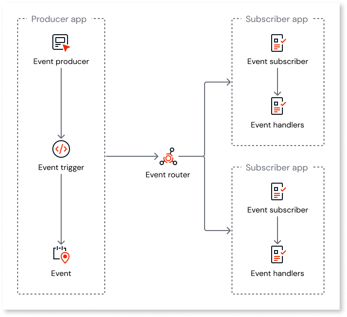

# Events

In ODC Studio, an event represents a change within an app. Events help track app changes and trigger specific actions in response to these changes. For example, creating a new account(event) triggers generating a bank account number(response) in a finance app.

Events facilitate process automation without impacting the user experience and enable real-time data processing. For example, you can use back-end events to automate monthly billing for subscribers in a streaming app.

The Screens and Blocks follow a lifecycle composed of stages, allowing you to act upon those stages using event handler actions. These event handlers provide visibility into the lifecycle of screens and blocks, allowing you to implement logic when certain events occur.

In ODC, events follow the publish/subscribe (pub/sub) paradigm, allowing asynchronous communication. This model simplifies the development of highly functional and architecturally complex apps within cloud-native architectures.

## Event-driven architecture

Event-driven architecture (EDA) promotes app independence, with each component having minimal dependencies. EDA enhances team autonomy by enabling the development of apps with loosely coupled dependencies. EDA follows a reactive programming model, where decoupled components offer a dynamic approach to event handling.

Publisher apps define events and triggers. When an event triggers, the publisher publishes the event in the message broker. Subsequently, subscribers interested in specific events can subscribe to them through the message broker.

Subscribers define event handlers to react to events asynchronously through server actions. The subscriber app consumes an event sent by the publisher app, creating a weak reference.

For example, in a finance app, you must generate a bank account number for each new account. In this example, creating a new account is an event trigger within the publisher app. A new account triggers an event, and the publisher publishes the event to a message broker. Subsequently, subscribers interested in specific events subscribe to them through the message broker. To respond to this event, subscribers use event handlers, such as generating a new bank account number.

Publisher app can also subscribe to events from other apps.

Events are triggered, and event handlers execute them asynchronously, enabling subscribers to receive and process events independently without waiting for the publisher to finish processing them.
