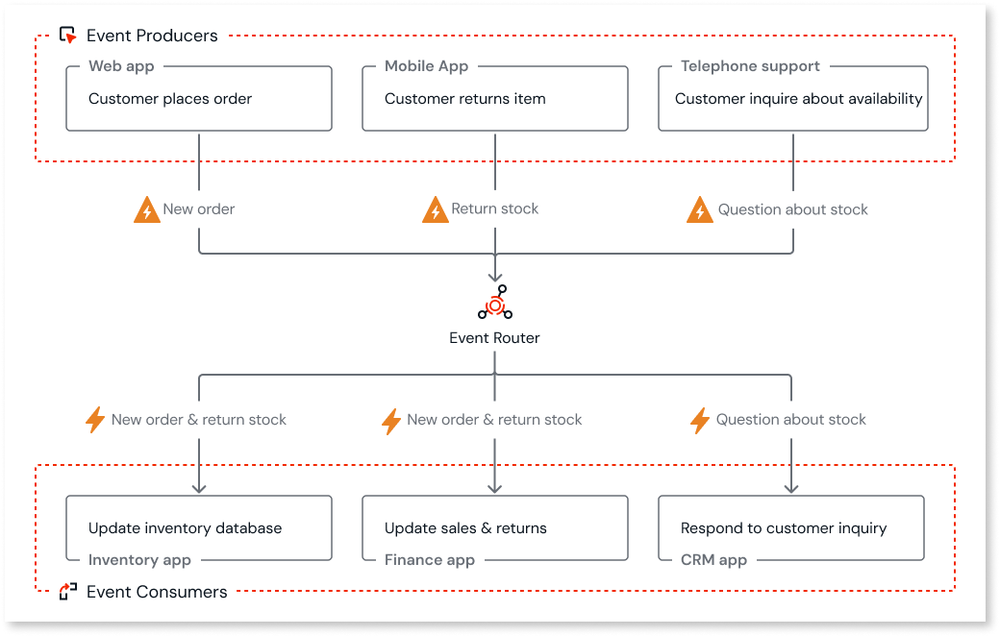

# About event-driven architecture

Event-driven architecture (EDA) is a design approach where events trigger actions and enable communication between independent and decoupled services. This approach is commonly used in distributed systems, microservices, and cloud-native apps.

An event is a change in state or an update of a system that can trigger a response, such as an item placed in a shopping cart on an e-commerce website or a change in the customer's address. Events can be generated by users or external systems.

Here are some examples of events that can occur in an app.

* A sensor detecting a temperature change.

* A customer submitting a loan application.

* A server reaching 80% of its capacity.

An event includes metadata, such as the event type, timestamp, source of the event, and payload, along with additional data about the event's occurrence.

## Components of event-driven architecture

The main components of event-driven architecture are:

* **Event producers**

* **Producer** apps that define and trigger an event based on a specific action or change in state. When an event is triggered, the producer app publishes the event in the event router.

* **Event consumers**

* **Consumer** apps that subscribe to specific events through the event router and perform actions based on the event data they receive.

* **Event router**

The medium through which events flow from producers to consumers. It is the middleware that manages the distribution of events in the system.

## How event-driven architecture works

Here's an example of an event-driven architecture for an eCommerce site.

Customer actions from various sources such as web app, mobile app, and telephone trigger specific events such as **New order**, **Return stock**, and **Question about stock**. An event router receives these events and directs them to relevant event consumers . For example, a **New order** or **Return stock** event updates both the inventory database and the sales & returns system. A **Question about stock** event is routed to the CRM app for customer service. This setup enables different apps to react in real-time to customer interactions.

## Benefits of event-driven architecture

Here are some benefits of adopting event-driven architecture:

* Promotes loose coupling between apps. Instead of direct dependencies, apps interact through asynchronous events. This [decoupling](../../app-architecture/intro.md) allows apps to be developed, deployed, and scaled independently without impacting others.

* Reacting to events as they occur facilitates real-time processing and responsiveness. This enables apps to adapt to changes and make quick, timely decisions.

* Enhances system reliability and fault tolerance. If one app fails, other apps can continue operating independently, minimizing the impact of failures on the overall system.

## Use cases of event-driven architecture

Here are some scenarios where EDA can be used.

* Real-time data orchestration to replicate data from a write-intensive datastore to a separate read-only replica, enabling faster queries, load balancing, and system reliability.

* IoT integrations that enable real-time monitoring of equipment health across various industries, such as smart-building solutions for energy efficiency and agricultural field sensors for checking crop health.

* Apps that require asynchronous and parallel processing operations, such as:

    * Handling multiple payment requests simultaneously for improved throughput.

    * Analyzing multiple data sets concurrently to accelerate insight generation.

    * Running simulations on multiple data points simultaneously for faster research.

## Related resources

* [Event-driven architecture in ODC](backend-events.md)

* [Implement events in ODC](implement-events.md)
