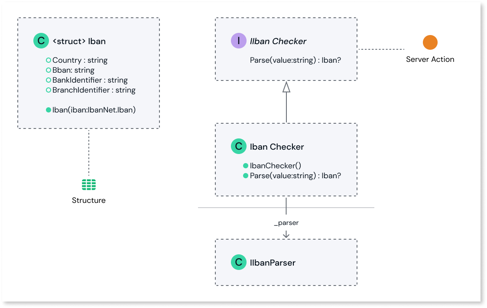

# External Libraries SDK README

The SDK is part of the OutSystems Developer Cloud (ODC) External Logic feature that you use to extend your apps built in the OutSystems visual language with custom code.

Use of this SDK is the first step in extending an ODC app with custom code. You use it to decorate the code of a C# .NET project with SDK attributes that map to OutSystems visual language elements.

## Prerequisites

* [.NET 8.0 SDK](https://dotnet.microsoft.com/en-us/download/dotnet/8.0) installed.
* [NuGet](https://www.nuget.org/downloads) package manager installed.
* An IDE that supports building .NET projects. For example, Visual Studio, Visual Studio Code, and Jet Brains Rider.
* Basic knowledge of C# programming concepts.

## Usage

You can start developing external logic for an ODC app from scratch or using one of the provided templates.

### From scratch

Using Microsoft Visual Studio 2022 with .NET 8.0, for example:

1. From the **Create a new project** window select the **Class Library** template.

1. Give the project a name, for example `ClassLibrary1`. You must select **.NET 8.0 (Long-term support)** as the framework. Click **Create**.

1. From the **Solution Explorer** pane, right-click on the project name and click **Manage NuGet packages...** Search for `OutSystems.ExternalLibraries.SDK`, select the result and click **Install**.

1. Create a public interface containing the methods you want to expose as server actions to your ODC apps and libraries. Then decorate it with the `OSInterface` attribute. For example,

        using OutSystems.ExternalLibraries.SDK;

        namespace MyCompany
        {
            [OSInterface]
            public interface IMyLibrary
            {
                public string SayHello(string name);
                public string SayGoodbye(string name);
            }
        }

1. Create a public class implementing that interface. For example,

        namespace MyCompany
        {
            public class MyLibrary : IMyLibrary
            {
                public string SayHello(string name) {
                    return $"Hello, {name}";
                }

                public string SayGoodbye(string name) {
                    return $"Goodbye, {name}";
                }
            }
        }
 
    The exposed methods can only have:

    * Basic .NET types: `string`, `int`, `long`, `bool`, `byte[]`, `decimal`, `float`, `double`, `DateTime`.
    * Structs decorated with the `OSStructure` attribute.
    * Lists (any type inheriting from [IEnumerable](https://learn.microsoft.com/en-us/dotnet/api/system.collections.ienumerable)) of any of the previous two types.

1. Once you're finished with the code, save the project and publish it. For example, right-click **Solution ClassLibrary1** and click **Open in Terminal**. Run command `dotnet publish -c Release -r linux-x64 --no-self-contained`.

    The published code runs in a Linux container. If your library doesn't have any runtime-specific dependencies, and to simplify the process, you can publish it without specifying the runtime: `dotnet publish -c Release --no-self-contained`.

1. Zip the contents of the publish output folder to the root of a ZIP file. Be careful to select the correct publish folder. For a `linux-x64` runtime-specific publish, the folder path is usually `./ClassLibrary1/bin/Release/net8.0/linux-x64/publish/*`. For a cross-platform publish, the folder path is usually `./ClassLibrary1/bin/Release/net8.0/publish/*`. Name the ZIP file according to your external library, for example, ExternalLibrary.zip.

1. Upload the ZIP file to the ODC Portal. See the [External Logic feature documentation](intro.md) for guidance on how to do this.

### From a template

#### IBAN (International Bank Account Number) checker: Basic version

1. Download and unzip the [basic template file from the SDK GitHub repository](https://github.com/OutSystems/OutSystems.ExternalLibraries.SDK-templates/blob/main/basic_template.zip).

1. Load the C# project file, `OutSystems.IbanChecker.csproj`, using a supported IDE.

    Files in the project:

    * **IIbanChecker.cs**: Defines a public interface named `IIbanChecker`, decorated with the `OSInterface` attribute. The interface has a single method named `Parse`, which takes an IBAN string value as input and returns an `Iban` struct. `Parse` is exposed as a server action to your ODC apps and libraries.

    * **IbanChecker.cs**: Defines a public class named `IbanChecker` that implements the `IIbanChecker` interface. The class is a convenient wrapper for the `IbanNet` library, an [open-source library](https://github.com/skwasjer/IbanNet) that provides functionality for parsing and validating IBANs. The class has a private field named `_parser`, which is an instance of the `IIbanParser` interface.

    * **Iban.cs** Defines a struct named `Iban`, decorated with the `OSStructure` attribute. The struct has four public properties: `Country`, `Bban`, `BankIdentifier`, and `BranchIdentifier`. `Iban` is exposed as a structure to your ODC apps and libraries.

    UML diagram:

    

1. Edit the code to meet your use case. If your project requires unit tests, modify the examples found in `../OutSystems.IbanChecker.UnitTests/IbanCheckerTests.cs` accordingly.

1. Run the Powershell script `generate_upload_package.ps1` to generate `ExternalLibrary.zip`. Rename as required.

1. Upload the generated ZIP file to the ODC Portal. See the [External Logic feature documentation](intro.md) for guidance on how to do this.

#### IBAN (International Bank Account Number) checker: Advanced version

1. Download and unzip the [advanced template file from the GitHub repository](https://github.com/OutSystems/OutSystems.ExternalLibraries.SDK-templates/blob/main/advanced_template.zip).

1. Load the C# project file, `OutSystems.IbanChecker.csproj`, using a supported IDE.

    Files in the project:

     * **IIbanChecker.cs**: Defines a public interface named `IIbanChecker` decorated with the `OSInterface` attribute. The interface has four methods:
    
        * `Parse`: Takes an IBAN string as input and returns an `Iban` struct.
        * `TryParse`: Attempts to parse an IBAN string as input and returns a boolean success indicator along with the parsed `Iban` struct.
        * `Validate`: Takes an IBAN string as input as checks it against a specific rule and a list of rejected countries.
        * `Format`: Takes an `Iban` struct and an optional format string as input and returns a formatted string representation of the IBAN.

        Each method is exposed as a server action to your ODC apps and libraries.

    * **IbanChecker.cs**: Defines a public class named `IbanChecker` that implements the `IIbanChecker` interface. The class is a convenient wrapper for the `IbanNet` library, an [open-source library](https://github.com/skwasjer/IbanNet) that provides functionality for parsing and validating IBANs. The class contains private fields `_parser` and `_validator`, which are instances of the `IIbanParser` and `IIbanValidator` interfaces. The constructor initializes these instances for use in the class methods.

    * **Structures/Iban.cs** Defines a struct named `Iban`, decorated with the `OSStructure` attribute. The struct has four public properties: `Country`, `Bban`, `BankIdentifier`, and `BranchIdentifier`. It's exposed as a structure to your ODC apps and libraries.

    * **Structures/IbanCountry.cs** Defines a struct named `IbanCountry`, decorated with the `OSStructure` attribute. The struct has five public properties: `TwoLetterISORegionName`, `DisplayName`, `NativeName`, `EnglishName`, and `DomesticAccountNumberExample`. It's exposed as a structure to your ODC apps and libraries.

    * **Structures/ValidationResult.cs** Defines a struct named `ValidationResult`, decorated with the `OSStructure` attribute. The struct has three public properties: `AttemptedValue`, `Country`, and `Error`. It's exposed as a structure to your ODC apps and libraries.

    * **CustomRules/RejectedCountriesRule.cs**: Defines a custom IBAN validation rule, `RejectCountryRule`, to reject specified country codes. It also defines an associated error result class, `CountryNotAcceptedError`, for handling rejected countries.

1. Edit the code to meet your use case. If your project requires unit tests, modify the examples found in `../OutSystems.IbanChecker.UnitTests/IbanCheckerTests.cs` accordingly.

1. Run the Powershell script `generate_upload_package.ps1` to generate `ExternalLibrary.zip`. Rename as required.

1. Upload the generated ZIP file to the ODC Portal. See the [External Logic feature documentation](intro.md#upload-and-publish-the-external-logic) for guidance on how to do this.

## Reference

The table below maps the .NET attributes exposed by the SDK to the corresponding OutSystems elements. Click the link embedded link for further information.

| .NET attribute | OutSystems element | .NET attribute property _(OutSystems element property)_ |
| --- | --- | --- |
| [`[OSInterface]`](REFERENCE.md#osinterfaceattribute-type) | External library | Name _(Name)_  Description _(Description)_  IconResourceName _(Icon)_  OriginalName _(Source name used for key calculation)_
| [`[OSAction]`](REFERENCE.md#osactionattribute-type) | Server action | Description _(Description)_   IconResourceName _(Icon)_  ReturnType _(Output parameter type)_  ReturnName _(Output parameter name)_  OriginalName _(Source name used for key calculation)_ |
| [`[OSParameter]`](REFERENCE.md#osparameterattribute-type) | Input/output parameter | DataType _(DataType)_  Description _(Description)_  OriginalName _(Source name used for key calculation)_ |
| [`[OSStructure]`](REFERENCE.md#osstructureattribute-type) | Structure | Description _(Description)_  OriginalName _([Source Name used for the key calculation])_ |
| [`[OSStructureField]`](REFERENCE.md#osstructurefieldattribute-type) | Structure attribute | DataType _(DataType)_  Description _(Description)_  Length (Length)  Decimals _(Decimals)_  IsMandatory _(IsMandatory)_  OriginalName _(Source name used for key calculation)_ |
| [`[OSIgnore]`](REFERENCE.md#osignore-type)  |   | Use to decorate a public property/field within a .NET struct decorated with to specify that _it shouldn't be exposed as an OutSystems Structure Attribute._   |

## Best Practices

### Use with the Private Gateway feature

You can connect your external library to private data and private services ("endpoints") that aren't accessible by the internet by using the [Private Gateway feature](../../manage-platform-app-lifecycle/private-gateway.md).

Once you've configured a private gateway to your network, you can use the connected endpoint(s) in your custom code using the hostname defined by the environment variable `SECURE_GATEWAY`. You use that hostname in conjunction with the configured ports.

For example, if you want to connect to a REST API endpoint on port 8080 you could use a string to define the Base URL as `$"https://{Environment.GetEnvironmentVariable("SECURE_GATEWAY")}:8080/"` if the endpoint is connected to cloud-connector over TLS/SSL or `http` if it's not.

Ensure that your code file includes the `using System;` directive at the top to have access to the `System` namespace, which is necessary for utilizing the `Environment.GetEnvironmentVariable` method.

### Architecture

Server actions built in the OutSystems visual language execute directly in the [ODC Runtime](../../manage-platform-app-lifecycle/platform-architecture/intro.md#runtime), sharing the same execution context as the app. This means that any state or context established during the execution of these server actions is maintained within the scope of the app's lifecycle.

On the other hand, server actions exposed through external libraries execute differently. Each time your app calls a server action from an external library, it makes an HTTPS call to an external service that hosts and runs the custom code. As a result, the execution context of these server actions is separate from the app.

This architecture has several important implications:

* **Statelessness:** The external libraries you build should be designed to be stateless. This means they shouldn't maintain any state information between calls. Any state or context needed to execute the external library should be passed explicitly as an input parameter. For example, storing state as fields in the library's class isn't supported.

* **Latency:** Since an HTTPS call is made each time a server action in an external library is called, a small amount of latency is introduced in the execution time. Minimizing the number of calls to external libraries and batching operations where possible can help mitigate the impact of this latency.

* **Independence:** External libraries run independently of the ODC app. This means they don't have direct access to the app's resources, context, or state, other than what you explicitly provide as an input parameter.

By designing your external libraries with these considerations in mind, you can ensure that they function correctly and efficiently within the broader architecture of your ODC apps.

### Use with large binary files

Server actions from external libraries don't support input sizes larger than 5.5MB. This limit includes all input parameter values, their names, and possible overhead, such as binary data.

If you pass a large binary file or string as an input to a server action during runtime, the **Input payload is too large** error is thrown and is logged as a runtime error in the app's logs.

To use a large binary file in custom code you can:

1. Expose the binary file in a [REST API endpoint](../../integration-with-systems/exposing_rest/intro.md) from your app and then implement logic in your custom code to consume the file from the endpoint.
1. Host the binary file on a file-sharing service and implement logic in your custom code to download the file from the URL.

## Troubleshooting

All validation of your external logic is done when [uploading the ZIP file to the Portal](intro.md#upload-and-publish-the-external-logic).

Use the [error page documentation](../../../error/elg/intro.md) for guidance. 
