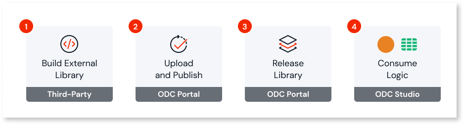

# Extend your apps with custom code

You can use External Logic when you need to extend OutSystems Developer Cloud (ODC) apps with custom code (C#). This lets you extend apps to cover use cases that can't be fully covered using the built-in functions and out-of-the-box libraries bundled with ODC. Along with writing your own C# code in IDEs such as Visual Studio or Jet Brains Rider, you can use open-source .NET libraries.

Your apps consume logic built in C# the same way they consume logic from libraries built in the OutSystems visual language or [out-of-the-box libraries](../../reference/libraries/intro.md). This means OutSystems developers consuming those libraries don't need to understand the underlying C# code to use external logic in their apps. The C# code becomes available in libraries as server actions and structures.

When you want to create new external logic or update existing external logic, follow these steps:

1. Build the logic in C# using the External Libraries Source Software Development Kit (SDK).
1. Upload and publish the logic as an external library using the ODC Portal.
1. Release the library in ODC Portal.
1. Consume the logic in your apps and libraries built in OutSystems using ODC Studio.

## Build the external logic

The OutSystems External Libraries SDK is a stand-alone kit for building logic in C# that you can expose to ODC apps.

Because it's a stand-alone kit, the C# developer doesn't need an ODC organization account to use it.

The [documentation for the SDK](README.md) guides the C# developer through from creating the project to packaging the built logic into a ZIP file ready to upload to the ODC Portal. The C# developer can upload the ZIP file to the ODC Portal themselves (if they have an ODC organization account) or share it with a colleague.

## Upload and publish the external logic { #upload-external-logic }

To complete this step you need permission to create and change libraries in the ODC Portal. To get the necessary permissions, speak to an administrator from your ODC organization.

Once you have the ZIP file of the logic created using the OutSystems External Libraries SDK, you need to upload and publish it as an external library.

To do this, select **External Logic** from the left nav menu in the ODC Portal to open the External Logic screen. You see a list of pending uploads and published external libraries. Now follow this procedure.

1. Click the:

    * **Create library** button to create a new external library.
    * **Upload new revision** button within the detail page of the external library to update an existing external library. You access the detail page by clicking the library name in the list of published external libraries.

    In both cases the **Upload file** screen displays.

1. Click the **Upload file** button to browse for the ZIP file or drag and drop it to the labeled area. The ZIP file must be less than 90MB. Then click **Continue**.

    A spinning wheel shows the status of the file upload and inspection process. You can continue working on other tasks in the ODC Portal during the process.

1. If there are errors in the code, the **View errors** button displays. Click the button to see the full list of errors. You must fix the errors in the C# code before you can proceed. Use the [error page documentation](../../../error/elg/intro.md) for guidance. Once you've fixed all the errors, click **Upload other file** button to upload the revised ZIP file.

    

    You can get a real-time list of errors while working on your C# code by using the **ODC Custom Code Analyzer**, a community asset (unofficial and unsupported by OutSystems). Check out the [CustomCode-Analyzer readme](https://github.com/jonathanalgar/CustomCode-Analyzer?tab=readme-ov-file#how-to-use) to learn how to use the extension. You can get help or share your feedback in the [Community Forum post](https://www.outsystems.com/forums/discussion/100963/odc-external-libraries-custom-code-analyzer/).

    

1. When the C# code is error-free, the **Review file contents** button displays. Click the button to see a full list of all the server actions and structures exposed through the generated external library. When ready to start the publish process click the **Publish library** button (displays for new library) or **Publish revision** button (displays for updated library).

1. The deployment status screen displays. The deployment status of the external library is one of the following:

    * **Running**: the deployment is in progress; please wait for it to finish.
    * **Finished with errors**: the deployment has finished, but it wasn't successful. Review the errors. Use the [error page documentation](../../../error/elg/intro.md) for guidance.
    * **Finished successfully**: the deployment finished successfully. The external library is available to consume in your apps and libraries built in OutSystems.

The external library is initially deployed to the Development stage (published). Once published, it's recommended you test the library in an app before releasing the first stable version. To do this, open the **Version history** tab on the detail page for the library, click the ellipsis next to the release date, and select **Try library in an app**. This launches a test session in ODC Studio, see [Test a revision of a library](../libraries/libraries.md#test-a-revision-of-a-library) for best practices on what type of app to use.

## Release the library

You can then use the **Release library** button on the detail page in ODC Portal to release the first version. Follow the guidance under [Release a new version of a library](../libraries/libraries.md#release-a-new-version-of-a-library) for more details.

When an app or library that consumes the external library is deployed to another stage, the external library is automatically deployed to that stage as well.

## Consume the external logic

Once successfully published and released, the external logic becomes available in a library to consume across your ODC organization's apps and existing libraries. To learn how to consume the exposed server actions in your apps and libraries using ODC Studio, see [Use public elements](../libraries/use-public-elements.md#libraries).

The server actions and structures exposed through external libraries are read-only and can't be edited in ODC Studio.

## Share the external logic

You can share an external library outside your organization by submitting it to Forge. You follow the same process to [submit or update](../forge/submit.md) an external library to Forge as for an asset developed in OutSystems.

Users outside your organization follow the same process to [install](../forge/install.md) an external library as for an asset developed in OutSystems. As with users in your organization, users who consume the external library from Forge can't edit the external logic in ODC Studio.

## Delete external logic

To delete an external library before has been published, follow these steps:

1. Go to the ODC Portal, and from the Navigation menu, select **External Logic** to display the list of pending uploads and published external libraries.
1. In the pending uploads list, click **X** next to the external library you want to delete to display a confirmation popup.
1. Click **Cancel creation** to display the updated list.

If you want to delete an external library after its published, the process is similar to deleting an app or library developed in OutSystems. Follow these steps:

1. Go to the ODC Portal, and from the Navigation menu, select **External Logic**  to display the list of pending uploads and published external libraries.
1. Access the detail page of the library by clicking its name in the list of published libraries.
1. Click the ellipsis (3-dots) to the right of the library name, then click the **Delete library** button to display a confirmation popup.
1. Enter the library name and click **Delete library** to display the updated list.

Deleting an external library impacts consumers relying on it.

For more information about deleting published assets, refer to [Deleting apps and libraries](../../deleting-apps/intro.md) for guidance.
