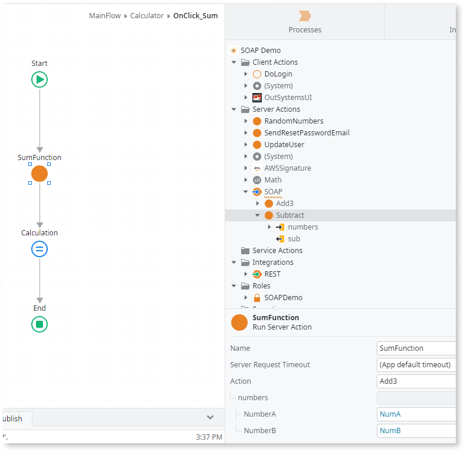

# Supporting SOAP in ODC

OutSystems Developer Cloud (ODC) lets you use Simple Object Access Protocol (SOAP) by creating a high-code solution and extending your code library. This document provides an example of how to create a library to consume a SOAP web service in ODC. This article assumes you are familiar with C#, .NET and SOAP. You can download the [SOAP demo OML example](resources/SOAP-Demo.oml).

## Prerequisites

Ensure you have installed the prerequisites to [extend your apps with external logic](./README.md#Prerequisites). Then in Visual Studio Code, go to the extensions marketplace and search for and install the following extensions:

* C# (extension id: ms-dotnettools.csharp)
* NuGet Package Manager GUI (extension id: aliasadidev.nugetpackagemanagergui)

### Install .NET tools to create a library

Select the folder in which you want to create your SOAP integration. Create a folder and give it a descriptive name, such as how-to-soap. Then go to the Visual Studio Code terminal, and enter the following command:
`cd path-to/<your-folder>`

1. To work with SOAP web services using the command line, install the WCF dotnet-svcutil tool for .NET. However, run the following command to ensure you have the WCF dotnet-svcutil tool installed.

    `dotnet tool install --global dotnet-svcutil`

2. To add the dependencies, use either the terminal or the NuGet Package Manager GUI using CTRL +SHIFT + P. Then install the following dependency:

`dotnet add package OutSystems.ExternalLibraries.SDK`

## Consume SOAP web service as an external library in ODC

To create a library that consumes a SOAP web service, follow this process:

1. [Create a library using C#](#create-a-library-using-c)
2. [Upload the library to ODC Portal](#upload-the-library-to-odc-portal)
3. [Use the actions from the library to consume the SOAP web service](#use-the-external-library-in-odc)

## Create OutSystems external library

To create an OutSystems external library that consumes SOAP web service in C#, follow this process:

1. [Set up the project](#set-up-the-project)
2. [Define the methods interface](#define-the-methods-interface)
3. [Import the images resources](#import-the-images-resources)
4. [Add the calculator SOAP web service](#add-the-calculator-soap-web-service)
5. [Call the SOAP web service](#call-the-soap-web-service)
6. [Release the SOAP web service](#release-the-soap-web-service)

### Set up the project

To install your web service and create the structures to be used by the interface, follow these steps:

1. To install your web service using svcutil, open the Visual Studio Code terminal and run the following command.

    `dotnet-svcutil https://<YOUR WSDL>`

    

    You can use a free [SOAP WSDL](https://ecs.syr.edu/faculty/fawcett/Handouts/cse775/code/calcWebService/Calc.asmx) available for testing purposes.

    

2. To create your library using the class library template, run the following code. Give the project a name, such as ConsumeSOAPExample and select .NET 6.0 (Long-term support) as the framework.

    `dotnet new classlib --language "C#" --framework "net6.0" -o ConsumeSOAPExample`

3. Create a new folder named **Structures** inside the ConsumeSoapExample folder. Create a new file called **Numbers.cs** within the Structures folder. Then copy and paste the following code to create and map the structures as OutSystems structures.
    
        using OutSystems.ExternalLibraries.SDK;
    
        namespace ConsumeSOAPExample.Structures 
        {
            // Its exposed as a structure to your ODC apps and libraries.
            [OSStructure(Description = "Number A & B")]
            public struct Numbers 
            {
                // Gets Number A & B to do the sum.
                [OSStructureField(DataType = OSDataType.Integer, Description = "Number A.", IsMandatory = true)]
                public int NumberA;
    
                [OSStructureField(DataType = OSDataType.Integer, Description = "Number B.", IsMandatory = true)]
                public int NumberB;
            }
        }

In the previous code, you defined a structure with two integer attributes (NumberA & NumberB). To learn more, see [available data types in the custom code SDK](https://github.com/OutSystems/OutSystems.ExternalLibraries.SDK-templates#3-usage).

### Define the methods interface

To define the method interface, follow these steps:

1. Add the following dependencies:
    
        using System.Xml;
        using System.ServiceModel;
        using ServiceReference;
        using OutSystems.ExternalLibraries.SDK;
        using ConsumeSOAPExample.Structures;
    
2. Rename the file from Class1.cs to ConsumeSOAPExample.cs.

3. Add an interface named **ICalculator** before the class in the namespace.

        namespace ConsumeSOAPExample 
        {
            public interface ICalculator
            {
    
            }
            public class Class1
            {
                
            }
        }

4. Add the custom code attributes from the OutSystems External Libraries SDK before the interface. 
    * The OSInterface includes several properties that ODC uses to define the library name, description, and icon to identify the interface.
   
            namespace ConsumeSOAPExample {
                /* In this case, the OSInterface attribute provides information about the Calculator interface to the ODC,
                    which uses this information to create an integration layer with a SOAP web service. */
                [OSInterface(Description = "Consume a Free SOAP web service in OutSystems Developer Cloud (ODC).", IconResourceName = "ConsumeSOAPExample.Resources.Soap.png", Name = "SOAP")]
                public interface ICalculator
                {
                }
            }

5. Inside the interface, add the two methods that represent the web service's methods.

        // This method is exposed as a server action to your ODC apps and libraries.
        [OSAction(Description = "The sum method takes two numbers as input parameters and returns their sum.", IconResourceName = "ConsumeSOAPExample.Resources.SOAP.jpg", ReturnName = "sum")]
        int Sum(
            [OSParameter(Description = "Number A & B as an integer")] Structures.Numbers numbers
        );
        // This method is exposed as a server action to your ODC apps and libraries.
        [OSAction(Description = "The subtraction method takes two numbers as input parameters and calculates the difference between the first number and the second number.", IconResourceName = "ConsumeSOAPExample.Resources.SOAP.jpg", ReturnName = "sub")]
        int Subtract(
            [OSParameter(Description = "Number A & B as an integer")] Structures.Numbers numbers
        );

### Import the images resources

In the interface, there are several icon resources. The icons are available in the [Sample project](resources/SOAP-Demo.oml). To import the resources, follow these steps:

1. After you download the icons into your project, create a new folder and name it **Resources**. Then upload the icons to the Resource folder.

2. To add these resources to the project, open ConsumeSOAPExample.csproj and add the following code inside the ItemGroup tag:
    
        <EmbeddedResource Include="Resources\add.png" />
        <EmbeddedResource Include="Resources\Soap.png" />
        <EmbeddedResource Include="Resources\sub.png" />   
    
### Add the calculator SOAP web service

To add the calculator SOAP web service, name the class **Calculator** and the interface **ICalculator**.  

        namespace ConsumeSOAPExample 
        {
            ...
            public class Calculator : ICalculator
            {
               ...
            }
        }

### Call the SOAP web service

To call the SOAP web service, follow these steps:

1. In the ICalculator interface, define the necessary properties for calling the SOAP web service.

        // Add calculator web service Soap Channel
        private static readonly string ENDPOINTADDRESS = "<https://ecs.syr.edu/faculty/fawcett/Handouts/cse775/code/calcWebService/Calc.asmx>";
        private static readonly int TIMEOUT = 1000;
        private readonly BasicHttpBinding _binding;
        private readonly EndpointAddress_address;
    
2. To create the request and add the properties for the BasicHttpBinding.

    * Define properties for the BasicHttpBinding.
    * Define the security mode and the endpoint address by adding the following lines after the BasicHttpBinding object. Add the following code:
    
            public class Calculator : ICalculator 
            {
                public Calculator()
                {
                    _binding = new BasicHttpBinding
                    {
                        SendTimeout = TimeSpan.FromSeconds(TIMEOUT),
                        MaxBufferSize = int.MaxValue,
                        MaxReceivedMessageSize = int.MaxValue,
                        AllowCookies = true,
                        ReaderQuotas = XmlDictionaryReaderQuotas.Max,
                        Security = new BasicHttpSecurity
                        {
                        Mode = BasicHttpSecurityMode.Transport
                        }
                    };
                    _address = new EndpointAddress(ENDPOINTADDRESS);
                }
            }
    
3. 	To use the add method to perform a sum, define a private asynchronous method called **AddAsync** that takes in a single parameter of type Numbers.Add the following code:  
    * To simplify the method, you can use two input parameters. However, this template showcases the usage of structures.
    * The first parameter is an object of type Numbers (defined in the OutSystems.SOAP.Structures namespace), and it contains two integers, NumberA and NumberB. 
    * The second parameter is an output parameter of type int that contains the sum of NumberA and NumberB.
    * The method returns a Task &#60;int&#62; object, which is a wrapper for the result of the asynchronous operation defined in the SOAP web service. 

            public int Sum(Numbers numbers)
            {
                /* This line calls the AddAsync method (defined later in the code), which asynchronously calls a SOAP service to add NumberA and NumberB.Once the result is returned, it is stored in the sum variable. */
                return AddAsync(numbers).Result;
            }
            private async Task<int> AddAsync(Numbers numbers)
            {
                /* This line creates a new instance of the CalculatorWebServiceSoapClient class, which is generated by dotnet-svcutil when you add a reference to a SOAP service. The using statement ensures that the proxy is properly disposed of when the method completes. */      
                using (var proxy = new CalculatorWebServiceSoapClient(_binding, _address))
                {
                    /* This line asynchronously calls the AddAsync method of the CalculatorWebServiceSoapClient class, passing in NumberA and NumberB from the numbers parameter. The await keyword suspends the execution of the method until the result is returned from the service. */
                    var result = await proxy.AddAsync(numbers.NumberA, numbers.NumberB);
                    return result;
                }
            }

4. 	To use the Subtract method to perform a subtraction, define a private asynchronous method called **SubAsync** that takes a single parameter of type Numbers. Add the following code: 
    * The input parameter is a structure that contains two numbers and returns the subtraction of those two numbers.
    * The first parameter is an object of type Numbers (defined in the OutSystems.SOAP.Structures namespace) and contains two integers, NumberA and NumberB. 
    * The second parameter is an output parameter of type int that contains the sub of NumberA and NumberB. 
    * The method returns a Task &#60;int&#62; object, which is a wrapper for the result of the asynchronous operation defined in the SOAP web service. 
            
            public int Subtract(Numbers numbers)
            {
                /* This line calls the AddAsync method (defined later in the code), which asynchronously calls a SOAP service to add NumberA and NumberB.Once the result is returned, it is stored in the sum variable. */
                return SubtractAsync(numbers).Result;
            }
            private async Task<int> SubtractAsync(Numbers numbers)
            {
                /* This line creates a new instance of the CalculatorWebServiceSoapClient class, which is generated by dotnet-svcutil when you add a reference to a SOAP service. The using statement ensures that the proxy is properly disposed of when the method completes. */      
                using (var proxy = new CalculatorWebServiceSoapClient(_binding, _address))
                {
                    /* This line asynchronously calls the AddAsync method of the CalculatorWebServiceSoapClient class, passing in NumberA and NumberB from the numbers parameter. The await keyword suspends the execution of the method until the result is returned from the service. */
                    var result = await proxy.SubtractAsync(numbers.NumberA, numbers.NumberB);
                    return result;
                }
            }
    
### Release the SOAP web service

1. Once you finish the code, save the project and publish it. For example, right-click ConsumeSOAPExample and select **Open in Terminal**. Run the command, 
    ` dotnet publish -c Release `
2. Zip the published output folder (for example, ConsumeSOAPExample>bin>Release>net6.0>publish) to the root folder of a ZIP file. For example, ExternalLibrary.zip is the name of your external library.

## Upload the library to ODC Portal

Once you have the SOAP zip file, [upload and publish the external logic](./intro.md#Upload-and-publish-the-external-logic) in ODC.

## Use the external library in ODC Studio

After uploading the SOAP web service to ODC, create an application called **SOAP Demo** in ODC Studio to test the web service.

1. Click the **Logic tab**, right-click the top Server action, and select the option to **Add a public element**. Then inside **All sources**, search for a dependency called SOAP and select the Add, Subtract actions and the Numbers structure.
   
   

2. Create a screen and name it **Calculator** with two inputs. Set both local variables as integers, name them **NumA** and **NumB**. Place a plus sign (+) between these two inputs and an equal sign (=) after the last input.

3. Create another local variable as an integer and name it **Sum**. Drag an expression in the canvas and add the Sum variable below the equal sign.

4. Drag a button below the expression and name it **Calculate**. In the **On Click** list, select **New Client Action** and name it **OnClick_Sum**. New Client Action opens for editing.
    
    

5. Inside the **OnClick_Sum** client action, go to the **Logic** tab > **Server actions** > **SOAP** 
    1. Drag the **Add action** to the flow and rename it **SumFunction**.
    2. In the Properties, for the Add action, click the (+) sign to expand numbers, and inside add your local variables, the NumberA and NumberB attributes.
    
    

6. Drag an assign and set the local variable **Sum** with the output of the **SumFunction** to get the sum of both numbers and present it to the screen.
7. Publish the app and see the result in the browser.

To test it faster, go to the **screen properties** > **Authorization** and set the **Accessible by** the property to Everyone. This allows any user to test it without a log in. Also, when you click the **calculate** button for the first time, it might take a few seconds to get the response.

  

