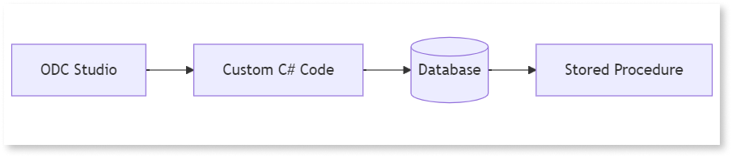

# Supporting stored procedure in ODC

Stored procedures allow you to execute a predefined set of commands as a single unit. You can encapsulate frequent complex operations making them both reusable and efficient.

In OutSystems Development Cloud (ODC) Studio, you can use stored procedures as custom code (C#) to integrate complex database operations directly into your apps. For example, if you frequently need to update multiple tables after a specific operation, you can use a stored procedure to automate this process efficiently.

[The sample code snippet](https://github.com/OutSystems/OutSystems.ExternalLibraries.SDK-templates/blob/main/templates/storedProcedure/StoredProcedure.cs) guides you on how to use stored procedures with a private gateway in SQL database. 

To learn more about custom code, refer to [Extend your apps with external logic using custom code](intro.md)
