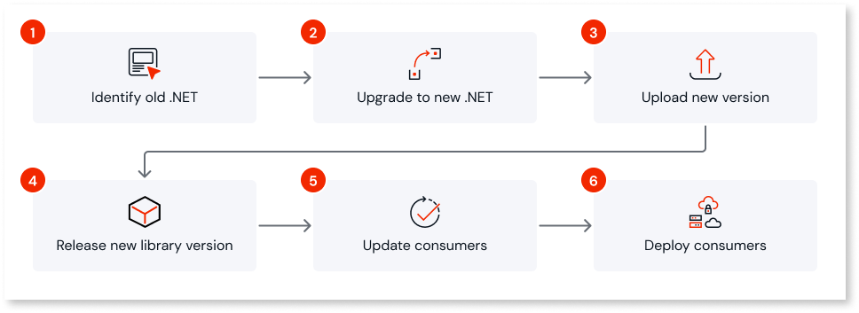
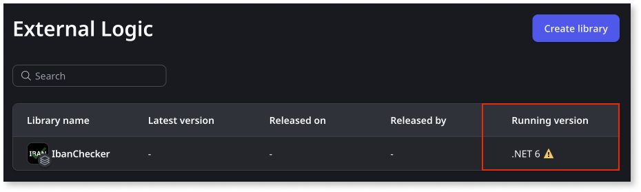

# Upgrading custom code libraries to a new .NET version

In OutSystems Developer Cloud (ODC), you extend your apps with custom code written in C# and packaged as external logic libraries that run on the .NET runtime. ODC periodically moves that custom code support to a more recent .NET version. This guide explains how those transitions work, the versions and dates that apply, and the steps to upgrade your custom code libraries with minimal disruption.

## Why upgrade

Upgrading keeps your custom code on a supported runtime. Two factors drive it:

* Microsoft ends support for each .NET version on a published schedule. For the dates, refer to [Microsoft's .NET and .NET Core lifecycle](https://learn.microsoft.com/en-us/lifecycle/products/microsoft-net-and-net-core).
* More recent .NET versions provide the latest features, security updates, and support.

## How ODC supports .NET versions

ODC supports more than one .NET version for custom code at the same time, so you can migrate gradually without disrupting other development. Each version follows the same lifecycle:

* **Availability**: the version becomes available in ODC on a set date. From that date, you can build new custom code with it and upgrade existing libraries to it.
* **Parallel support**: while a newer version and an older version are both available, you can use and maintain either one. Use this window to migrate your libraries, update their consumers, and deploy across all stages to Production.
* **Deprecation**: on its deprecation date, support for the older version ends. After that date, you can no longer upload, update, or install custom code that targets it, and OutSystems no longer ensures its functioning, maintenance, or security.

Plan your migration so all libraries and their consumers are upgraded and deployed to Production before the deprecation date.

## Supported versions and dates

The following table lists the .NET versions for custom code and their key dates. The current transition moves custom code from .NET 8 to .NET 10.

| .NET version | Available in ODC | Support ends |
| --- | --- | --- |
| .NET 10 | June 22, 2026 | To be announced |
| .NET 8 | August 7, 2024 | November 10, 2026 |

To upgrade before .NET 8 support ends, follow the steps under Upgrade your custom code libraries.

## Upgrade your custom code libraries

Follow these steps to migrate a custom code library from its current .NET version to a more recent one.

1. Identify custom code libraries that are still using the previous .NET version. You can do this in Portal, under **External Logic**. The **Running version** column shows the .NET version, with a warning for libraries that need an upgrade.

    

1. Upgrade the .NET target framework to .NET 10. For more information, refer to your IDE documentation, for example [multi-targeting in Visual Studio](https://learn.microsoft.com/en-us/visualstudio/ide/visual-studio-multi-targeting-overview). If necessary, adjust the code for the [.NET 9 breaking changes](https://learn.microsoft.com/en-us/dotnet/core/compatibility/9.0) and the [.NET 10 breaking changes](https://learn.microsoft.com/en-us/dotnet/core/compatibility/10.0). For libraries sourced from the Forge, check for updated versions.

1. [Upload the new version in Portal](intro.md#upload-and-publish-the-external-logic). This step isn't necessary if the update was sourced from the Forge.

1. [Release the new version of the library](../libraries/libraries.md#release-a-new-version-of-a-library-release-library).

1. [Update consumers to use the new version](../libraries/libraries.md#update-to-a-new-library-version-update-consumers) and test them.

1. Deploy the consumers across all stages. Ensure they reach Production to propagate the upgrade. Complete this before support for the previous version ends, so all apps continue to run smoothly.

## Recommended actions

Take these actions to keep your factory on a supported .NET version:

* Plan the upgrade across your factory as soon as a more recent version becomes available.
* Build new custom code, and updates to existing libraries, with the latest available .NET version to minimize later migration effort.
* Upgrade existing libraries, update their consumers, and deploy to Production before the deprecation date.
* Forge asset owners: upgrade your assets so consumers have time to test and roll out across the pipeline.
