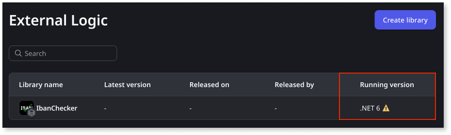

# Upgrading custom code libraries to .NET 8

OutSystems Developer Cloud is transitioning from supporting .NET 6 to .NET 8 for custom code. This guide provides essential information to manage this migration effectively, ensuring minimal disruption and a smooth transition through the outlined phases.

**Reasons for the upgrade**:

* Microsoft is discontinuing .NET 6 [Learn more](https://learn.microsoft.com/en-us/lifecycle/products/microsoft-net-and-net-core).
* Ensuring the latest features, security updates, and support by adopting .NET 8.

## Plan for the upgrade phases { #plan }

The discontinuation of .NET 6 will imply that, apart from building new custom code libraries in .NET 8, you’ll also need to plan to migrate your existing .NET 6 custom code to .NET 8.
Planning this migration is important to ensure that other development activities are not disrupted by the requirement to migrate to .NET 8. For example, facing the need to use .NET 8 when fixing a bug.
ODC will support, for a period of time, both .NET versions to allow for time to migrate and update consumers with minimal disruption to the development lifecycle.

Take the following steps into account when planning the upgrade:

1. Identify custom code libraries that are still using .NET 6. This can be done in Portal, at **External Logic**. The **Running version** on the list shows the .NET version along with a warning for the ones still in .NET 6. 

    

1. Upgrade the .NET target framework to .NET 8. For more information, check the IDE documentation. For example, [Visual Studio](https://learn.microsoft.com/en-us/visualstudio/ide/visual-studio-multi-targeting-overview). If necessary, adjust the code for breaking changes in [.NET 7](https://learn.microsoft.com/en-us/dotnet/core/compatibility/7.0) and [.NET 8](https://learn.microsoft.com/en-us/dotnet/core/compatibility/8.0). In the case of libraries sourced, from the Forge, check for updated versions.

1. [Upload the new version in Portal](intro.md#upload-external-logic). This step is not necessary if the update was sourced from the Forge.

1. [Release the new version of the library](../libraries/libraries.md#release-a-new-version-of-a-library).

1. [Update consumers to use the new version](../libraries/libraries.md#update-consumers) and test them.

1. Deploy the consumers across all stages. You should ensure they reach Production to propagate the upgrade to all stages. This will naturally be done at your own pace but should be completed by [phase 2](#phase-2) to ensure all apps continue to run smoothly.

### Phase 1: introduction of .NET 8 support

**August 7, 2024**

In this phase, support for .NET 8 is introduced. It’s strongly recommended to start planning migrating existing custom code.

* Developers can start using .NET 8 for new custom code or updates on existing custom code.
* Forge allows for .NET 8 custom code libraries to be uploaded.
* You can still upload and maintain .NET 6 custom code. It’s advised to take the opportunity to use .NET 8 for new custom code and updates on existing custom code.

**Recommended actions**

* [Plan the upgrade](#plan) across your factory.
* Begin new projects and updates in existing projects in .NET 8 to minimize later efforts. In the next phase, upload of .NET 6.0 will be blocked.
* If you're creating a new custom code library, use .NET 8 to avoid future migration efforts.
* Forge asset owners are strongly encouraged to upgrade their assets, ensuring their consumers have ample time to test and rollout across the pipeline.

**Support**: Full support for both .NET 6 and .NET 8 during this phase.

### Phase 2: deprecation of .NET 6 { #phase-2}

**December 20, 2024**

At phase 2, the support for .NET 6 is dropped and it will no longer be possible to:

* upload new custom code (or new versions) in .NET 6.
* upload new custom code libraries built in .NET 6 or update existing Forge assets using .NET 6
* install the custom code Forge libraries that haven't been upgraded to .NET 6 

OutSystems no longer ensures the proper functioning, maintenance and security of custom code libraries that weren't upgraded.

**Recommended actions**

* Have all your custom code libraries upgraded by this date.
* Make sure the consumers are also all updated and deployed to all stages.

**Support**: Only .NET 8 is fully supported.
