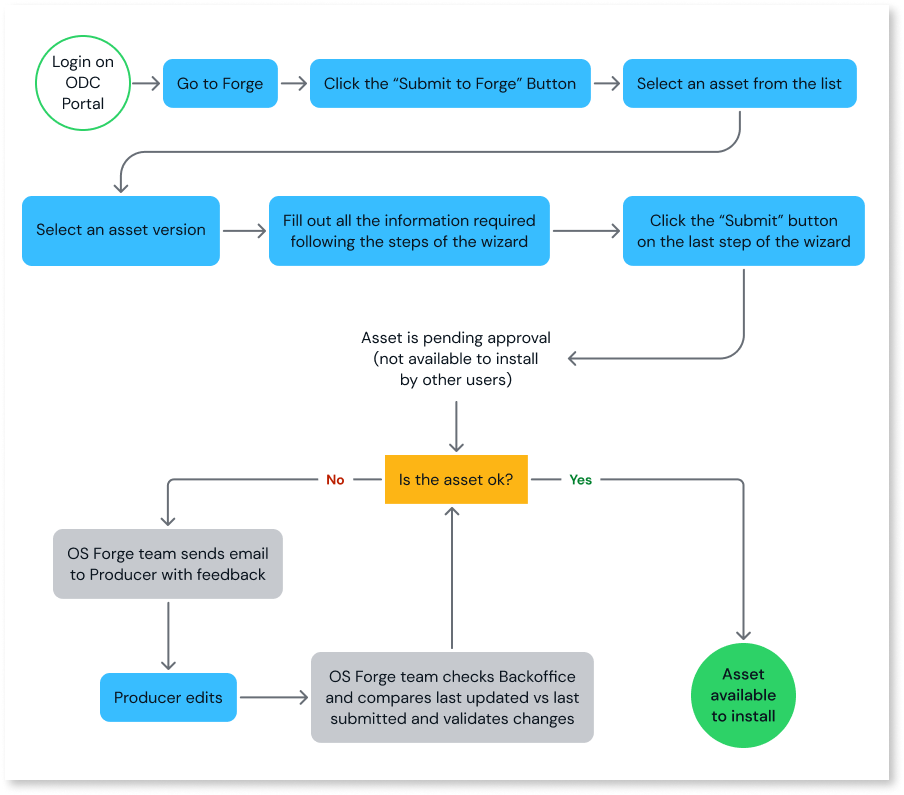

# Submit assets to Forge

Forge is a repository of reusable software assets that help overcome technical challenges and helps to solve business use cases. OutSystems enables you to easily and quickly learn how to build and share an asset in Forge nd scale the number of out-of-the-box solutions in the community. Users who build assets in their organization can submit them seamlessly while guided to follow the standards required by the Forge.

The following diagram shows the asset submission journey. The journey is slightly different for new assets and updates to existing assets.

When you submit a new asset, it gets reviewed by the OutSystems Forge team to make sure it meets the requirements. The asset is added to the Forge Repository, and from ODC Portal, you can see it in Forge and edit the information on the detail page. The asset is only visible to you (the owner) and not to users outside your organization. Once it's approved, all users outside your organization can access your asset. Users see an **Install** button on the asset. If it's a new version, users see an **Update** button, indicating that a new version of the asset is available to install.

## Prerequisites

To submit an asset, your asset must meet the following prerequisites:

* Asset names must be unique. The name can't be the same as a name used for a previously submitted Forge asset.
* Submit any dependencies first because you can’t proceed with submission if you’re missing a dependency.
* Assets must have a short description and an icon that you can edit in the original asset.
* Assets must be versioned except for App Templates that are versioned by Forge. Versioning assets is slightly different for apps and libraries.
    * To version libraries, [release them](../libraries/libraries.md#release-library).
    * To version apps, [deploy them](../../deploying-apps/deploy-apps.md) from the Deployment console to production.

## Submit an asset to Forge

In ODC Portal, you can submit assets to Forge without needing to upload your assets. When you access Forge, in **All assets** you can see all the assets available to install. And at **My assets** the ones that are installed at your ODC organization, as well as the ones your organization submitted to Forge

By default, the asset name, icon, and short description are defined during development. If you want to change them later, you can create a new version with the changes and submit it. The short description displays on the asset's card

1. Log into ODC Portal and select **All assets**, from the navigation menu. A list of assets available to install on your organization displays.  
1. From the top right, click the **Submit to Forge** button. A list of assets developed in your organization displays. Assets that display as disabled don't meet the prerequisites. When you hover over an asset, a tooltip displays and provides guidance about how to enable the asset.
1. From this list of assets, select the one you want to submit.
1. Select the asset version. 
1. Click **Continue**. The wizard proceeds to **Analyze requirements & dependencies**.
   1. If the asset consumes dependencies that aren't yet submitted to Forge, the wizard indicates the missing assets. For each dependency, Forge validates that the prerequisites are met so the asset can be submitted.
   1. If all the dependencies are already in Forge, or the asset doesn't consume any, you can continue.
1. In the wizard, enter a detailed description of your asset. Your description should describe the asset's features and any problem(s) it solves.
1. If the asset is a library, select the library type that the filters will use on the **All assets** page.
1. Add images that best illustrate the asset's features, main use cases, and behavior.
1. Add any limitations that might exist, such as images not resizing correctly in some browsers.
1. Optionally, edit the License.
1. Add the team contact.
1. Add clear and concise documentation to guide developers on how to install and configure the asset and general instructions on how to use it.
1. In the last step, the wizard displays a preview of the assets detail page for you to review.
1. Click **Submit** to finalize the process.

## Submit a new version to Forge

When an asset gets updated, resubmit it to Forge to share the changes. The updated asset must have the same name as the original asset.

Follow these steps to submit a new version of your asset:

1. From the top right, click the **Submit to Forge** button. A list of assets developed in your organization displays.
1. From this list of assets, select the asset with the new version that you want to submit.
1. Select the asset version. 
1. Click **Continue**. The wizard proceeds to **Analyze requirements & dependencies**.
   1. If the asset consumes dependencies that aren't yet submitted to Forge, the wizard indicates the missing assets. For each dependency, Forge validates that the prerequisites are met so the asset can be submitted.
   1. If all the dependencies are already in Forge, or the asset doesn't consume any, you can continue.
   1. If the asset consumes dependencies that aren't yet submitted to Forge, a pop-up displays indicating the missing assets. For each dependency, Forge validates that the prerequisites are met so the asset can be submitted.
1. In the wizard, enter a detailed description of your asset. Your description should describe the asset's features and any problem(s) it solves.
1. If the asset is a library, select the library type that the filters will use on the **All assets** page.
1. Review the images that best illustrate the asset's features, main use cases, and behavior.
1. Verify the release notes have information that describes the changes made to the asset.
1. Review the License if changes were made.
1. Optionally, add or edit the team contact.
1. Verify the documentation of the asset and update it if necessary.
1. In the last step, the wizard displays a preview of the assets detail page for you to review.
1. Click **Submit** to finalize the process.
