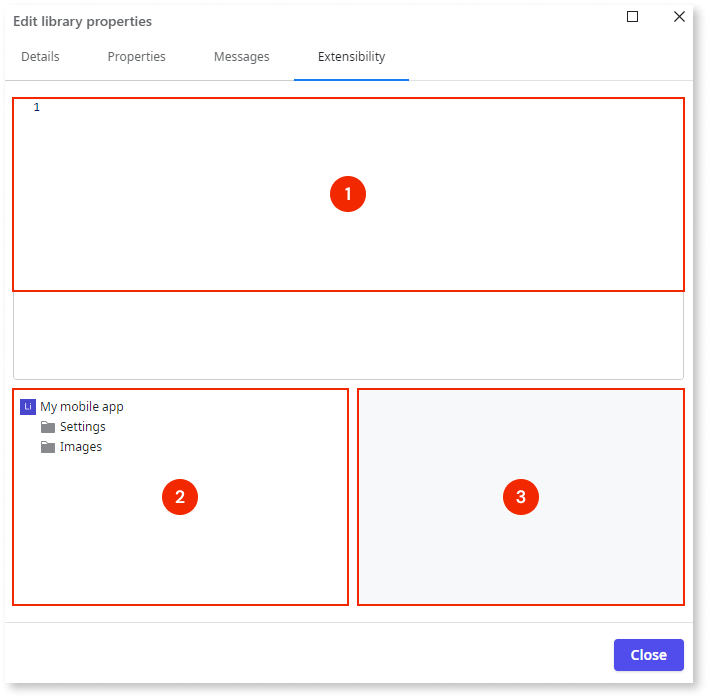

# Edit app and library properties

This article demonstrates how you can edit the app and library properties (i.e. the  metadata) in ODC.
<iframe src="https://player.vimeo.com/video/1069574566" width="750" height="422" frameborder="0" allow="autoplay; fullscreen" allowfullscreen="">How to edit the app and library properties - Metadata</iframe>

The **Edit app properties** and **Edit library properties** dialog lets you configure your app and library components in ODC Studio. Using different tabs, you can edit **Details**, **Properties**, **Messages** and, **Extensibility** properties.

After setting the properties, no save action is necessary. These changes save automatically.

## Access app and library properties

One way to access the dialog is to open your app and then click the **Edit app properties** or the **Edit library properties** icon.

## Edit app properties

### Details

On the **Details** tab, you can modify the following:

* Icon
* Primary color
* Name
* Description

### Properties

On the **Properties** tab, you can modify the following:

Defaults

* Default Theme
* Default Screen
* Splash Screen
* Global Exception Handler
* Default Transition
* Server Request Timeout

Required Scripts

* Add Required Script

### Messages

On the **Messages** tab, you can modify the following:

Validation Messages

* Mandatory Input
* Invalid Integer
* Invalid Decimal
* Invalid Currency
* Invalid Date
* Invalid Time
* Invalid DateTime
* Invalid Text
* Invalid Phone
* Invalid Email

**Upgrade Messages**:

* Upgrade Complete
* Upgrade Failed
* Upgrade Failed on Resources
* Upgrade Failed on Data Model
* Upgrade Required
* Upgrade Required with Data Loss

## Edit library properties

### Details

Refer to Edit app properties.

### Properties

On the **Properties** tab, you can modify the following:

Defaults

* Default Theme
* Global Exception Handler
* Default Transition
* Server Request Timeout

Required Scripts

* Add Required Script

### Messages

On the **Messages** tab, you can modify the following:

Validation Messages

* Mandatory Input
* Invalid Integer
* Invalid Decimal
* Invalid Currency
* Invalid Date
* Invalid Time
* Invalid DateTime
* Invalid Text
* Invalid Phone
* Invalid Email

### Extensibility

In the library dialog, the **Extensibility** tab includes the following:

* A JSON text editor that checks your syntax (1).
* A context pane with items you can reference by dragging or double-clicking (2).
* A details pane that lets you view the properties without closing the editor (3).

