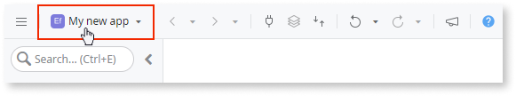

# Edit app, library, and mobile library properties

This article demonstrates how you can edit the app, library, and mobile library properties, that is, the metadata in ODC.

You can configure and manage your mobile app’s configuration from  **Edit app properties** (or Edit library properties, if you are editing a library) dialog. To access the app properties, open ODC Studio, click your app name, and select **Edit app properties**.

The app properties is organized into **General** and **Mobile** settings:

* **General** - Settings that apply to both web and mobile apps, such as app details, validation messages, and advanced settings.
* **Mobile** - Settings specific to mobile apps, such as appearance, permissions, offline data sync, and extensibility.

After configuring the settings, no save action is necessary. These changes save automatically.

## Access app, library, and mobile library settings

To edit the properties, follow these steps:

1. Go to ODC Studio.
1. Depending on what you want to edit, click the app, or library, or mobile library.
   The **Edit app properties** dialog box is displayed.

## General properties {#general-settings}

The following sections describe settings that apply to all app types.

### Details {#app-details}

On the **Details** page, you can configure your web or mobile app's identity and branding.

The following table describes each setting on the **Details** page:

| Setting | Description | Considerations |
| :---- | :---- | :---- |
| **Icon** | The app icon displayed on the device home screen and in ODC Portal. Upload a PNG, JPG, or GIF file up to 512KB. | Use a square image with a transparent background for best results across platforms. |
| **Primary color** | The color associated with the app. Affects the splash screen background and status bar default color. | Choose a color that aligns with your brand guidelines. |
| **Name** | The internal app name used in ODC Studio and ODC Portal. | Changing the name doesn't affect the display name shown to end users on their devices. |
| **Description** | A free-text description of the app. | Use this field to help team members identify the app's purpose. |

### Messages {#app-messages}

On the **Messages** tab, you can customize the messages that appear when end users submit invalid input in forms or when the app requires an upgrade.

The following table describes each validation message:

| Setting | Default value | When it appears |
| :---- | :---- | :---- |
| **Mandatory Input** | `The field is required.` | When a required field is left empty. |
| **Invalid Integer** | `Enter a valid integer.` | When the input doesn't match an integer format. |
| **Invalid Decimal** | `Enter a valid decimal.` | When the input doesn't match a decimal format. |
| **Invalid Currency** | `Enter a valid currency.` | When the input doesn't match a currency format. |
| **Invalid Date** | `Enter a valid date.` | When the input doesn't match a date format. |
| **Invalid Time** | `Enter a valid time.` | When the input doesn't match a time format. |
| **Invalid DateTime** | `Enter a valid time.` | When the input doesn't match a date and time format. |
| **Invalid Text** | `Enter valid text.` | When the input doesn't match the expected text format. |
| **Invalid Phone** | `Enter a valid phone number.` | When the input doesn't match a phone number format. |
| **Invalid Email** | `Enter a valid email address.` | When the input doesn't match an email format. |

Customize these messages to match your app's language, tone, or branding requirements.

The following table describes each upgrade message. These upgrade messages do not apply to mobile library and general-purpose library.

| Setting | Description |
| :---- | :---- |
| **Upgrade Complete** | Displayed when the app finishes upgrading to a newer version. |
| **Upgrade Failed** | Displayed when the app upgrade fails. |
| **Upgrade Failed on Resources** | Displayed when the app upgrade fails due to a resource loading error. |
| **Upgrade Failed on Data Model** | Displayed when the app upgrade fails due to a data model incompatibility. |
| **Upgrade Required** | Displayed when the app detects a mandatory upgrade is available. |
| **Upgrade Required with Data Loss** | Displayed when a mandatory upgrade is available and the upgrade causes local data loss. |

### Advanced settings {advanced-settings}

You can use the **Advanced settings** page to configure default behaviors and required resources for your app.

The following table describes each setting on the **Advanced settings** page:

| Setting | Description | Default value |
| :---- | :---- | :---- |
| **Default Theme** | The theme applied to all screens in the app. Controls the visual appearance such as colors, fonts, and spacing. | The theme included with the app template. |
| **Default Screen** | The first screen that loads when the app opens. This is the home screen of your app. | The first screen in the main flow. |
| **Splash Screen** | The splash screen displayed when loading a website. For mobile apps, the splash screen is configured in [app settings](../../building-apps/mobile/configuring-mobile-apps.md#splash-screen-splash-screen). For detailed information about customizing splash screen for mobile apps, refer to [Customize splash screen](../../building-apps/mobile/configure-splash-screen.md) | The default splash screen included with the app template. |
| **Global Exception Handler** | The action that runs when an unhandled exception occurs anywhere in the app. | `Common\OnException` |
| **Default Transition** | The screen transition animation used when navigating between screens. Options include **Slide from Right**, **Fade**, and others. | Slide from Right |
| **Default Timeout in seconds** | The maximum time, in seconds, that the app waits for a server request to complete before timing out. | `10` |
| **Required Scripts** | External JavaScript files that the app loads at startup. Use this to include third-party libraries or analytics scripts. | None |

For detailed information about settings specific to mobile apps, refer to [Mobile settings](../../building-apps/mobile/configuring-mobile-apps.md#mobile-properties-mobile-settings).

## Edit library properties

### Details

On the **Details** page, you can configure your general-purpose library and mobile library's identity and branding. For detailed information, refer to [Details](#details-app-details)

### Messages {library-messages}

On the **Messages** page, you can customize the validation messages that appear when end users submit invalid input in forms. The available messages for general-purpose library and mobile library are the same as the app [Messages](#messages-app-messages).

### Advanced settings {library-properties}

On the **Advanced settings** page, you can configure default behaviors and required resources for your library. The available settings for general-purpose library and mobile library are the same as the app [Advanced settings](#advanced-settings-advanced-settings).

### Extensibility settings

The extensibility settings page applies only to mobile library.

On the **Extensibility settings** page, you can configure your plugins's extensibility configurations. For detailed information about configuring extensibility, refer to [Configure extensibility configurations](../../building-apps/mobile/configuring-mobile-apps.md#configure-extensibility-configurations-configure-extensibility).

## Related resources

The following resources provide additional details on configuring your apps:

* [Mobile settings](../../building-apps/mobile/configuring-mobile-apps.md#mobile-settings-mobile-settings)
