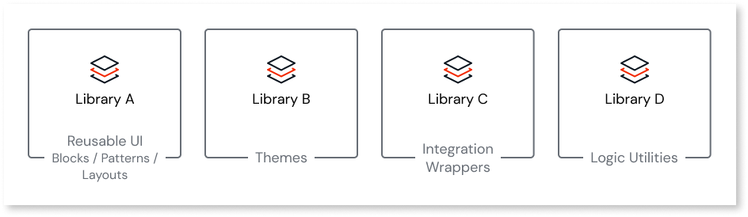
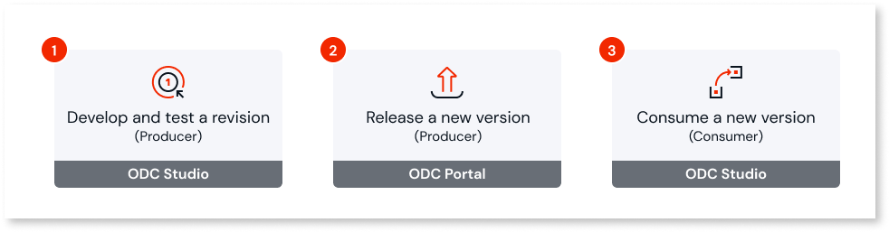
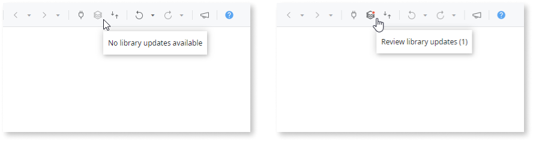

# Libraries

Libraries are a core building block for OutSystems Developer Cloud (ODC) developers and serve as **repositories of reusable UI and logic elements**.

Important for promoting code reusability and maintainability, libraries allow developers to create consistent apps quickly. By using libraries, organizations can reduce overall app development time.

ODC helps you design and develop libraries to be **reusable in various business contexts and scenarios**. For example, a library developed for data processing should work equally well whether the data relates to an organization's finance or sales department.

Libraries are **stateless by design**, which means they can't persist data. Not storing data ensures libraries act solely as providers of functionality and logic, leaving the data management and storage to the apps. This reduces complexity and enhances modularity and reusability.

Common use cases for libraries include:

* As a wrapper around an external system. A library can act as middleware between your apps and an external system (a RESTful service, for example) by abstracting and centralizing the layer consumed by different apps.
* As a repository of business style guides and themes. This enables the implementation of desired visuals for reuse across your organization's app portfolio.

OutSystems Developer Cloud (ODC) elevates the library to a **top-level concept**. Libraries exist at the same level as Web Apps and Mobile Apps and have an **independent lifecycle**. For more information on how to think about libraries in the context of your app's architecture, see [App Architecture](../../app-architecture/intro.md#libraries-in-odc--libraries-).

## Libraries versioning

Versioning enables systematic updates and integration of your library's elements into apps and other libraries within your organization. This **ensures consistency and prevents unexpected breaking changes** within the development environment. Versioning applies to all types of libraries in ODC organization: libraries you create, system libraries that OutSystems provides (OutSystems UI, for example), and [external logic libraries](../external-logic/intro.md).

The concept of **versioning is core to the development lifecycle of a library**, forming a cyclical process comprised of three main steps. First, the [revision of a library is iteratively developed and tested](#test-a-revision-of-a-library) to ensure its functionality and stability. Once tested successfully, a [new version of the library can be released](#release-a-new-version-of-a-library) for use. Lastly, developers [decide whether to use this new version](#decide-if-to-consume-a-new-version-of-a-library-in-your-app-or-library) in their apps or libraries.

After you've published and tested a library in ODC Studio, its revision number automatically increments by one, serving as a snapshot of the library's development at a particular point. The number is immutable and works the same way as the revision number of an app. At this point in the lifecycle, any published changes aren't available to other apps and libraries in your organization.

Conversely, you set the version number during a library's release and it represents a stable, consumable state of the library. When you release, the accumulated changes become available to other apps and libraries in your organization. The version number is a stable identifier that persists, marking the mature instances of the library.

Understanding the distinction and impact of revision and version numbers is key. Proper versioning ensures that changes in a library don't disrupt its consumers, allowing developers to modify libraries without inadvertently affecting dependent apps. Consuming a library at a specific version is important for maintaining app stability and reliability, enabling controlled and gradual adaptations to changes and reducing the risks associated with updates.

### Test a revision of a library

After creating a library, you can test it by publishing the library. When you publish your library, pop-up dialog displays an option to test a library inside an app. You can create a new app or use an existing app to test the library. All public elements from the library are available in the app. While the test app is opened in ODC Studio, after every new publish of the library, the app is updated to the latest library revision. All public elements are added to the app.

You can test your library in only one test app at a time. You can first test the library with one app, then close it, and then select a different app to test the library. For example, if you are creating a library for use in both web and mobile apps, you would use such a procedure to test the library in both app types.

OutSystems recommends testing libraries in a test app rather than in apps for production to ensure only the developers testing the app are impacted by changes. Having a test app(s) for each library creates a consistent test set for regression testing to ensure changes in the library don't break existing functionality. Also, you can use test apps for manual testing or a test framework like Behavior Driven Development (BDD) to execute these tests.

### Release a new version of a library { #release-library }

The Release library functionality is permission-based, which means you must have the release permission to see and use the function. If you don't see the Release functionality, check with your Admin to get the Release permission.

When you click **Release Library**  in ODC Studio, the release process continues in the ODC Portal.

To locate your library, go to the ODC Portal and select **Apps** from the Navigation menu. This opens the App overview page, and then from the dropdown, you can select **Library** to display all published libraries. To start the release process click the **Library name** drop down and select **Release Library**.

You must release the first version of a library for the library's elements to be accessible in all apps or libraries in your organization.

To update or learn more about a library, locate a library and click the three dots on the top right. You can edit the library in ODC Studio or review the details for this library. When you select **View details**, a screen displays the revision number, the date the library was published, and by whom.

If this library was never released, a message displays informing you the library was never released and that it’s available to release. Releasing a library makes its elements available to other apps and libraries in your organization. Apps and libraries that consume public elements from a given library are referred to as its consumers. New consumers have access to the elements in the library. Existing consumers can update to the new release and access new or changed elements.

To release the library, click the **Release library** button.

Below the message, you can review the consumers and producers of the library and the version history. The version history shows the name of the person who released the version and the date it was released.

To continue, from the **Release library** page, click Release library. Select the revision you want to release and click **Continue**. The **Define Release** notes page displays, and along the left side, your progress displays.

In the **Define release notes** section, you can set the version number and enter Release notes. Both fields are required.

You can use the suggested version number or enter your own number. Version numbers follow the semantic versioning scheme for software based on three numbers: major, minor, and patch. The major number indicates there are breaking changes to functionality. The minor number indicates there's new functionality but there are no breaking changes to functionality. The patch number indicates bug fixes and minor non-breaking changes were made. By default, ODC automatically increments the patch number for every release. This helps to distinguish minor, non-breaking changes. However, if you're introducing new capabilities or making breaking changes, consider incrementing the minor or major version numbers, respectively.

In the Release Notes section, describe the changes made, such as any new or removed elements. You can also link to a URL that provides additional information. When you’re done, click **Continue**.

It's important to add any information about the changes you made, such as any new or removed elements. You should also include information about any breaking changes. Provide as much information as necessary to enable your library users to decide if they want to update to this newer version and what changes or impacts they can expect. This enables users to make informed decisions. Depending upon the change, a user may need to make other changes in their app, or may decide to skip a release.

Review the release information and then click **Release library**. A green banner displays when your library is successfully released.

### Decide if to consume a new version of a library in your app or library { #update-consumers }

When you open your app or library in ODC Studio, ODC Studio automatically updates app dependencies. If there are library updates, ODC Studio displays a popup to either review or dismiss the updates.

You can dismiss the updates and review them later by clicking the **library updates available** button on the top toolbar.

This notification mechanism requires ODC Studio version 1.3.0 or higher.

Review the updated libraries and check for breaking changes impacting your app or library using the new library version. For example, If your app relies on a Server Action no longer supported in the new specified library version, you need to update the dependency on the Server action.

You can either accept or dismiss these library updates, giving you the flexibility to control the version of the library in your app or library.

If you accept these updates, but later decide you want to roll them back, you can:

* Publish the previous revision of the consumer app or

* Merge the current version with the previous version of the app. This option only reverts the library update if you select the older version of the library.

The updates are rolled back, the library is untouched, and other consumer apps are agnostic to the changes.
