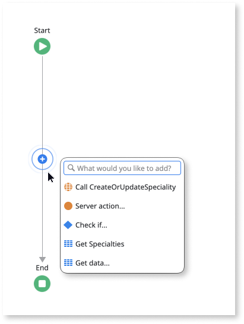
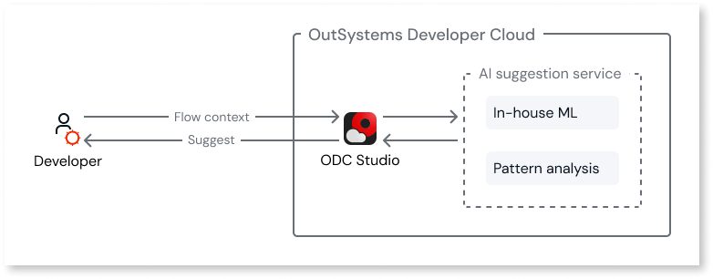

# AI logic suggestions

AI logic suggestions help you build action flows faster by suggesting the next steps in your logic. Trained on millions of anonymized code patterns, the feature reduces repetitive work and guides you toward best practices.

Suggestions appear in flow connectors when you click the AI radar, shown as a pulsing blue circle.

<iframe src="https://player.vimeo.com/video/926348913" width="750" height="635" frameborder="0" allow="autoplay; fullscreen" allowfullscreen="">Video illustrating AI logic suggestions within flow connectors.</iframe>

## Prerequisites {#prerequisites}

AI logic suggestions requires the feature [enabled in ODC Studio](#enable-disable) and connectivity to `https://api.outsystems.com`.

## Getting suggestions

Suggestions appear as you build action flows, offering elements that fit your current context. The AI radar (a pulsing blue circle) on flow connectors indicates when suggestions are available. There are several ways to access them:

* Click the AI radar (blue circle) on flow connectors
* Drag a connector from an existing element and drop it in the flow window
* Accept a suggestion that auto-completes properties, which triggers the next suggestion

Accept a suggestion by clicking it or using arrow keys and `Enter`. ODC Studio creates the element and may auto-complete properties based on context.

<iframe src="https://player.vimeo.com/video/926351837" width="750" height="635" frameborder="0" allow="autoplay; fullscreen" allowfullscreen="">Video showcasing AI logic suggestions.</iframe>

## Types of suggestions

AI logic suggestions analyzes flow context and provides up to six suggestions. High confidence produces fewer, more targeted suggestions.

* **Specific suggestions**: Elements with pre-completed business context, such as an **Action** with a pre-populated **Source** field.
* **Generic suggestions**: Elements that fit the current position but without business context, such as a **Message** element.

Suggested nodes use simplified names. For example, Aggregates appear as Get Data.

## Tips for better suggestions

* **Name your flow first.** Descriptive names like **DoLogin** provide context. The AI radar displays a white **+** when a custom name is set.
* **Define parameters and variables.** Input parameters, output parameters, and local variables give context and enable auto-completion.
* **Use quick search as fallback.** When suggestions don't fit, start typing to search for other elements.

## Settings {#enable-disable}

Enable or disable AI logic suggestions in ODC Studio **Preferences** under **AI-Assisted Development** > **Enable logic suggestions in your flow**.

## How it works

AI logic suggestions uses an OutSystems proprietary machine learning model trained on anonymized development patterns. Unlike [agentic development tools](../../agentic-development/intro.md) that use external Large Language Models, AI logic suggestions runs entirely within OutSystems infrastructure.

