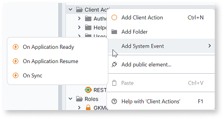

# On Application Resume

Applies only to Mobile Apps.

Action to be executed when the application is returning from background to foreground. Can be used for validating application state when resuming (e.g. checking for network availability).  

To add this action to a Mobile, do the following:

1. In your app, open the **Logic** tab.

1. Right-click the "Client Actions" node in the tree and select **Add System Event** > **On Application Resume**.

    

## Related resources

* [Best practices for app lifecycle, navigation, and deep linking](../mobile/best-practices/best-practices-app-lifecycle-navigation.md)
