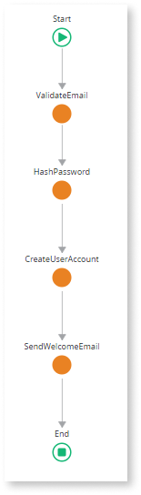
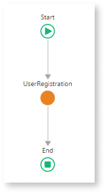
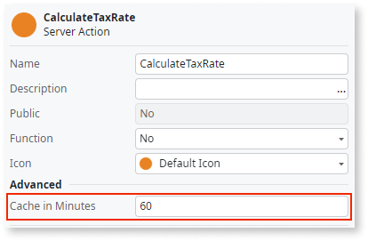
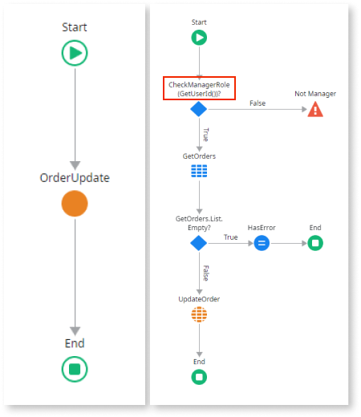
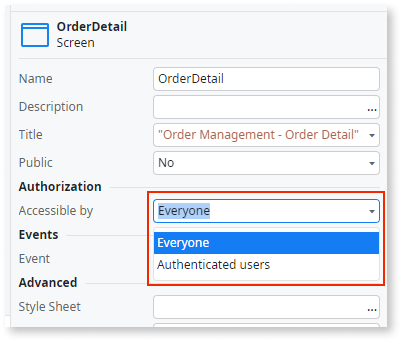

# Best practices for logic

In OutSystems, your apps' logic is implemented through actions. Follow these recommendations to ensure efficiency and good performance.

## Avoid multiple server calls in a client action flow { #multiple-server-calls }

Multiple server calls inside client actions can lead to performance issues.
Each call results in a separate server request, leading to numerous round trips between the client and server, which can increase latency. 

The following is an example of a client action flow with several sequenced server calls, which is not a good practice:

### Recommendation

If you need to make multiple server calls in a client action, wrap all those server calls into a single server action and use that in the client action instead:

### Benefits

Having all required server logic in a single server action reduces the number of server requests, which improves your app's performance.

## Don't add aggregates or SQL queries inside a cycle { #aggregates-inside-cycle }

Aggregates or SQL queries inside a For Each cycle mean repeated database calls for each iteration.
This results in significant performance degradation, particularly with large datasets or nested loops.

### Recommendations

When adding aggregates or SQL queries to an action flow, consider the following:

* Avoid executing aggregates or SQL queries inside a For Each cycle. 

* Instead of adding an aggregate or SQL query inside a cycle, add a more complex one that gets all the needed information before the cycle.

* If you have an aggregate to fetch the master entity before the cycle, followed by another aggregate inside the cycle to fetch the details, consider eliminating the inner aggregate. Add a join to the outer aggregate instead.

### Benefits

Keeping database calls outside the cycle prevents you from executing the same call repeatedly, thus improving performance.

## Avoid isolating a single aggregate in an action { #isolated-aggregates }

Aggregates are optimized to fetch only the attributes used in the action. When you isolate an aggregate in an action and the action returns an entire record or list of records, the platform can't optimize the number of fields to retrieve and fetches all their information from the database. This causes unnecessary database overload and memory usage.

### Recommendations

When calling aggregates in your logic flows, follow these recommendations:

* Avoid creating an action exclusively to execute an aggregate. Instead, call the aggregate directly in your logic flow.

* If you need to isolate an aggregate in an action for code reusability purposes, make sure to define the output parameters according to the attributes needed from the aggregate. 

### Benefits

Calling an aggregate directly instead of wrapping it in an action allows the platform to automatically detect the necessary fields to fetch, thus improving your app's performance. 

## Avoid hard-coded values { #hard-coded-values }

Using hard-coded values makes your app's code difficult to understand and maintain:

* Hard-coded literals are difficult to locate if you need to change their values.

* Using hard-coded True/False conditions can lead to unreachable logic or cause unexpected behavior, such as forgotten feature flags forcing the execution of a specific If branch.

### Recommendations

Avoid hard-coded values in your app's code. Depending on the use case, use one of the following options instead:

* Use [static entities](../data/modeling/entity-static.md) to hold a predefined set of values, such as product categories, or a set of statuses (for example, `New`, `In Progress`, `Pending`, or `Closed`). This promotes strong typing that is less error-prone.

* Use [settings](../../manage-platform-app-lifecycle/configuration-management.md#managing-settings) for app configurations and other application-wide values that don't change frequently, such as email address, or feature toggle flags.

* Use [entities](../data/modeling/entity.md) for other app configurations that can change frequently.

* Use parameters in your SQL query statements.

### Benefits

Avoiding hard-coded values makes your code easier to understand and maintain.

## Enable caching of server actions returning the same result { #caching }

Server actions that calculate or fetch information multiple times with the same results consume unnecessary processing time and resources. If those actions are slow, they negatively impact the end-user experience.

### Recommendations

When implementing your server-side logic:

* Enable caching of server actions that return the same information multiple times. Caching temporarily stores previously calculated or fetched data in memory. When the server action is run again for the same information, the stored data is returned, and the calculation or fetching is skipped.

  

* Don't enable caching of server actions that return information that changes frequently. This will often trigger cache invalidation mechanisms, and the information will take longer to be returned.

### Benefits

Enabling the cache of server actions that repeatedly return the same information improves your app's performance, as it avoids repeated calculation or data retrieval.

## Validate user permissions on server-side logic { #validate-permissions-server-side }

Client-side logic is less secure than the server-side logic. Thus, you need more than [client-side validations](../ui/creating-screens/best-practices-screens.md#roles) to secure your app against malicious users trying to obtain or modify data they should not have access to.

### Recommendations

For sensitive operations, such as database operations that can modify data, [verify the logged-in user permissions on the server-side logic](../../user-management/secure-app-with-roles.md#restrict-logic-flows) using the **CheckROLENAMERole()** and **GetUserId()** functions.

You can reinforce this best practice by [restricting access to fetched data](../ui/creating-screens/best-practices-fetch-display-data.md#restrict-access).

### Benefits

Validating permissions on the server-side logic improves your app's security, as it guarantees the logged-in user has authorization to execute the operation. 

## Avoid exposing server actions on public screens

A screen that is accessible by everyone generates public endpoints that can be potentially accessed and manipulated by malicious users.

### Recommendations

With the exception of special use cases, such as authentication operations (for example, Login), don't expose Server Actions on screens that don't require authentication. A good approach is to [set the correct roles for each screen](../ui/creating-screens/best-practices-screens.md#roles).

### Benefits

Avoiding unnecessary exposure of Server Actions on public screens reduces the risk of exploitation by malicious users, improving your app's security.
