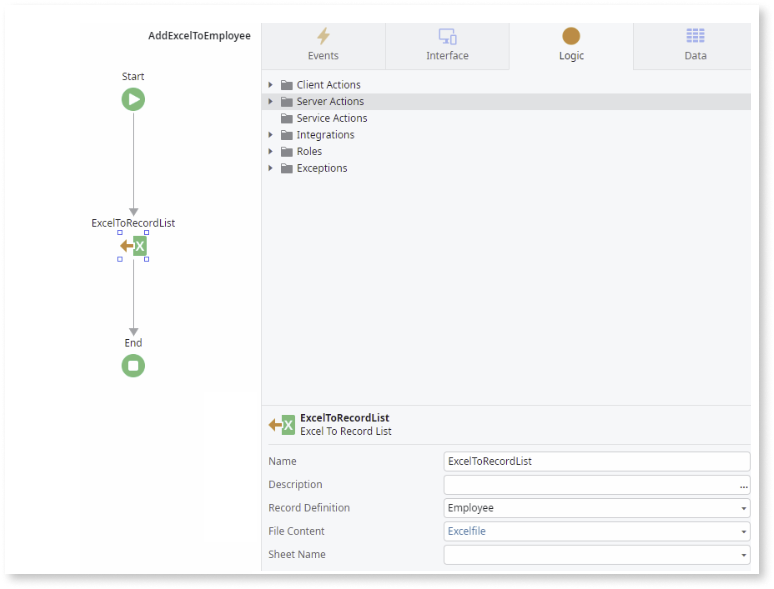
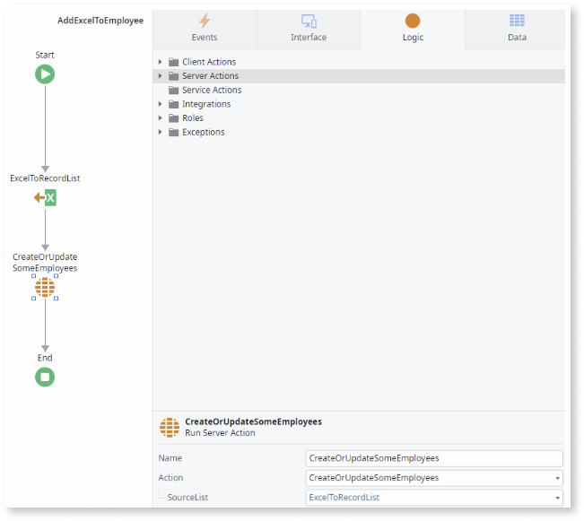

# Excel to Record List

The **Excel to Record List** action converts an Excel object to a Record List. This article explains how you can use the **Excel to Record List** action to load data from an Excel file and save it in your app at runtime.

The Excel To Record List is only available in Server Actions. In Reactive Web and Mobile apps, you must send the uploaded file to the server and then process it in a Server Action.

## Convert an Excel object to a Record List

### Prerequisites

To use **Excel To Record List** action, you need an entity or structure that matches the content of the Excel (.xlsx or .xlsb) file you want to import. OutSystems matches the attribute labels of the entity or structure specified in the Record Definition property with column headings in the Excel file. Entity attributes without a corresponding column in the Excel file get the default value of their data type (for example, "" for a Text attribute).

The following example shows a scenario in which you want to add or update the names and addresses of your current employees in an entity called Employee.

1. In a Server Action, add the **Excel to Record List** action to the logic.

1. Define the **Record Definition** property as the **Employee** entity.

1. Define the **File Content** property as the Excel file you are importing.

    

1. (Optional) To import a specific sheet, you must specify the sheet name in the **Sheet Name** property. By default, OutSystems imports data from the first sheet.

1. Add the **CreateOrUpdateSomeEmployees** entity action and define its **Source List** as the **ExceltoRecordList**.

    

1. (Optional) Add a Server Action to validate the imported data and ensure it complies with your business rules.

    **Note**:  Excel to Record doesn't validate if the Excel file data has mandatory values.

## Properties

|Name|Description |Mandatory| Observations
|---|---|---|---|
|Name|Identifies an element in the scope where it is defined, like a screen, action, or app/library.| Yes| |
|Description| Text that documents the element.  |  | Useful for documentation purposes. The maximum size of this property is 2000 characters. |
|Record Definition|Entity or structure that defines the structure of the data that you want to load. |Yes | The attribute labels must match the column header names in the imported Excel.  |
|File Content| Holds the Excel file.| Yes | The expected data type is Binary Data.|
|Sheet Name| Name of the Excel sheet to import. By default, the first sheet is imported unless a sheet named 'Sheet1' exists in the file. |  |The expected data type is Text.                            |

## Related articles

* [Record List to Excel in ODC](record-list-excel.md)

* [Bootstrap an Entity Using an Excel File](../data/modeling/excel-bootstrap.md)
