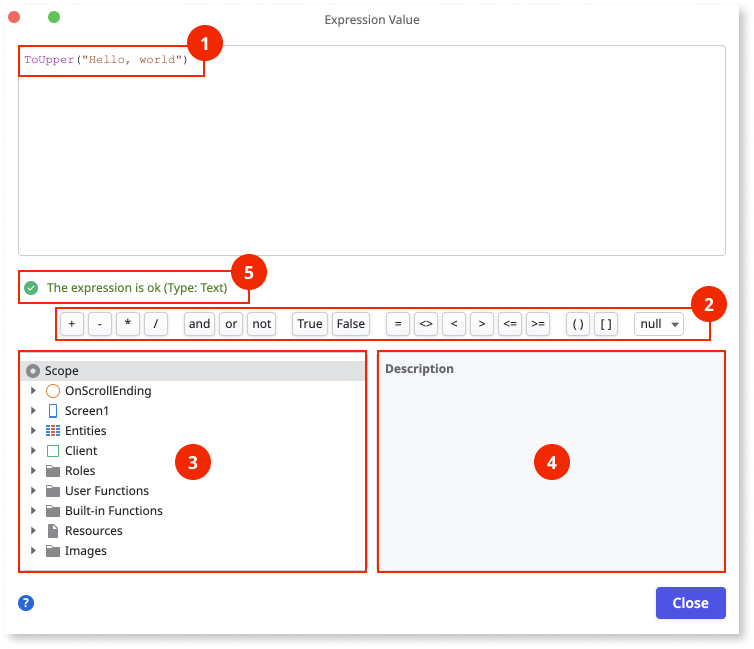

# Edit expressions

Edit expressions with the expression editor in ODC Studio. Launch the expression editor by double-clicking one of the following:  

* Expression widget
* Property fields
* Errors and warnings in the TrueChange pane

The following are the parts of the expression editor, with notes on how you can use them.

Expression field
:    Edit your expressions in the expression field (1). Use **Ctrl+Space** to autocomplete a word or show a list of suggestions to use in the expression.

Toolbar
:    The buttons in the toolbar (2) are the operators developers use most often. Click the button to insert the element in the expression field.

Scope pane
:    The scope pane (3) shows the elements you can use in the expression, such as variables, built-in functions, and scripts. The availability of local elements depends on where in the app you're editing the expression. Note that only actions that you set as functions show in the scope pane.

Description pane
:    You can read the details about an element in the description pane (4). If a function has documentation, the documentation shows in the description pane.

Status
:     The expression status (5) tells you if the expression you're editing is valid or not.

## Notes

The following are notes about expression and the expression widget, and the concepts that are closely related to the expression editor.

### Expression, operands, operators

An expression is what you edit in the expression editor. An expression consists of operands and operators. Check out the following topics for more information:

* [Introduction to expressions](../expressions.md)
* [Operands](operands.md)
* [Operators](operators.md)

### Expression widget

To quickly display the result of an expression, use the Expression widget. 
