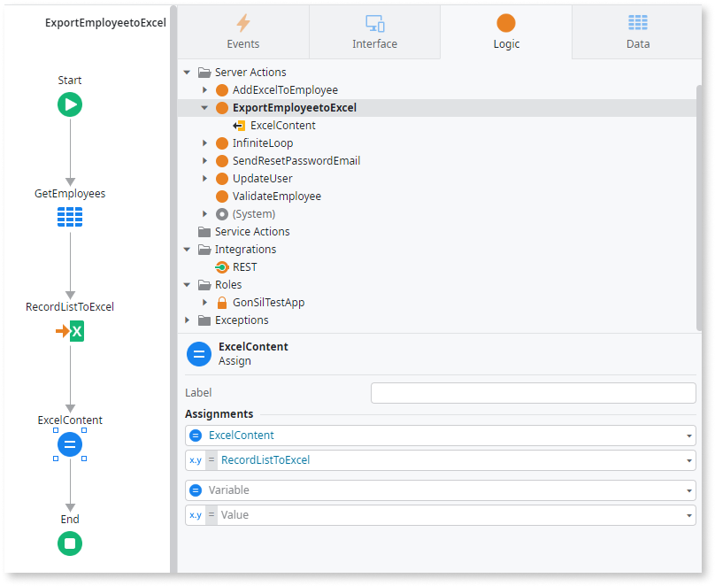
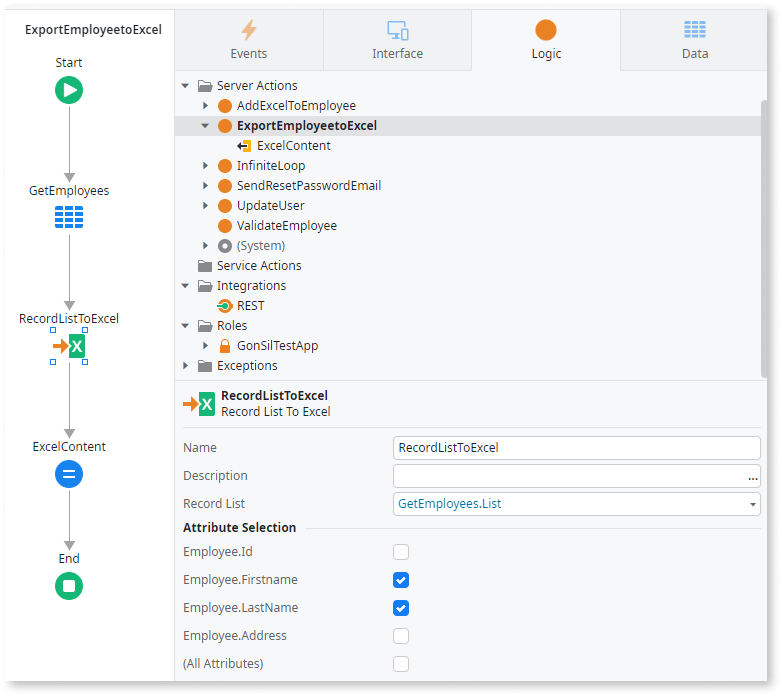

# Record List to Excel

The **Record List to Excel** action converts a Record list to an Excel file. This article explains how you can use the Record List action to convert your data into an Excel file.

## Convert a Record List to Excel

The following example shows a scenario in which you export a list of employees from an Entity called **Employee** into an Excel spreadsheet.

1. In a Server Action, create an Output Parameter called **ExcelContent** with a **Binary Data** data type.

1. Drag an **Aggregate** node and add the **Employee** Entity as a source.

1. Drag the **Record List to Excel** Action and define the **Record List** parameter as **GetEmployees.List**.

1. Drag an **Assign** node and assign the output of **Record List to Exce**l to the **ExcelContent** Output Parameter.

    

1. (Optional) You can omit which information is exported into Excel. For example, you may want your employees' names but not their addresses. In the previous logic, you can untick the **Employee.Address** attribute to ensure it's not exported.

    

## Properties

|Name|Description|Mandatory|Default value|Observations |
|---|---|---|---|---|
|Name|Identifies an element in the scope where it's defined, like a screen, action, or app/library.| Yes| RecordListToExcel1 | |
|Description| Text that documents the element.  | No | | Useful for documentation purposes. The maximum size of this property is 2000 characters. |
|Record List| Holds the list of records to be exported to an Excel file |Yes | | The required type for this property is **Record List**.  |

## Related resources

* [Excel to Record List](excel-record-list.md)
