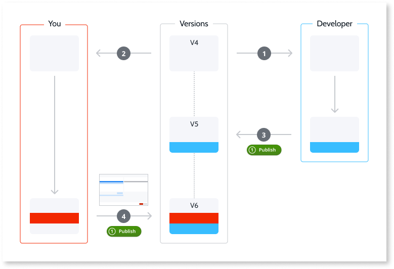
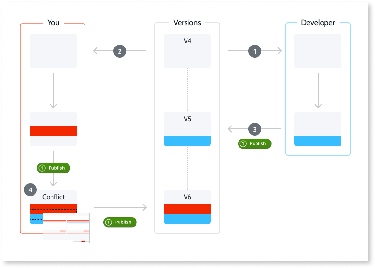

# The merge feature and team collaboration

OutSystems Developer Cloud (ODC) uses a versioning system that assigns an incremental revision number to each published app. ODC lets you restore or compare an app to any previous revision stored on the server.

Multiple developers work on the same app simultaneously. When you publish changes, ODC automatically attempts to merge your code with changes made by other developers. If there are conflicts, ODC Studio displays **Conflicting revision detected**.

For more information about the merge feature, refer to [Merge the work](intro.md).

## Automatic merge of app revisions

When no conflicts exist in visual elements (for example, screens and widgets) and textual elements (for example, CSS and JavaScript), ODC automatically performs a merge. For example: 

1. Other developers open revision 4 of the app and start developing it.
1. You also open revision 4 of the app and begin developing.
1. The other developers publish their changes.
1. You publish your changes, and ODC detects changes to be merged based on the revision from which both developers started developing (V4).
1. ODC automatically merges the changes, and then you can publish the app.

## Resolve merge conflicts

When multiple developers modify the same app elements, ODC can't automatically merge the work. You must resolve the conflicts manually by choosing the changes you want to publish. For example: 

1. Other developers open revision 4 of the app in ODC Studio and start developing it.
1. You open revision 4 of the app in ODC Studio and start developing.
1. The other developers publish their changes.
1. You publish your changes.
1. ODC detects changes to be merged based on the revision from which both parties started developing (V4). The **Conflicting revision detected** window displays two options,
    * **Override with this revision**: Overwrites published changes with your changes.
    * **Compare revisions**: Compares published changes and your changes to select which change to publish.
1. Select **Compare revisions** to display a compare and merge screen between the published and your changes.
1. Select the changes you want to keep and select **Merge and publish**.

## Compare and merge revisions

You compare the changes of your local app with a previously published revision of the app on the server. From the top left corner in ODC Studio, select the menu icon > **App** to display a list of options:

* **Compare and Merge with published revision** – enables you to compare the published revision of the app with the currently open app.
* **Compare and Merge with another revision of file** –  fetches the list of the available revisions of the app from the server, selects one revision and compares it with the currently open revision. Additionally, you can load a local app from your system.
