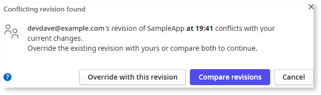
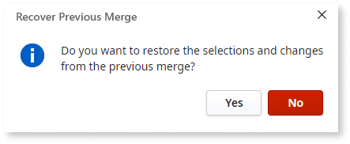

# Merge the Work

In an environment where many developers work on the same app, you often need to incorporate other people's changes. OutSystems Developer Cloud (ODC) Studio automatically merges differences if no conflicts exist. 
If ODC detects conflicting changes when you click 1-Click Publish, you must resolve them before publishing the app.

ODC Studio's merge capabilities are designed with OutSystems visual language, so that you can review changes for both visual and textual elements.

To resolve conflicts, see [Compare and merge example](<merge-example.md>). The [merge feature and team collaboration](<concepts.md>) outlines the merge operations in OutSystems.

## Conflicting revision detected

If ODC Studio detects changes and can not automatically merge and publish your app, ODC Studio displays the **Conflicting revision detected** window. Following is a description of some of the most relevant buttons and their actions.

* Override with this revision
:   Use it to override the published revision of the app with your local revision. With this action, all changes in the current published revision are lost.

* Compare revisions
:  Use to open the **Compare and Merge** window to preview the changes between versions. Then you can edit the local revision and publish it.

## Compare revisions window

To open the **Compare revisions** window, click **Compare revisions** in the **Modified revision detected** window. The **Compare revisions window** displays the local and published versions side by side, enabling you to select and incorporate textual and visual elements. Elements with conflicting changes are labeled **Conflict (Modified)** or **Conflict(Deleted)**. Double-click an element to navigate to the details screen.

## Editing the textual elements

During the merge, you can edit textual elements such as CSS, JavaScript, and property values within elements in a conflict state. The textual elements are read-only if they are not in a conflict state. When you double-click on a textual element, two tabs display the different versions of the element. 

**Merged revision (# of conflicts)** tab in a conflict state, with the editable text and comparison:

* **Your revision** pane – displays the textual element in the local revision of the app during a merge, which you can edit.
* **The other revision** pane – displays the textual element in the published revision of the app, which you cannot edit.

You click **Done and back** to save the resolve conflict and go back to the compare screen.

**Merged revision (# of conflicts)** tab not in a conflict state, with the comparison:

* **Your revision** pane – displays the textual element in the local revision of the app, which you cannot edit.
* **The other revision** pane – displays the textual element in the server revision of the app, which you cannot edit.

You click **Back** to go back to the compare screen.

### Resolving conflicts in the textual elements

Select the changes you want to publish to the server. From the **Merged revision (# of conflicts)** tab,

* To accept the changes from the published revision, select the red arrow in **The other revision** pane.
* To accept the changes from the local revision, select the check box in **Merged revision** pane.
* To change the resulting local revision, edit the text in **Merged revision** pane.

### Highlight all differences

By default, the pane for editing the changes highlights only the lines with conflicts. If you'd like to highlight all the changes, select the **Highlight all differences** check box.

### Color reference

The highlights in different colors help identify the differences between the versions. To see a tootip description, use the mouse over.

Following are the color descriptions.

| Color | Name | Meaning |
 --- | --- | --- |
 | Gray | Deleted line
 | Green| Inserted line
 | Light blue | The modified line with no changes and conflicts, no changes in this revision
 | Red | Modified in both versions with conflicts

## Recover previous merge

ODC saves the merge changes and actions automatically. When the **Recover Previous Merge** window displays, click **Yes** to continue working on changes without losing the previous edits. Clicking **No** deletes the saved merge edits, and you must start the edits from scratch.

