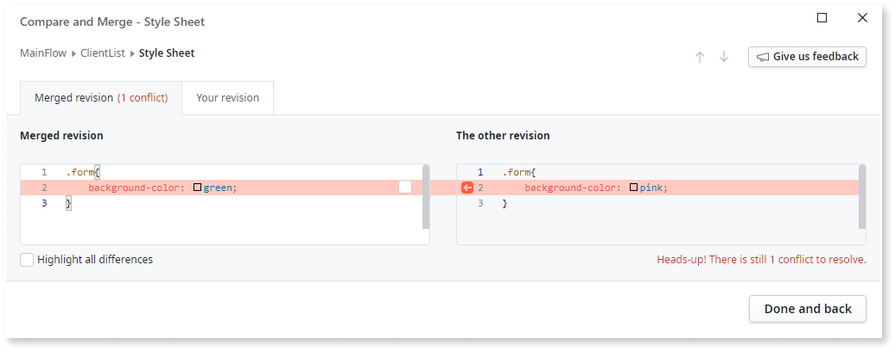
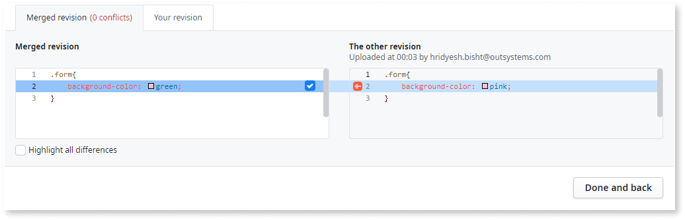
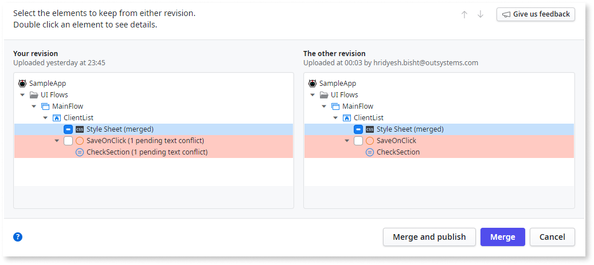
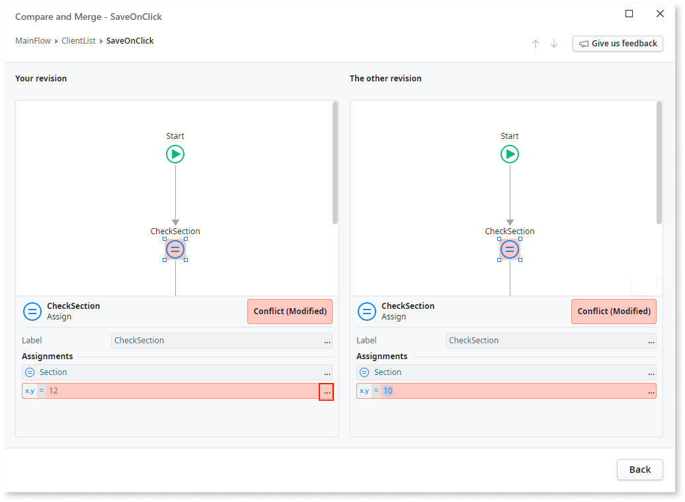
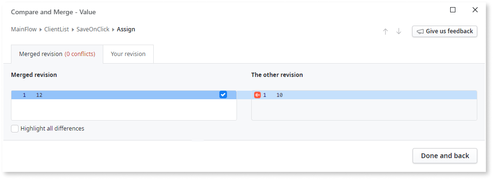
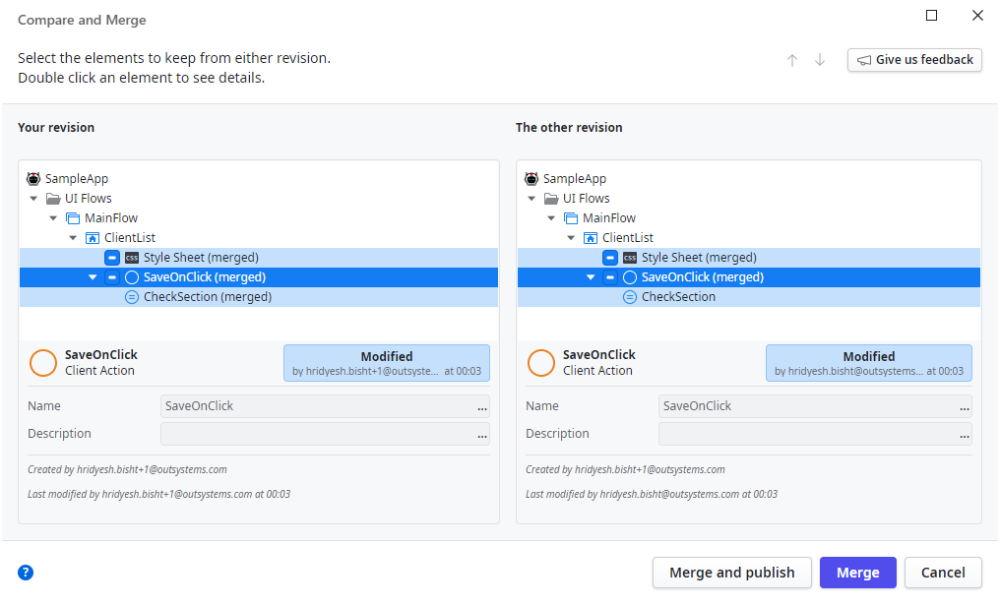

# Compare and merge example with conflicts

In this example you are trying to publish an app, but a window **Modified revision detected** pops up. It seems that you and your fellow developer edited the app simultaneously. You select **Compare revisions** > **Merge and publish**, but there are conflicting changes between the local and the published versions of the app. 

Due to conflicts, you can't automatically integrate your changes. ODC displays two options, **Overwrite with this revision** and **Compare revisions**. You click **Compare revisions** to compare your revision with the other revision. 

After analyzing the **Compare and Merge** window, you find that:

* You both edited the CSS on the "ClientList" screen. You must resolve the conflicting changes.
* You both edited the "Section" Assign on the "ButtonOnClick" action. You need to resolve the conflicting changes.
* The other developer added a new screen called "Report." There are no conflicts to resolve here.

Follow these steps to resolve the conflicts.

1. Double-click the element **Style Sheet (pending text conflict)** in the **ClientList** screen. The **Compare and Merge - Style Sheet** opens. The number in the tab **Merged revision (1 conflict)** indicates the number of conflicts.

    

1. Select the checkbox next to the text in **Merged revision** to add the CSS code of the revision. **Merged revision (1 conflict)** changes to  **Merged revision (0 conflicts)**. You can edit the code by typing in the **Merged revision** pane.

    

1. Click **Done and back** in the lower right corner of the screen to return to the **Compare and Merge** section.

    

1. Double-click **SaveOnClick** to open the **Compare and Merge - ButtonOnClick** window. You see that the `Section` assign element has conflicting values.

    

1. Click on the value viewer labeled by the three dots (`...`) next to the **Assignments** value to open **Compare and Merge - Value** window.

1. To select the value from your revision of the app, click the check box in the  **Merged revision (1 conflict)** pane. **Merged revision (1 conflict)** changes to **Merged revision (0 conflicts)**.

    

1. Click **Done and back** in the lower right corner to return to the **Compare and Merge - ButtonOnClick** section.

1. Click **Back** in the lower right corner to return to the main **Compare and Merge** window. If there are no conflicts (no elements highlighted in red), you can publish the app.

1. Click **Merge and Publish** to publish it. If you want to update the local app and publish later, click **Merge** at this step.

    
