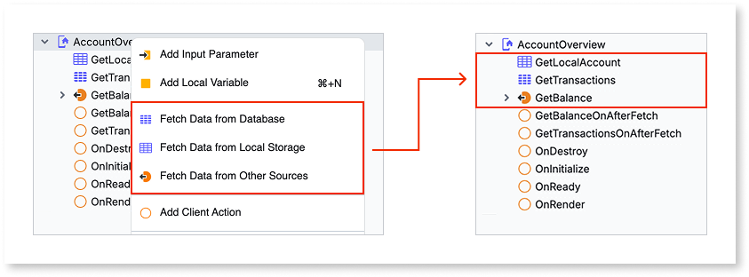
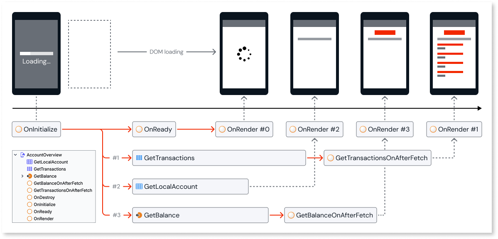
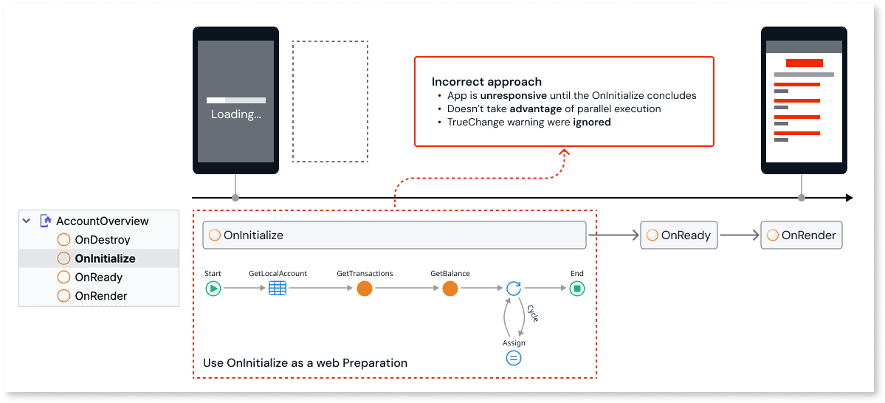

# Best practices for loading data on mobile screens

Mobile screens that wait on sequential, synchronous server calls before rendering leave users staring at a blank or frozen screen, an effect that's especially noticeable on low-end devices and unreliable networks. This article covers best practices for loading data on a mobile screen, including running **Fetch Data** actions, the asynchronous calls that retrieve an [Aggregate](../../data/fetch-data/aggregate.md) or Data Action's data without blocking the screen, in parallel, post-processing responses, grouping server calls, using local storage and caching, and loading long lists with infinite scroll.

## Loading data into mobile applications {#loading-data}

Loading data for a mobile screen is a common scenario. This pattern explains how to retrieve data with the least possible impact on the overall user experience.

Consider a Home banking mobile app where you need to display the account summary and latest transactions on the `AccountOverview` screen.

Take the following actions into account.

### Use fetch data actions for parallel and asynchronous execution {#fetch-data-actions}

Sequential, synchronous server calls block screen rendering until every call finishes, delaying the moment the user sees any content. This happens whether those calls run in [**On Initialize**](../../ui/screen-block-lifecycle-events.md#on-initialize), the event that fires before the screen starts fetching data, or [**On Ready**](../../ui/screen-block-lifecycle-events.md#on-ready), the event that fires once the screen's DOM is ready.

#### Recommendations

Use fetch data actions to run server calls in parallel and asynchronously, so the screen doesn't wait for all data to arrive before rendering. On the `AccountOverview` screen, this means firing separate fetch data actions for the account summary, balance, and transaction list at the same time, instead of waiting for each one to finish before starting the next.

#### Benefits

The screen renders as soon as it's ready, independent of how long each data fetch takes, and users see content progressively as each response arrives. You get improved performance with parallel fetch data actions, and by avoiding synchronous server calls, you get non-blocking screens.

### Use the On After Fetch event for post-processing {#on-after-fetch}

[**On After Fetch**](../../ui/screen-block-lifecycle-events.md#on-after-fetch) is an event handler for an Aggregate or Data Action in ODC mobile apps. It runs after the data finishes loading and before that data renders on the screen or block, so you use it to act on the retrieved data. For example, you can use this event to assign the first or last record to a variable, populate dependent structures, or trigger a query that depends on another query. On the `AccountOverview` screen, the balance query's **On After Fetch** event subtracts pending holds from the raw balance to derive the available balance before it renders.

This event is found in the **Events** section of the properties editor of the Aggregate or Data Action.

#### Recommendations

Use the **On After Fetch** event to run post-processing logic after a fetch data action's response arrives, instead of blocking the initial render with that logic. This keeps calculations like the `AccountOverview` balance derivation off the screen's critical rendering path.

#### Benefits

The screen becomes responsive earlier, and post-processing only runs once the data it needs is available. Because the calculation finishes before the screen renders, the user never sees a raw value flash before the derived one replaces it.

### Example of parallel fetching and post-processing {#account-overview-walkthrough}

The following example shows the `AccountOverview` screen applying both practices together: it fires the account, balance, and transaction fetch data actions in parallel, then uses **On After Fetch** to derive the available balance without blocking rendering.

The following diagram shows the account, balance, and transaction data fetched in parallel:

The following diagram shows the resulting timeline of events and actions:

The following sequence shows how the `AccountOverview` screen renders progressively as each fetch data action and its post-processing complete:

1. Start by running **On Initialize** without executing any actions.
1. Execute three parallel asynchronous **Fetch Data** actions to retrieve the account #2, balance #3, and the list of transactions #1.
1. **On Ready** and **On Render** #0 are triggered and the screen is now responsive to the user.
1. **GetLocalAccount** #2 response arrives and the UI reacts to display the local account information on **On Render** #2.
1. **GetBalance** #3 response arrives and **GetBalanceOnAfterFetch** is triggered, calculating the available balance before a new **On Render** #3 displays it on the screen.
1. **GetTransactions** #1 response arrives and **On Render** #1 displays the list of transactions.

By running the fetch data actions in parallel and handling the balance calculation through **On After Fetch**, the screen responds as soon as **On Ready** triggers, and each **Fetch Data** action updates the screen independently as its response and post-processing complete.

### Group server calls to reduce request latency {#group-server-calls}

Issuing multiple separate server calls for related data increases the number of round trips and the overall request latency.

#### Recommendations

Group related server calls into a single server call where possible, to decrease request latency and the number of server calls the screen depends on. For example, if `AccountOverview` needed both the account holder's profile and their notification preferences, group those into a single server call rather than issuing two requests for data that's already related.

#### Benefits

Fewer round trips reduce total request latency and the load on the server.

### Use local storage to load only the data a screen needs {#local-storage-load-data}

Fetching more data than a screen displays, or reshaping data on the client, adds unnecessary processing and delay on low-end devices.

#### Recommendations

Store frequently accessed data in **local storage**, data persisted on the device instead of fetched from the server on every read, so screens don't depend on a live network connection for every read. Denormalize the local data model so it already matches what the screen displays, avoiding client-side transformation. For the `AccountOverview` screen, store the account summary locally so it's available immediately on return visits, instead of refetching data that rarely changes between sessions.

#### Benefits

The screen loads only the essential data, reducing delay. Client-side processing decreases, which speeds up rendering.

### Cache data that changes infrequently {#cache-infrequent-data}

Data that rarely changes, such as catalog categories or an account's currency, still costs a full network round trip every time a screen refetches it, an unnecessary cost on mobile networks where every round trip adds noticeable delay. Enabling cache on a server action reduces server-side processing time, but the round trip itself remains. Storing the result on the client avoids that round trip altogether.

#### Recommendations

In addition to [enabling caching on the server action itself](../../logic/best-practices-logic.md#caching), store the result of infrequently changing data, for example catalog categories or configuration values, in a client variable or local storage entity with an expiration or invalidation rule, and reuse it instead of calling the server again on every screen visit. On `AccountOverview`, this applies to data like the account's currency or account type, values that rarely change and don't need to be refetched on every visit.

#### Benefits

Screens that depend on infrequently changing data respond faster, since they read from local storage instead of making a network round trip.

### Implement infinite scroll for long lists {#infinite-scroll}

Loading an entire product or record list at once wastes bandwidth and processing time, particularly for catalogs with thousands of items. The transaction list on `AccountOverview` has the same problem: a customer with years of history shouldn't wait for the entire list to load before seeing the most recent transactions.

#### Recommendations

Use the list widget's [**On Scroll Ending**](rendering-data-mobile.md#fine-tune-lists) event, the callback that fires as the user nears the end of the visible list, to fetch additional records, and tune the **infinite-scroll-threshold** setting to control how early the next batch loads. Applied to `AccountOverview`, this means the screen loads the most recent transactions first and fetches older ones only as the user scrolls further down.

#### Benefits

Long lists scroll more smoothly, with fewer visual glitches, since the app only loads and renders the records currently needed.

### Common pitfall scenario {#common-pitfall}

Avoid fetching screen data synchronously in the **On Initialize** or **On Render** events. Instead use asynchronous **Fetch Data** actions.

In the following example, the screen rendering is delayed and blocks the user until all actions end. This results in a blocking screen with unnecessary high loading time. If `AccountOverview` fetched the account summary, balance, and transactions this way, the screen would stay blank until all three responses returned, instead of rendering as soon as each one arrives.

For general recommendations on keeping **On Initialize** and **On Ready** lightweight, refer to [Keep initialization actions lightweight](performance-optimization-mobile.md#lightweight-initialization).

## Related resources {#related-resources}

To learn more about mobile best practices and other performance-related topics, refer to the following:

* [Mobile best practices](intro.md)
  
* [Best practices for rendering data on mobile screens](rendering-data-mobile.md)
  
* [Best practices for mobile app responsiveness](performance-optimization-mobile.md)

* [Screen and block lifecycle events](../../ui/screen-block-lifecycle-events.md)
