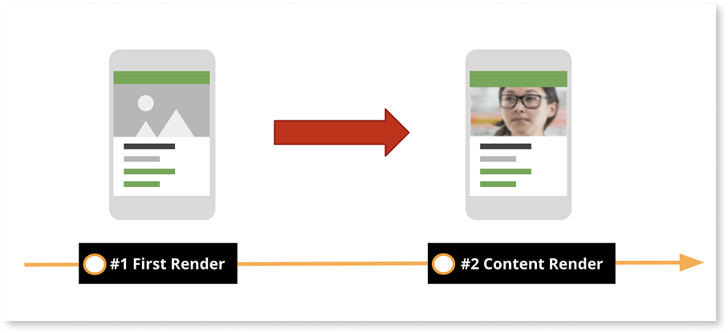
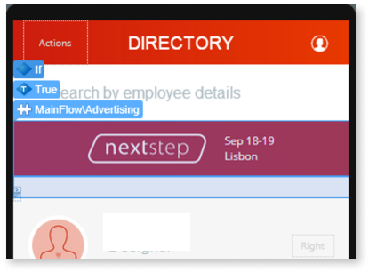
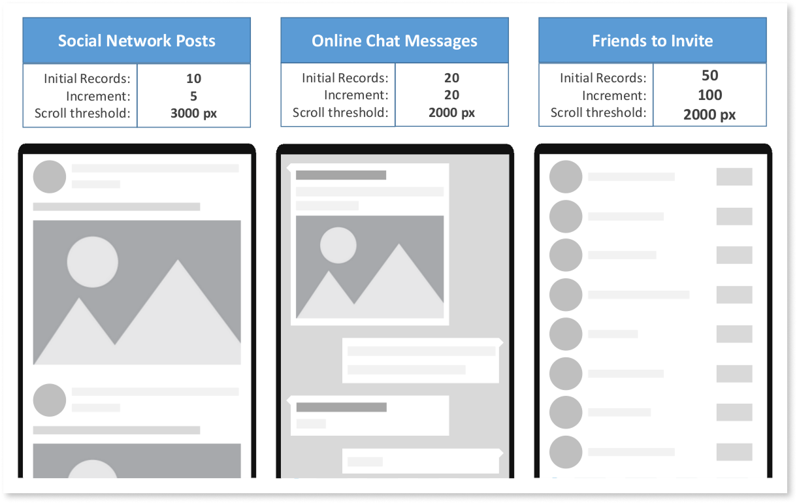

# Best practices for rendering data on mobile screens

When a user navigates to a mobile screen, the static content usually renders first, while the dynamic content takes longer since it's fetched asynchronously. Without care, this results in an incomplete-looking screen where content moves around unexpectedly as data arrives. Apply the following best practices to keep mobile screens visually stable while data loads, so content doesn't shift or jump as it arrives.

## Display a placeholder image while content loads {#placeholder-image}

An incomplete screen with content moving around while dynamic data loads creates a jarring effect and can cause users to tap the wrong element as content shifts under their finger. For example, on a product list screen, the product names and prices can render immediately while each product image is still downloading, so every image pops into place and pushes the surrounding text down as it arrives.

### Recommendations

Design and display a skeleton placeholder, a static shape that mirrors the final content's layout, such as gray bars for text lines or a gray rectangle for an image, while the dynamic content is being fetched.

This strategy is valid for all dynamic content in the screen, such as blocks, cards, or list items. When the skeleton placeholder turns into the fetched content, you may experience some flickering. To avoid flickering when the skeleton placeholder turns into the fetched content, animate it with a shimmer effect that sweeps across the shape, signaling that content is loading instead of an abrupt swap.

### Benefits

The screen looks complete from the moment it renders, avoiding the jarring effect of content moving around as dynamic data arrives.

## Prioritize screen content {#prioritize-content}

By default, OutSystems mobile apps fetch screen data without a specific priority. If your screen has main content that needs to render first, but nothing enforces that order, secondary content can render before it and delay the content the user came for. For example, an advertising banner can render before the main information on the screen.

### Recommendations

To keep the main content the first thing the user sees, delay the rendering of secondary content. To do this, proceed as follows:

1. Place the secondary content in a Block inside the **True** branch of an **If** widget. The Block must enclose all the logic to fetch the secondary content so that data fetching of the secondary content only runs when the Block is rendered.

1. On the **False** branch of the **If** widget, place an empty state to avoid content from moving around when the secondary content is fetched.

1. Set the **If** condition to a variable holding **False** by default.

1. In the **On Render** event of the screen, add logic to set the variable to **True** so that the secondary content starts to render.

### Benefits

Users see the main content of the screen first, without it being delayed or pushed around by lower-priority content that's still loading.

## Set the width and height of image widgets {#image-widget-size}

Setting the width and height of an **Image** widget keeps the screen layout stable while the final image downloads. Without explicit dimensions, the widget's height starts at 0 pixels and jumps to the image's final height once it downloads, causing a flickering effect as the screen height shifts.

### Recommendations

Set the width and height of the **Image** widget to the expected size of the final image.

### Benefits

The screen layout stays stable while the image downloads, avoiding the flickering effect caused by the widget resizing once the image loads.

## Optimize list load {#optimize-list}

Lists fetch and render multiple records at the same time. Unoptimized lists increase load time and cause scroll lag, particularly on low-end devices or unreliable networks. Apply the following recommendations to fetch and render list data efficiently:

### Fetch data on demand {#fetch-on-demand}

Fetching all the records of a list at once delays the initial render and wastes bandwidth on records outside the user's current view.

#### Recommendations

Fetch records as you need them instead of all at once. Start with a minimum set, for example, 10 records. As the user scrolls down, use the **On Scroll Ending** event, the list widget's callback that fires as the user nears the end of the visible list, to fetch the next set of records, for example, the following 10 records. To understand how this works, scaffold a list on a screen, since this mechanism is provided by default.

#### Benefits

The list renders faster initially and uses less bandwidth, since it only fetches the records the user is about to see.

### Fine-tune how lists fetch data on demand {#fine-tune-lists}

Lists vary in how much data each record carries, how many records they hold in total, and the batch size used to fetch them. A batch tuned for small, lightweight records fetches too little at a time for large, image-heavy records, causing frequent round trips that strain low-end devices and slow networks, while a batch tuned for large records over-fetches and wastes bandwidth on small, lightweight ones. Default fetch settings don't always match the size of your records, causing visual glitches and slow scrolling.

#### Recommendations

Adjust the number of records that are initially loaded, the increment when scrolling down, and the scroll threshold that triggers the **On Scroll Ending** event. The values to use depend on the size of the records:

* The **initial number of fetched items** should ensure a balance between a fast data fetch and a sensible amount of scrolling until a request for more data occurs.
* The **incremental number of fetched items** triggered by scrolling should generally be similar to the initial amount of fetched items, but you may need to tune it according to the usage of your app. If users frequently use the list to search for entries, your app should be prepared to fetch data faster and load more items at a time.
* The **scroll threshold** that triggers fetching new items is the distance in pixels before the scroll hits the end of the list, and should be set to 2000 pixels. If you need to tune this threshold to improve the usability of your application, add the attribute **infinite-scroll-threshold** to the list widget with a new integer value in pixels.

The following figure shows examples of values to use in different situations. Start with these as initial guidelines and then test and adjust to your specific case.

#### Benefits

Fine-tuned fetch settings provide a better user experience when using lists, avoiding visual glitches and slow list scrolls.

### Keep list items simple {#simple-list-items}

Complex logic or widgets inside a list item get multiplied by the number of items being rendered in the list.

#### Recommendations

Avoid designing list items with complex logic or complex widgets, like JavaScript to load a map from Google Maps, for example.

#### Benefits

Lists render and scroll more smoothly, since the cost of each item stays low regardless of how many items the list renders.

### Avoid expanding content in list items {#avoid-expanding}

Expandable content in a list item, such as a trimmed description with a "Show All..." link, impacts the behavior of the list while rendering.

#### Recommendations

Don't design list items with expandable content. Use OutSystems UI patterns such as [MasterDetail](../../../building-apps/ui/patterns/adaptive/masterdetail.md), which shows an item's details on a separate screen or panel instead of expanding it in place, instead.

#### Benefits

The list keeps a predictable, stable layout while rendering and scrolling, instead of shifting to accommodate expanding items.

## Related resources {#related-resources}

To learn more about mobile best practices and other performance-related topics, refer to the following:

* [Mobile best practices](intro.md)
  
* [Best practices for loading data on mobile screens](loading-data-mobile.md)
  
* [Best practices for mobile app responsiveness](performance-optimization-mobile.md)
