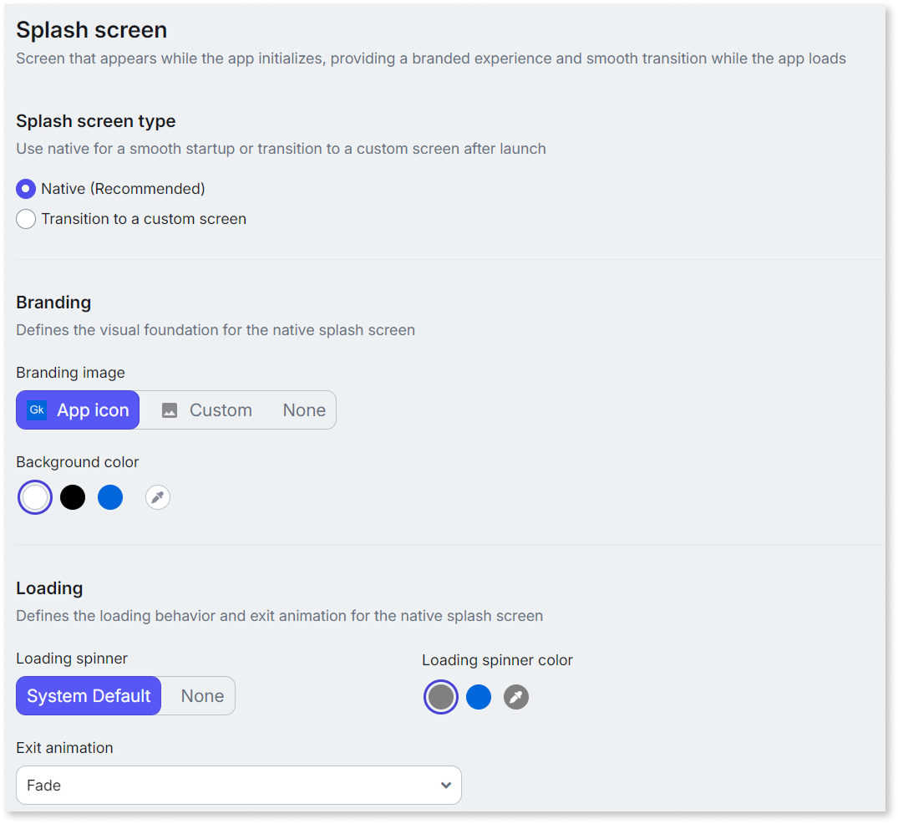
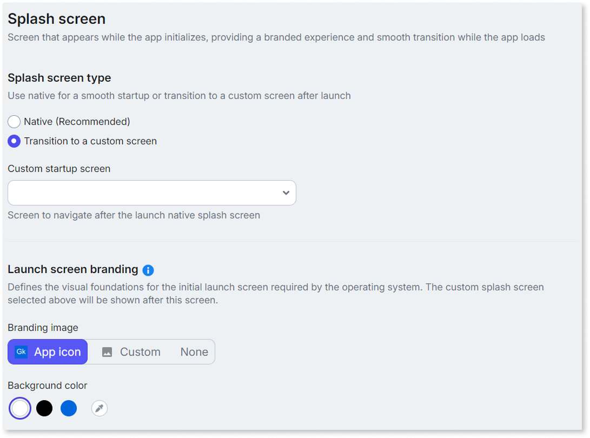
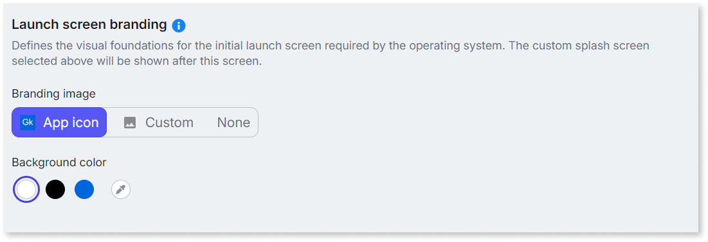

# Customize the splash screen

A splash screen is the introductory screen that appears when a user opens your app. It displays your branding while the app initializes and provides a smooth visual transition to the app's home screen.

Hybrid mobile apps load both a native container and a web layer at startup. Without a splash screen, simultaneous loading results in blank frames, color flashes, or visible layout shifts that make the app feel slow or broken. A well-configured splash screen replaces that gap with a stable, branded interface that keeps users informed during launch and aligns with
[Android](https://developer.android.com/develop/ui/views/launch/splash-screen) and [iOS](https://developer.apple.com/design/human-interface-guidelines/launching)
platform guidelines.

## Understanding screens during startup {#startup-screens}

Your app displays one or more screens between launch and the home screen, depending on the splash screen type you choose:

### Splash screen {#splash-screen}

The branded native screen displayed while the app initializes.

### Launch screen {#launch-screen}

The initial branded native screen displayed when you choose **Transition to a custom screen** as the splash screen type. It serves the same purpose as a splash screen but hands off to a custom screen instead of the home screen.

### Custom startup screen {#custom-startup-screen}

A developer-built OutSystems screen displayed after the launch screen. Use it for blocking operations such as data synchronization or extended initialization logic.

## Configure the splash screen {#configure-splash-screen}

You can configure the splash screen on the **Splash screen** page of **Edit app properties**. To access the app properties, open ODC Studio, click your app name, and select **Edit app properties**. For detailed information about configuring app properties, refer to [Configure mobile apps](configuring-mobile-apps.md).

The Splash screen page contains the following configuration groups: **Splash screen type**, **Branding**, and **Loading**. The sections below explain the different configurations.

For splash screen configurations, the app properties override the extensibility configurations. You can resolve the conflict by aligning both configurations or by removing the splash screen properties from the extensibility JSON. For more information about extensibility configurations, refer to [App extensibility configuration JSON schema](extensibility-configurations/extensibility-app-reference.md#splashscreen).

### Choose the splash screen type {#splash-screen-type}

The **Splash screen type** determines what users see during startup. You can choose between the following options:

* **Native:** Displays a [native splash screen](#splash-screen) that overlays the WebView until your home screen is ready. This is the recommended option and the default for new Capacitor apps. It provides the smoothest and fastest launch experience, rendered directly by the device's native layer (Android or iOS).
  
  

  For Cordova apps, selecting **Native** displays a web-based screen instead of a native screen. The web-based screen is however styled visually to provide native experience.

  

    The following image shows the **Splash screen** settings for the **Native** type:

    

* **Transition to a custom screen:** Displays the [native launch screen](#launch-screen) first, then transitions to a [custom startup screen](#custom-startup-screen). This is the default for existing apps. Choose this option when you need a customized startup experience for blocking operations such as data synchronization or extended initialization logic. Keep the custom screen lightweight to avoid increasing load time; for more information, refer to [Complex splash screen](../../monitor-and-troubleshoot/manage-technical-debt/performance/complex-splash-screen.md). Only for Capacitor apps, when you select this option, you configure the branding of the launch screen under **Launch screen branding**. For detailed information, refer to [Configure launch screen branding](#launch-screen-branding).

  The following image shows the **Splash screen** settings for the **Transition to a custom screen** type:

  

### Set branding options {#set-branding}

The **Branding** group defines the visual foundation of the splash screen. It contains the following settings:

**Branding image** — Choose the branding image displayed at the center of the splash screen. You can select the app icon, upload a custom branding image, or choose none. App icon is suitable for most apps because users associate the app icon with your brand and it creates instant recognition during launch. Use a custom image when your brand identity includes a logotype or graphic that differs from the app icon. Choose **None** when you do not want any image displayed.

When you upload a custom image, follow these guidelines:

* Use a **1024 x 1024 pixels** PNG.
* Design your image with a safe zone, and place essential content within the center to avoid losing it at the edges. On Android, the image is cropped to a circle to adhere to Android requirements and guidelines. On iOS, the image is kept as is.

**Background color** — Choose the background color for the splash screen surface. The available presets are **White** (default), **Black**, and **Primary Color** (your app's primary color). A custom color picker is also available.

Match the splash screen background to the home screen for a smooth transition. For apps with dark content, use black or a dark color. If your branding image is transparent, pick a background color that complements it.

### Set loading behavior {#loading-behavior}

The **Loading** configuration defines the loading indicator and exit animation for the splash screen. Use these settings to control what users see while the app finishes initializing and how the splash screen transitions out.

Enable the loading spinner if startup takes more than a few seconds. A static splash screen during a long load appears frozen, and the spinner reassures users that the app is loading. Choose a spinner color that contrasts with the background. Leave the spinner off for fast-loading apps.

### Configure launch screen branding for Capacitor apps {#launch-screen-branding}

This section applies only when you select **Transition to a custom screen** as the splash screen type for Capacitor apps. These settings control the [launch screen](#launch-screen) appearance, not the [custom startup screen](#custom-startup-screen).

These configurations don't apply to Cordova apps. For Cordova-specific configuration, refer to [Configure the launch screen for Cordova apps](#configure-launch-cordova).

When you choose **Transition to a custom screen** option, the app startup process displays the [launch screen](#launch-screen) first, followed by your [custom startup screen](#custom-startup-screen). The **Launch screen branding** settings determine the look and feel of the launch screen only. For more information, refer to [Set branding options](#set-branding).

The following image shows the **Launch screen branding** options:

   

Ensure that the [custom startup screen](#custom-startup-screen) is visually consistent with the launch screen so that the transition is smooth.

### Configure the launch screen for Cordova apps {#configure-launch-cordova}

For Cordova apps, the launch screen is configured through extensibility configurations.

By default, Cordova apps display a solid-color launch screen using the app's primary color. No additional configuration is needed for this default. To customize the launch screen, use extensibility configurations.

* **Override the background color** — Set the background color through the extensibility JSON using app configurations. For more information about the available properties, refer to [App extensibility configuration JSON schema - Splash screen](extensibility-configurations/extensibility-app-reference.md#splashscreen).

* **Use full-screen images** — For detailed information about using custom images, refer to [Use Custom Splash Screens](https://success.outsystems.com/documentation/11/deploying_apps/mobile_apps_packaging_and_delivery/customize_your_mobile_app/use_custom_splash_screens/).

## Generate the mobile package {#generate-package}

After you configure the splash screen, publish your app and generate a new mobile package to apply the changes on devices. For more information, refer to [Creating a mobile package](creating-mobile-package.md).

## Related resources {#related-resources}

Explore these resources for more details:

* [Configure mobile apps](configuring-mobile-apps.md) — Explains how to configure your mobile app settings, extensibility, and sync behavior
  
* [Screen and block lifecycle events](../ui/screen-block-lifecycle-events.md) — Explains the On Initialize, On Ready, and other events that fire on the home screen after the splash screen dismisses

* [Handling optimized complex synchronization on mobile devices](../data/offline/mobile/complex-sync.md) — Explains the sync patterns, including a "Context = Splash" strategy for loading homepage data during startup.

* [Creating a mobile package](creating-mobile-package.md) — Explains how to publish and distribute your app after configuration
