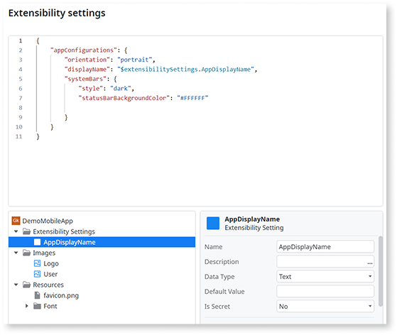
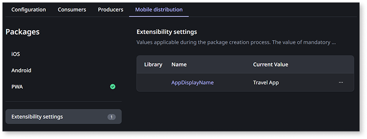

# Configure mobile apps

You can configure and manage your mobile app’s configuration from  **Edit app properties** dialog. To access the app properties, open ODC Studio, click your app name, and select **Edit app properties**.

The app properties is organized into **General** and **Mobile** properties:

* [General](../../building-apps/libraries/app-lib-properties-edit.md#general-settings-general-settings) - Settings that apply to both web and mobile apps, such as app details, validation messages, and advanced settings.
* [Mobile](#mobile-properties-mobile-settings) - Settings specific to mobile apps, such as appearance, offline data sync, and extensibility.

For mobile apps, changes made in the app properties automatically sync with the underlying [extensibility configuration JSON files](extensibility-configurations.md). For advanced use cases that require granular control over the build process, you can directly edit those JSON files. Examples include adding custom Cordova preferences, configuring build actions, or setting platform-specific resource paths.

To find a specific property, use the search field on the sidebar.

## General properties

These are properties that apply to web, mobile apps, general-purpose library, and mobile library such as details, messages, and advanced settings. For detailed information, refer to [General properties](../../building-apps/libraries/app-lib-properties-edit.md#general-settings-general-settings).

## Mobile properties {#mobile-settings}

These are settings specific to mobile apps, such as appearance, permissions, offline data sync, and extensibility.

### Appearance {#mobile-appearance}

You can use the **Appearance** page to configure how your mobile app looks and behaves on devices.

#### Display name

The user-visible name that appears on the device home screen and in the app switcher. By default, this matches the app **Name** from the **Details** page. Set a different display name when you need to use a shorter name for the home screen, localize the name for different regions, or apply specific branding.

This property maps to `appConfigurations.displayName` in the [app extensibility JSON](extensibility-configurations/extensibility-app-reference.md).

By changing the **Display name** you can modify the name of your app in stores and devices without changing the URL.

#### Screen orientation

Controls whether the app locks to a specific orientation or adapts to the device position. The following options are available:

* **Adaptive** -  The app rotates freely based on how the user holds the device. Use this option when your UI supports both portrait and landscape layouts.
* **Portrait** -  Locks the app to portrait mode. Use this option for content-heavy apps such as news readers or chat apps.
* **Landscape** - Locks the app to landscape mode. Use this option for media players, dashboards, or drawing apps.

This property maps to `appConfigurations.orientation` in the [app extensibility JSON](extensibility-configurations/extensibility-app-reference.md#orientation), where **Adaptive** corresponds to `"all"`, **Portrait** to `"portrait"`, and **Landscape** to `"landscape"`.

#### Target device

<div class="info" markdown="1">

Applies to iOS only.

</div>

Specifies the device family that the app targets. The following options are available:

* **Both** - The app runs on iPhones and iPads.
* **Only phone** - The app runs only on iPhones.
* **Only tablet** - The app runs only on iPads.

This property affects the iOS App Store listing and how the app adapts its layout to different screen sizes. It maps to `appConfigurations.targetDevice` in the [app extensibility JSON](extensibility-configurations/extensibility-app-reference.md#targetdevice).

#### Status bar content color

Controls the color of icons and text in the device status bar (the bar on the screen that shows the time, battery, and signal). The following options are available:

* **System** - Automatically adapts to the device's light or dark mode. The status bar uses dark icons on light backgrounds and light icons on dark backgrounds.
* **Light** - Forces light-colored icons and text. Use this option when your app has a dark header or background.
* **Dark** - Forces dark-colored icons and text. Use this option when your app has a light header or background.

This setting maps to `appConfigurations.systemBars.style` in the [app extensibility JSON](extensibility-configurations/extensibility-app-reference.md#systembars), where **System** corresponds to `"default"`, **Light** to `"light"`, and **Dark** to `"dark"`.

For more information about customizing system bars, refer to [Customize system bars with edge-to-edge display](extensibility-configurations/customize-system-bars-edge-to-edge.md).

### Splash screen {#splash-screen}

You can use the **Splash screen** page to customize the introductory screen that appears while your app initializes, including the splash type, branding, and loading behavior. For detailed information, refer to [Customize the splash screen](configure-splash-screen.md).

### Offline data sync {#offline-data-sync}

You can use the **Offline Data Sync** page to configure when and how your app synchronizes data between the device and the server. These settings control the automatic sync behavior that works with the [offline data synchronization framework](../../building-apps/data/offline/intro.md).

The following table describes each setting:

| Setting | Description | When to enable |
| :---- | :---- | :---- |
| **Synchronize on device online** | Triggers a data sync when the device regains network connectivity. | Enable for apps where data consistency matters, such as field service or inventory apps. |
| **Synchronize on app resume** | Triggers a data sync when the app returns to the foreground after being in the background. | Enable for apps where users expect fresh data each time they open the app. |
| **Retry synchronization after failure** | Automatically retries a failed sync. When enabled, a **Seconds to retry** field appears where you set the delay between retry attempts. | Enable for apps that operate in areas with unreliable connectivity. Disable if you prefer users to trigger syncs manually. |

For detailed information about implementing offline data synchronization, refer to [Offline data synchronization in mobile apps](../../building-apps/data/offline/intro.md).

### Extensibility settings {#configure-extensibility-settings}

You can use **Extensibility settings** to define build-time settings for your app. In mobile apps, extensibility settings replace [ODC app settings](../../manage-platform-app-lifecycle/configure-app-settings.md). They provide centralized configuration management and the flexibility to customize app behavior without changing the code.

To add an extensibility setting, follow these steps:

1. In the context pane, right-click **Extensibility Settings** and select **Add Extensibility Setting**.
1. Enter the details for the extensibility setting, such as name, description, and data type.

Reference extensibility settings in the JSON editor using `$extensibilitySettings`.

In this screenshot, `$extensibilitySettings.AppDisplayName` references a setting named `AppDisplayName`.



#### Using extensibility settings with universal schema

This example demonstrates how to reference extensibility settings like `CameraUsageDescription`, `ApiKey`, and `ServerUrl` in both Cordova and Capacitor configurations within the same plugin.

```json
{
    "buildConfigurations": {
        "cordova": {
            "source": {
                "npm": "@my-company/cordova-plugin@1.0.0"
            }
        },
        "capacitor": {
            "source": {
                "npm": "@my-company/capacitor-plugin@1.0.0"
            }
        }
    },
    "pluginConfigurations": {
        "permissions": {
            "ios": {
                "NSCameraUsageDescription": {
                    "description": "$extensibilitySettings.CameraUsageDescription"
                }
            },
            "android": [
                "android.permission.CAMERA"
            ]
        },
        "cordova": {
            "preferences": {
                "API_KEY": "$extensibilitySettings.ApiKey",
                "SERVER_URL": "$extensibilitySettings.ServerUrl"
            }
        },
        "capacitor": {
            "configurations": {
                "MyPlugin": {
                    "apiKey": "$extensibilitySettings.ApiKey",
                    "serverUrl": "$extensibilitySettings.ServerUrl"
                }
            }
        }
    }
}
```

#### Define extensibility settings in ODC Portal

Once you configure an extensibility setting in ODC Studio and publish the app, define its value in ODC Portal. You can define a unique value for each deployment stage.

To define the value for an extensibility setting, follow these steps:

1. Go to ODC Portal.
1. Click the app and select **Mobile distribution** > **Extensibility settings**.

    

1. Edit the extensibility setting.

<div class="info" markdown="1">

You must regenerate the mobile package every time you change the value of an extensibility setting. For detailed information, refer to [Create mobile app package](creating-mobile-package.md).

</div>

### Configure extensibility configurations {#configure-extensibility}

You can configure extensibility configurations using [universal extensibility configurations JSON schema](extensibility-configurations.md) for your mobile app and plugins in ODC Studio.

To configure extensibility configurations, follow these steps:

1. Go to ODC Studio.
1. Click the app or mobile library name. The **Edit app settings** dialog box is displayed.
1. Select **Extensibility settings**.
1. In the JSON editor, define your extensibility configurations using the universal extensibility configurations schema. For detailed information, refer to [App extensibility configuration](extensibility-configurations/extensibility-app-reference.md) and [Library(plugin) extensibility configurations](./extensibility-configurations/extensibility-lib-reference.md).

The **Extensibility** includes:

* A JSON text editor with syntax checking and auto-complete support.
* A context pane that lists items you can reference in the JSON, such as extensibility settings, scripts, and resources. Drag or double-click an item to insert a reference.
* A details pane that shows properties of the selected item without closing the editor.


#### Specify framework compatibility

For [mobile libraries](../../building-apps/libraries/libraries.md) that wrap mobile plugins, ODC Studio automatically selects the **Cordova** or **Capacitor** checkbox based on your plugin source. For example, if your extensibility configurations reference a Cordova plugin source, the Cordova checkbox is automatically selected.

If your Cordova plugin also works with Capacitor, manually select the **Capacitor** checkbox to indicate cross-framework compatibility. This is useful for simple plugins that work across both frameworks.

## Related resources

The following resources provide additional detail on configuring and extending your mobile apps.

### Extensibility configurations

* [Universal extensibility configuration JSON schema](extensibility-configurations.md)
* [App extensibility configuration](extensibility-configurations/extensibility-app-reference.md)
* [Library extensibility configurations](extensibility-configurations/extensibility-lib-reference.md)
* [Cordova-based extensibility configuration JSON schema](legacy-extensibility-configuration.md)

### Mobile capabilities

* [Offline data synchronization in mobile apps](../../building-apps/data/offline/intro.md)
  
* [Customize system bars with edge-to-edge display](extensibility-configurations/customize-system-bars-edge-to-edge.md)
