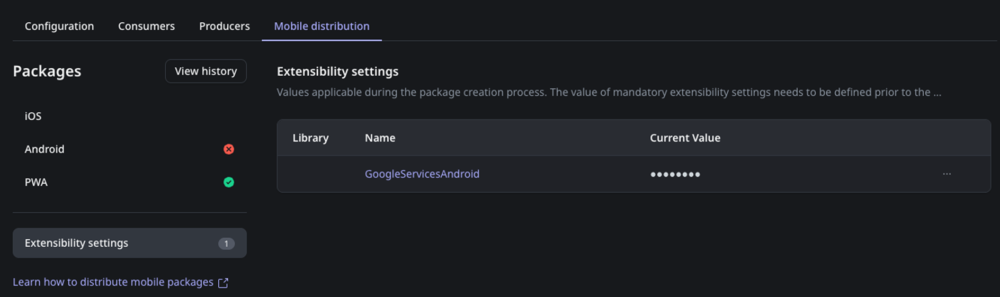

# Configure mobile apps

You can configure your mobile app via the mobile app properties. For customizing and enhancing mobile app functionality beyond the default settings and for more granular control over the mobile app's build process, you can directly edit the [extensibility configuration JSON files](extensibility-configurations.md).

## Configure mobile properties

To view and modify the app properties, click the app name and select **Mobile**. The changes made in the mobile properties automatically sync with the extensibility configuration script, and vice versa. For example, configuring a property in **Mobile** updates the corresponding property in the script, and changes in the script reflect in the **Mobile** properties.


The mobile app properties work correctly only if the extensibility scripts are error-free. If there are errors, ODC Studio displays a warning message. To get details about the issue, hover over the warning icon beside a property title in the **Mobile** tab. The same behavior occurs when the mobile app property uses a placeholder variable in the extensibility script.

While the mobile app properties sync with the underlying extensibility configuration files, for advanced use cases you can directly edit the [Extensibility configurations](extensibility-configurations-json-schema.md) files. These JSON files offer granular control over your mobile app's build process and enable custom adjustments.

## Configure extensibility configurations {configure-extensibility}

You can configure extensibility configurations using [universal extensibility configurations JSON schema](extensibility-configurations.md) for your mobile app and plugins in ODC Studio.

To configure extensibility configurations, follow these steps:

1. Go to ODC Studio.
1. Click the app or mobile library name.
    The edit properties dialog box is displayed.
1. Select **Extensibility**.
1. In the JSON editor, define your extensibility configurations using the [universal extensibility configurations schema](extensibility-configurations.md). For detailed information, refer to [App extensibility configuration](extensibility-configurations/extensibility-app-reference.md) and [Library(plugin) extensibility configurations](extensibility-configurations/extensibility-lib-reference.md).

The **Extensibility** includes:

* A JSON text editor that checks your syntax (1).
* A context pane with items you can reference by dragging or double-clicking (2).
* A details pane that lets you view the properties without closing the editor (3).


### Specify framework compatibility

For mobile libraries that wrap mobile plugins, ODC Studio automatically selects the **Cordova** or **Capacitor** checkbox based on your plugin source. For example, if your extensibility configurations reference a Cordova plugin source, the Cordova checkbox is automatically selected.

If your Cordova plugin also works with Capacitor, you can manually select the **Capacitor** checkbox to indicate cross-framework compatibility. This is useful for simple plugins that work across both frameworks.

## Configure extensibility settings {#configure-extensibility-settings}

You can configure the build time settings for your app using extensibility settings. These settings can be directly added from the ODC Studio. In mobile apps, extensibility settings are a replacement for [ODC app settings](../../manage-platform-app-lifecycle/configure-app-settings.md).

The extensibility settings provide centralized configuration management and the flexibility to customize app behavior without changing the code.

To add a new extensibility setting, follow these steps:

1. Click the app name and select **Extensibility**.
1. Right-click **Extensibility Settings** and select **Add Extensibility Setting**.
1. Enter the details for the extensibility setting, such as name, description, and data type.

You can directly reference these extensibility settings in the extensibility configurations schema using `$extensibilitySettings`.

In this screenshot, the extensibility setting `GoogleServicesAndroid` is referenced in the extensibility configurations using `$extensibilitySettings`


### Using extensibility settings with universal schema

This example demonstrates how you can reference extensibility settings like `CameraUsageDescription`, `ApiKey`, and `ServerUrl` in both Cordova and Capacitor configurations within the same plugin.

```json
{
    "buildConfigurations": {
        "cordova": {
            "source": {
                "npm": "@my-company/cordova-plugin@1.0.0"
            }
        },
        "capacitor": {
            "source": {
                "npm": "@my-company/capacitor-plugin@1.0.0"
            }
        }
    },
    "pluginConfigurations": {
        "permissions": {
            "ios": {
                "NSCameraUsageDescription": {
                    "description": "$extensibilitySettings.CameraUsageDescription"
                }
            },
            "android": [
                "android.permission.CAMERA"
            ]
        },
        "cordova": {
            "preferences": {
                "API_KEY": "$extensibilitySettings.ApiKey",
                "SERVER_URL": "$extensibilitySettings.ServerUrl"
            }
        },
        "capacitor": {
            "configurations": {
                "MyPlugin": {
                    "apiKey": "$extensibilitySettings.ApiKey",
                    "serverUrl": "$extensibilitySettings.ServerUrl"
                }
            }
        }
    }
}
```

## Define extensibility settings

Once the extensibility setting is configured in the ODC Studio and the app is published, you must define the value for the extensibility setting in the ODC Portal. You can define a unique value for each deployment stage.

To define the value for the extensibility setting, follow these steps:

1. Go to ODC Portal.

1. Click the app and select **Mobile distribution** > **Extensibility settings**.

    

1. Edit the extensibility setting.

<div class="info" markdown="1">

You must regenerate the mobile package every time you change the value of the extensibility settings. For detailed information, refer to [Create mobile app package](creating-mobile-package.md).

</div>

## Related resources

For more information, refer to the following resources:

* [Universal extensibility configuration JSON schema](extensibility-configurations.md)

* [Cordova-based extensibility configuration JSON schema](legacy-extensibility-configuration.md)
