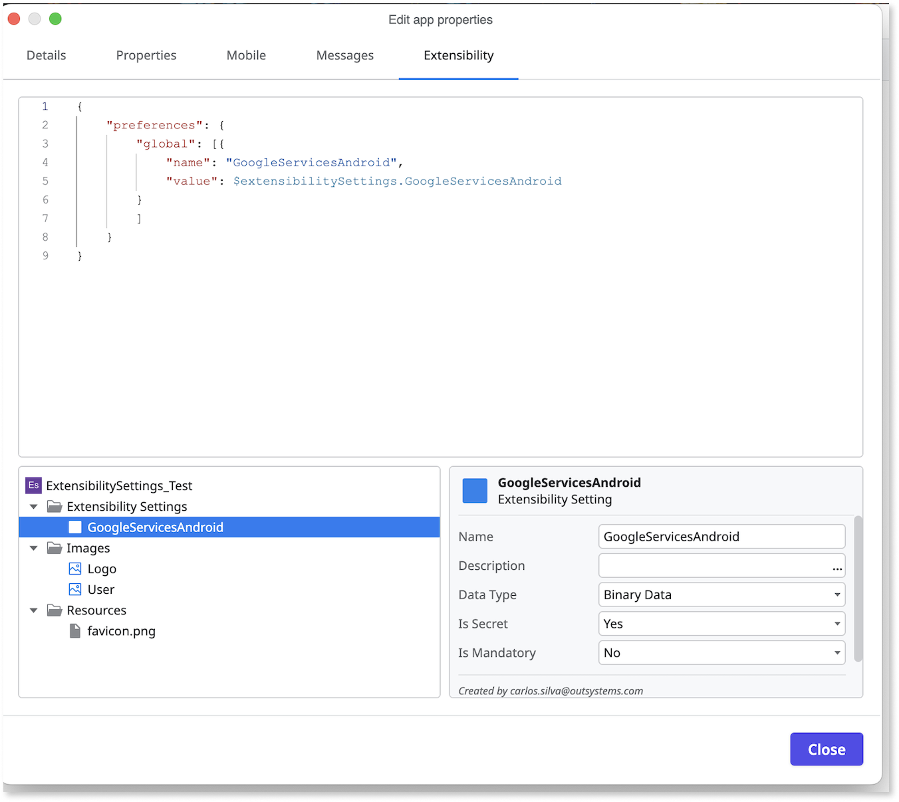

# Configuring mobile apps

You can configure your mobile app via the mobile app properties. For customizing and enhancing mobile app functionality beyond the default settings and for more granular control over the mobile app's build process, you can directly edit the [extensibility configuration JSON files](extensibility-configurations.md). Additionally, the icon selected for the app is automatically used as the icon in the store unless a new one is set in the extensibility configurations. The icon selected in the creation step must be 1024x1024. If it isn't, it will be resized to fit this criterion, which may increase its size beyond the 512KB limit, making it invalid.

## Configure mobile properties

To view and modify the app properties, click the app name and select **Mobile**. The changes made in the mobile properties automatically sync with the extensibility configuration script, and vice versa. For example, configuring a property in **Mobile** updates the corresponding property in the script, and changes in the script reflect in the **Mobile** properties.

The mobile app properties work correctly only if the extensibility scripts are error-free. If there are errors, ODC Studio displays a warning message. To get details about the issue, hover over the warning icon beside a property title in the **Mobile** tab. The same behavior occurs when the mobile app property uses a placeholder variable in the extensibility script.

While the mobile app properties syncs with the underlying extensibility configuration files, for advanced use cases you can directly edit the [Extensibility configurations](extensibility-configurations-json-schema.md) files. These JSON files offer granular control over your mobile app's build process and enable custom adjustments.

## Configure extensibility settings

To configure the build time settings for your app, click the app name and select **Extensibility**. You can also add new and delete settings directly from ODC Studio.

## Define extensibility settings

Once the app is published, you can define the extensibility settings in ODC Portal for different deployment stages.

To define the settings, follow these steps:

1. Go to ODC Portal.
1. Click the app and select **Mobile distribution** > **Extensibility settings**.
1. Edit the setting.

You must regenerate the mobile package every time you change the value of the extensibility settings. For detailed information, refer to [Create mobile app package](creating-mobile-package.md).
