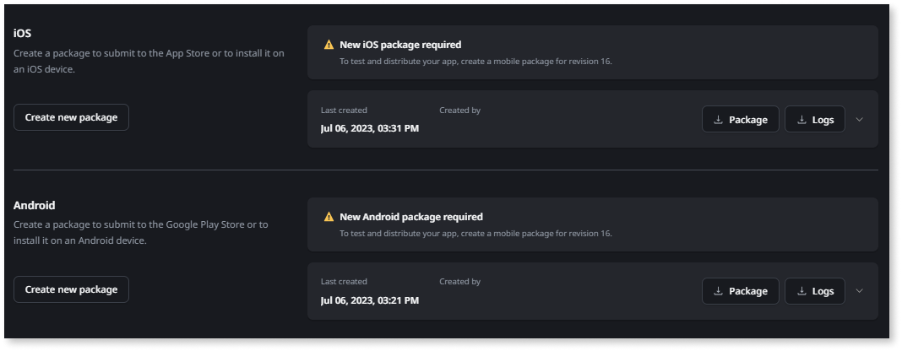
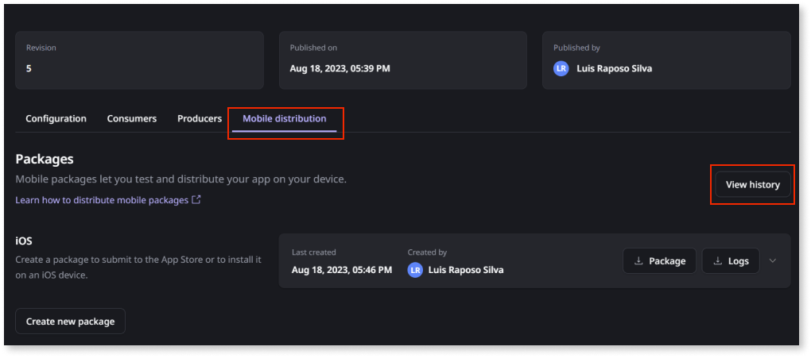
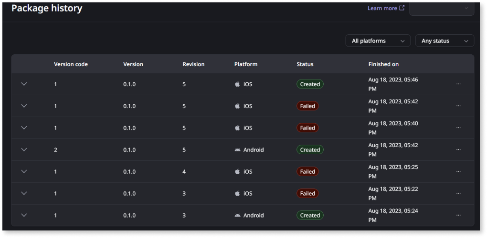

# Create mobile app package

After you can create a mobile app in ODC (OutSystems Developer Cloud) Studio, you can create a mobile app package in ODC Portal. The following list describes the overall process of making your app available for users: 

1. Develop your app. You can quickly preview your app in a browser as you develop. 
1. Try your app on a mobile device by creating a debug package for installation.  
1. Create your production mobile package.
1. Distribute your app by submitting it as a package to an app store or sharing it internally for a direct download.

Avoid changing the app name. If you change the app name, ODC changes the URL, which is the app's identifier. To learn more, refer [considerations when building mobile apps.](#considerations-when-building-mobile-apps).

## Creating an iOS or Android Package

Go to ODC Portal and in the app details page, click **Mobile distribution**. To create a package click **Create package**. From the same screen, you can create an iOS or Android package. The two packages can process at the same time. Once you click the **Create Package** button, the ODC Portal displays a screen for you to provide configuration information. On first use, ODC Portal prefills some iOS and Android configuration fields for you.

Once the creation of the package completes, the display shows you the date and time it was last created, who created it, and a link to download the package. The page also shows the PWA QR code, information about the version, build type, and app identifier.  

To configure a package, you can use the default settings or enter information specific to your package. The required fields have an asterisk. The following sections contain a list of the fields to complete along with a short description.

## iOS package

Settings for creating an iOS package.

* **Build type** - the way you want to distribute this mobile package such as a stage, the app store or in-house for testing purposes
* **App identifier** - a unique identifier for your app in stores
* **Certificate** - authentication used in Apple’s iOS developer program
* **Certificate password** - the password to use for the authentication process
* **Provisioning profile** - the profile that matches the certificate
* **Mobile Apps Build Service (MABS) version** - a cloud service used by ODC to generate your packages
* **Version (Major, Minor, Patch)** - the ODC Portal suggests a version number, but you can enter any version number, that's equal to or higher than the previous version
* **Version code** - a number that increments by one every time MABS generates a new package. You can change this number, but it must be higher than the previous version

## Android package

Settings for creating an Android package.

* **Build type** - the way you want to distribute this mobile package such as a stage, a Google Play (app bundle), debug, or release
* **App identifier / Keystore details** - a unique identifier for your app in stores and Keystore details
* **Mobile Apps Build Service (MABS) version**  - a cloud service used by ODC to generate your package
* **Version (Major, Minor, Patch)** - ODC Portal suggests a version number, but you can enter any version number that's equal to or higher than the previous version
* **Version code** - a number that increments by one every time MABS generates a new package. You can change this number, but it must be higher than the previous version.

## App versions and MABS

ODC uses OutSystems **Mobile App Build Service (MABS)**. MABS is a cloud service that generates mobile packages. OutSystems continually improves MABS and makes new versions available. On the create package page, you can select the MABS version you want to use to create the mobile packages. ODC Portal records the MABS version you chose to generate the mobile package.  

The mobile package includes a version code field that's different from the app version. A version code is an internal number associated with the current code being used to create the mobile package. App stores use this number to determine whether one version is more recent than another version. By default, the version code increments by one every time MABS creates a mobile app package. The version of the app that gets created in ODC Studio isn't production-ready. This means it’s not ready for distribution, but you can use it to create a package.

There might be times when you need to change the default mobile app version number or the version code number. For example, if you are migrating an existing app from another provider to OutSystems, the current version number or version code of your app in the app store might be higher than the OutSystems version numbers. In this case, you need to set the OutSystems version number or version code number to a higher value than what's in the store.

______________________________________________________________
_QR CODE is a registered trademark of Denso Wave Incorporated._

## Download mobile app build logs { #download-mobile-app-build-logs }

You can obtain the build logs of your mobile apps in ODC Portal. Build logs are available for both successful and failed builds, and each platform (Android and iOS) has its own build log.

To obtain a mobile app build log:

1. In the ODC Portal, go to **Apps** and click your mobile app name to navigate to the mobile app detail page.
1. In the **Mobile distribution** tab, click the log icon for the desired platform to download the build log.
    

## View package history

You can view the package history of your mobile app in the ODC Portal. The package history allows you to monitor the following:

* Successful and failed mobile package creation requests
* Mobile app version
* Mobile app version code
* Mobile app revision
* Timestamp of when the mobile package creation process started
* Person who triggered the mobile package creation process

You can also download package files, log files, and source code files. 

Monitoring your package history and having access to package resources facilitates troubleshooting. The package history allows you to identify if an issue is one that already occurs on previous versions or if it’s a new issue created from recent changes to the package.

To view the package history of your mobile app:

1. In the ODC Portal, click the relevant mobile app. 

1. Select the **Mobile distribution** tab and click **View history**.

    

    The package history is displayed. 

    

For more information about troubleshooting your apps, see [Monitor and troubleshoot apps](../../monitor-and-troubleshoot/monitor-apps.md).

## Considerations when building mobile apps

Consider the following when creating mobile apps.

### Change app name breaks experience in mobile apps { #changing-app-name } 

Avoid changing the app name. If you change the app's name, ODC changes the URL, which is the app's identifier. This adversely impacts the mobile apps already running on devices or in distribution because:

* Updates over the air aren't delivered.
* All data and server actions fail.
* Application logs (native and runtime) are no longer available since logs are stored locally on the device, associated with the application URL. This also occurs after updating the native package to the new version pointing to the new URL.
* Outdated app version can still be opened and run. Depending on the logic flow (use of server actions, for example), the app may have limited usability. Sometimes its not obvious to users that a problem exists or that the app isn't functioning correctly.

### You can't preview a mobile app in the Safari browser within the ODC Portal

Using the Safari browser to preview a mobile app within the ODC Portal doesn't work. The app and the preview render within an iFrame in different domains, and due to security restrictions from Apple, Safari can't access the content.

OutSystems recommends Chrome browser for previewing the mobile app in the ODC Portal.

### App login doesn't work in the preview if you're using Safari or any other browser configured to block third-party cookies

More and more browsers are blocking third-party cookies by default. Using the Safari browser or any other browser configured to block third-party cookies to preview a mobile app within the ODC Portal prevents the login screen in your application from working. The app and the preview render within an iFrame in different domains and due to the configuration to block third-party cookies, the login doesn't work.

OutSystems recommends Chrome browser for previewing the mobile app in the ODC Portal. If the browser is blocking third-party cookies you can disable that feature in the browser security settings.

