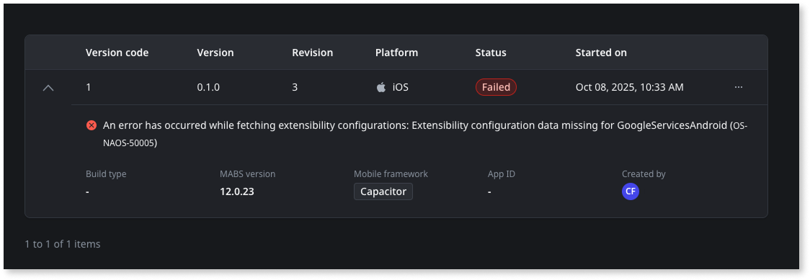

# Create mobile app package

A mobile app package is a compiled version of your mobile app, ready for installation on devices or distribution through app stores. It includes all the necessary resources, configurations, and code to run the app on specific platforms such as iOS or Android.

ODC uses a cloud service called **Mobile Apps Build Service (MABS)** to generate these packages, so you don't need to manage the native SDKs.

MABS versions earlier than 12.0 use Apache Cordova as its underlying hybrid framework. [MABS 12](mabs-overview.md) supports both Cordova and Capacitor as a dual-stack solution.

After creating a mobile app in ODC Studio, you can create a mobile app package in ODC Portal.

Here's the overall process to make your app available to your users:

1. Develop your app. You can quickly preview your app in a browser as you develop.

1. Try your app on a mobile device by creating a debug package for installation.

1. Create your production mobile package.

1. Distribute your app by submitting it as a package to an app store or sharing it internally for a direct download.

Avoid changing the app name when building mobile apps. If you change the app name, ODC changes the URL, which is the app's identifier. To learn more, refer to [considerations when building mobile apps](#considerations-when-building-mobile-apps).

## Create an iOS or Android package

To create an iOS or Android package, follow these steps:

1. Go to the ODC Portal and navigate to the app details page.

1. Click **Mobile distribution**.

1. Click **Create package** to start the process.
From the same screen, you can create an iOS or Android package. ODC can process two packages at the same time.
  
    

1. Select the **Build type**, the way you want to distribute this mobile package, such as a stage, the app store, or in-house for testing purposes

1. Enter the  **App identifier**, a unique identifier for your app in stores

1. (For iOS package) Provide the **Certificate**, **Certificate password**, and **Provisioning profile**.

1. (For Android package) Provide the Keystore details such as **Keystore** binary file, **Keystore password**, **Alias**, and **Alias password**.

1. Select the **Mobile Apps Build Service (MABS) version**. You can select either the stable version or a particular MABS version. If you choose version **12.0**, then select either **Cordova** or **Capacitor** as the mobile framework. Ensure that all the plugins you use in the app are compatible with the chosen framework. For detailed information about dual stack support in MABS, refer to [Capacitor and Cordova support in MABS](mabs-overview.md).

    

1. Enter the **Version (Major, Minor, Patch)** number. If you want to modify the version, enter any version number that's equal to or higher than the previous version

* Enter the **Version code**, a number that increments by one every time MABS generates a new package. You can change this number, but it must be higher than the previous version.

1. Click **Create iOS package** or **Create Android package** depending on what you want your build.

Once you've finished creating the package, you can view the following details:

* Package creation date and time

* Package creator

* Link to download the package

The page also shows the PWA QR code, version information, build type, and app identifier.

For detailed information about troubleshooting, refer to [MABS errors](https://success.outsystems.com/support/errors/mabs_errors/).

## Understanding MABS and versioning in mobile app packages

 OutSystems improves MABS and makes new versions available to support new SDKs and essential toolchain upgrades. On the create package page, you can select the MABS version you want to use to create the mobile packages. For detailed information about the MABS versioning, refer to [MABS versioning and lifecycle](https://success.outsystems.com/support/release_notes/mobile_apps_build_service_versions/mabs_versioning_and_lifecycle/).

 The ODC Portal records the MABS version you chose to generate the mobile package.

The mobile package includes a version code field that's different from the app version. A version code is an internal number associated with the current code used to create the mobile package.

App stores use this number to determine whether one version is more recent than another version. By default, the version code increments by one every time MABS creates a mobile app package. The version of the app that gets created in ODC Studio isn't production-ready. This means it’s not ready for distribution, but you can use it to create a package.

Sometimes, you need to change the default mobile app version number or the code number. For example, if you are migrating an existing app from another provider to OutSystems, your app's current version number or version code in the app store might be higher than the OutSystems version numbers. In this case, you need to set the OutSystems version number or version code number to a higher value than what's in the store.

## Download mobile app build logs { #download-mobile-app-build-logs }

From the ODC Portal, you can download the mobile package after a successful build. However, build logs are always available, whether the package creation succeeds or fails.

To obtain a mobile app build log:

1. Go to the ODC Portal.

1. Navigate to mobile app detail page.

1. Click **Mobile distribution**.

1. Choose the platform iOS or Android. If the package is successfully created, download the package.
To download the logs, click the ellipsis.

  

## View package history

You can access the package history to review previously created mobile packages. Package history helps troubleshoot failures by showing whether issues occurred in earlier versions or resulted from recent changes.

For MABS 12, the package history and distribution details indicate the framework used for each build. Existing builds are tagged as Cordova builds.

You can also download the mobile package, logs, and source code files when available. The package history allows you to monitor the following:

* Successful and failed mobile package creation requests
* Mobile app version
* Mobile app version code
* Mobile app revision
* Timestamp of when the mobile package creation process started
* Person who triggered the mobile package creation process

To view the package history of your mobile app, follow these steps:

1. Go to the ODC Portal.

1. Navigate to mobile app detail page.

1. Select **Mobile distribution** and click **View history**.

    The package history is displayed.

    

    Successful builds show a **Created** status, while failed builds show **Failed**. The failed builds also includes the specific error that resulted in the failure for easy troubleshooting.

    

## Considerations when building mobile apps

Consider the following when building mobile apps.

### Changing the app name breaks the experience in mobile apps { #changing-app-name }

Avoid changing the app name. If you change the app's name, ODC changes the URL, which is the app's identifier. This adversely impacts the mobile apps already running on devices or in distribution because:

* Updates over the air aren't delivered.
* All data and server actions fail.
* Application logs (native and runtime) are no longer available since logs are stored locally on the device and are associated with the application URL. This also occurs after updating the native package to the new version, pointing to the new URL.
* The outdated app version can still be opened and run. The app may have limited usability depending on the logic flow (use of server actions, for example). Sometimes, it's not obvious to users that a problem exists or the app isn't functioning correctly.

### You can't preview a mobile app in the Safari browser within the ODC Portal

Using the Safari browser to preview a mobile app within the ODC Portal doesn't work. The app and the preview render within an iFrame in different domains, and due to security restrictions from Apple, Safari can't access the content.

OutSystems recommends using the Chrome browser to preview the mobile app in the ODC Portal.

### App login doesn't work in the preview if you're using Safari or any other browser configured to block third-party cookies

More and more browsers are blocking third-party cookies by default. Using the Safari browser or any other browser configured to block third-party cookies to preview a mobile app within the ODC Portal prevents the login screen in your application from working. The app and the preview render within an iFrame in different domains and due to the configuration to block third-party cookies, the login doesn't work.

OutSystems recommends the Chrome browser for previewing the mobile app in the ODC Portal. If the browser is blocking third-party cookies, you can disable that feature in the browser's security settings.

## Related resources

* [MABS versioning and lifecycle](https://success.outsystems.com/support/release_notes/mobile_apps_build_service_versions/mabs_versioning_and_lifecycle/)

* [Building Cordova and Capacitor apps in MABS 12](mabs-overview.md)

* [MABS errors](https://success.outsystems.com/support/errors/mabs_errors/)

______________________________________________________________
_QR CODE is a registered trademark of Denso Wave Incorporated._
