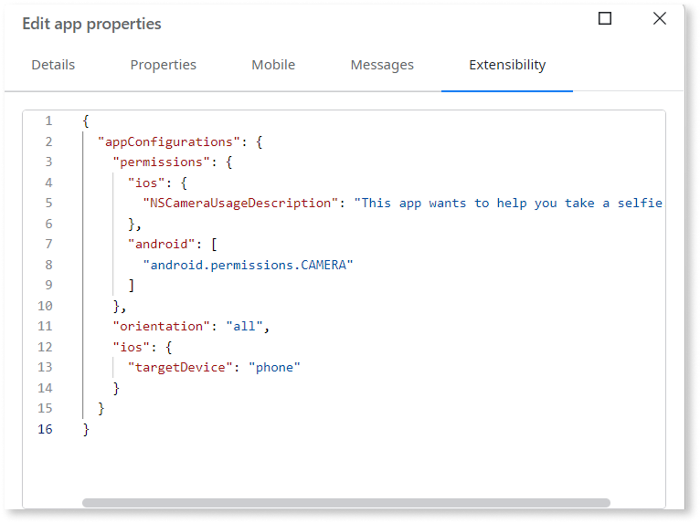

# Extensibility configurations JSON schema

OutSystems is progressively rolling out the automatic migration of Cordova-based schema to universal schema.

Applies only to mobile apps.

Extensibility configurations are JSON-based settings that allow you customize mobile-native settings. For mobile apps, you can configure properties such as splash screen, target device, and screen orientation. For mobile libraries, you can configure permissions and reference a mobile plugin to be used in your mobile library.

You can access extensibility configurations from **App** > **Edit app properties** > **Extensibility** or from your library's properties.

Some of these properties can be configured visually via the mobile app properties. For detailed information, refer to [Configuring mobile apps](configuring-mobile-apps.md).

With the introduction of the modern [Capacitor](https://capacitorjs.com/docs) framework, the extensibility configurations support both Capacitor and Cordova frameworks. For detailed information, refer to the [Universal extensibility configurations JSON schema](extensibility-configurations.md). For existing apps and libraries, OutSystems recommends that you [migrate from your existing Cordova-based schema to the universal extensibility schema](migrate-cordova-schema.md).

Extensibility configurations may be processed by OutSystems for service improvement and troubleshooting purposes. You are fully responsible for ensuring these configurations never contain, or allow OutSystems to access, any personal, confidential, or sensitive information. If a configuration must include sensitive details, you must use the ODC's secret settings to prevent sensitive data from being collected or accessed by OutSystems.

## Why are extensibility configurations needed?

Extensibility configurations are essential for customizing mobile apps and managing plugins to meet specific requirements. For detailed information about different use cases, refer to [Using extensibility configurations](extensibility-configurations-use-cases.md).

Here are some ways in which you can use the extensibility configurations:

### Customize mobile app properties

You can customize mobile app properties, such as display name, orientation, permissions, and splash screens, to meet specific requirements via the [app extensibility configurations JSON file](extensibility-configurations/extensibility-app-reference.md).

### Manage plugins

Define and manage native plugins, specifying their source, required variables, and permissions via [library extensibility configurations JSON file](extensibility-configurations/extensibility-lib-reference.md).

Within the app and mobile library extensibility configurations, you can perform native project modifications using [build actions](build-actions.md). Build actions use JSON files to define a sequence of customizations to be applied to the mobile project during the build process. With build actions, you can modify **Info.plist** or **build.gradle** files in a structured and repeatable way.

Build actions is the modern replacement for Cordova hooks and is available in both the app and library configuration. You can use build actions only for Capacitor apps.

### Build plugins that support dual framework

Support building plugins that wrap Cordova, Capacitor, or both. This allows mobile library creators to build a single wrapper that can be used in either a Cordova project or in a modern Capacitor project, facilitating a smoother transition.

### Configure and manage build time settings

You can configure and manage build time settings for your mobile app using **Extensibility settings**. You can declare these settings for your mobile app in ODC Studio and from ODC Portal, you can define and manage these settings for different deployment stages. For detailed information, refer to [Configuring mobile apps](configuring-mobile-apps.md).

## Related resources

Explore these resources to learn more about configuring your app using universal extensibility configurations:

* [Universal extensibility configurations JSON schema](extensibility-configurations.md)

* [Using extensibility configurations](extensibility-configurations-use-cases.md)

* [Migrate from your existing Cordova-based schema to universal extensibility schema](migrate-cordova-schema.md)

Explore these resources to learn more about configuring your app using Cordova-based extensibility configurations:

* [Cordova-based extensibility configurations JSON schema](legacy-extensibility-configuration.md)

* [Cordova-based extensibility configurations use cases](cordova-extensibility-configurations-use-cases.md)
