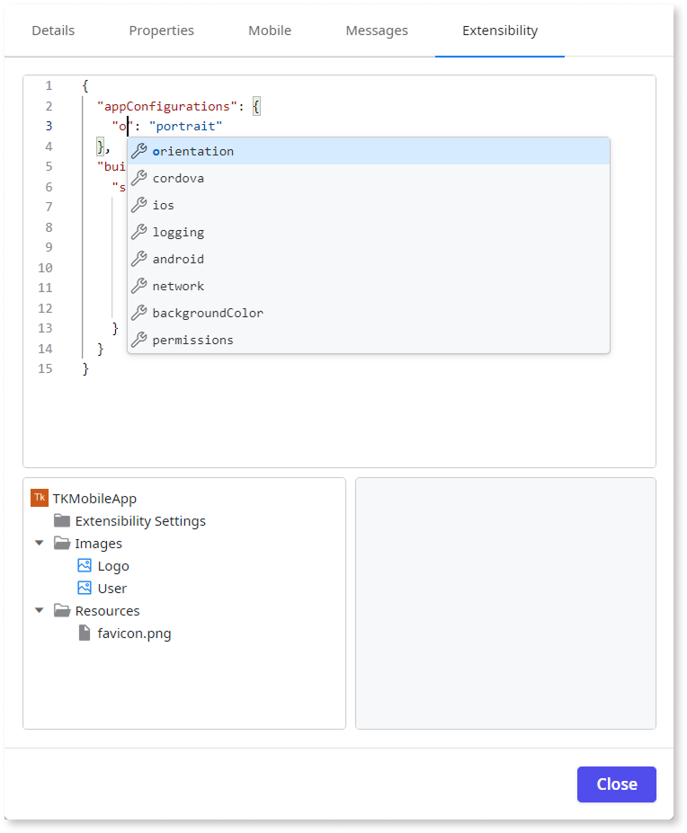

# Universal extensibility configurations JSON schema

OutSystems is progressively rolling out the automatic migration of Cordova-based schema to universal schema.

With the introduction of the modern [Capacitor](https://capacitorjs.com/docs) framework the extensibility configurations support both Capacitor and Cordova frameworks and are managed through two distinct JSON files.

* [App extensibility configurations JSON file](extensibility-configurations/extensibility-app-reference.md)

* [Library extensibility configurations JSON file](extensibility-configurations/extensibility-lib-reference.md)

OutSystems recommends adopting the universal schema because of the following benefits:

* Provides better modularity and maintainability by separating app and library configurations

* Enables structured and repeatable modifications/customizations using [build actions](build-actions.md) that are available within the app and library extensibility schema.

* Supports auto-complete and syntactical validation for preferences and values.

This screenshot illustrates auto-complete support for JSON while configuring your apps through **Extensibility**.

The [Cordova-based extensibility configuration schema](legacy-extensibility-configuration.md) doesn't have separate app and library contexts and doesn't support build actions.

The support for the Cordova-based schema will be deprecated soon. OutSystems recommends [migrating to the universal schema](migrate-cordova-schema.md).

## Schema requirements by MABS version {schema-mabs-versions}

The extensibility configuration schema you must use depends on your MABS version:

* **MABS 12 or later**: For configuring Capacitor or Cordova apps, you must use the universal schema. The Cordova-based schema is not supported.

* **MABS 11.2 to 12.x**: For Cordova apps, you can use either the universal schema or the Cordova-based schema, but you can only use one of them in your app. If the app includes both the schemas, the universal schema takes precedence and the Cordova-based schema is ignored.

* **MABS 11.1 or earlier**: You must use only Cordova-based schema. The universal schema is not supported in these versions.

If you're building apps with Apache Cordova framework using MABS versions older than 12, you can continue to use the [Cordova-based extensibility configurations JSON schema](legacy-extensibility-configuration.md).

If you attempt to use the Cordova-based schema with the Capacitor apps an error is thrown. For detailed information, refer to [Troubleshooting errors](extensibility-configurations/troubleshooting-errors.md).

## App extensibility configurations JSON schema

[App configuration](extensibility-configurations/extensibility-app-reference.md) is defined at the mobile app level. You use it to customize the final mobile app package, setting properties like the display name, orientation, app-wide permissions, and splash screen. This is the primary configuration you edit when building your app.

For detailed information about app configurations use cases, refer to [Using extensibility configuration JSON schema](extensibility-configurations-use-cases.md).

## Library extensibility configurations JSON schema

[Library (or plugin) configuration](extensibility-configurations/extensibility-lib-reference.md) is defined within a library module. You use it to define the native plugin that the library wraps. In library configuration, you can specify the plugin source, such as npm, its required variables, and the specific permissions the plugin needs to function. You edit this configuration file when creating or wrapping a mobile plugin.

For detailed information about library configurations use cases, refer to [Using extensibility configuration JSON schema](extensibility-configurations-use-cases.md).

## Related resources

Explore these resources to learn more about configuring your app using universal extensibility configurations:

* [App extensibility configuration JSON schema](extensibility-configurations/extensibility-app-reference.md)

* [Library (plugin) extensibility configuration JSON schema](extensibility-configurations/extensibility-lib-reference.md)

* [Using extensibility configurations](extensibility-configurations-use-cases.md)
