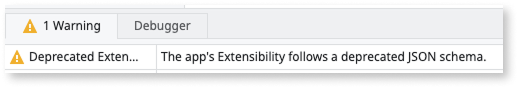
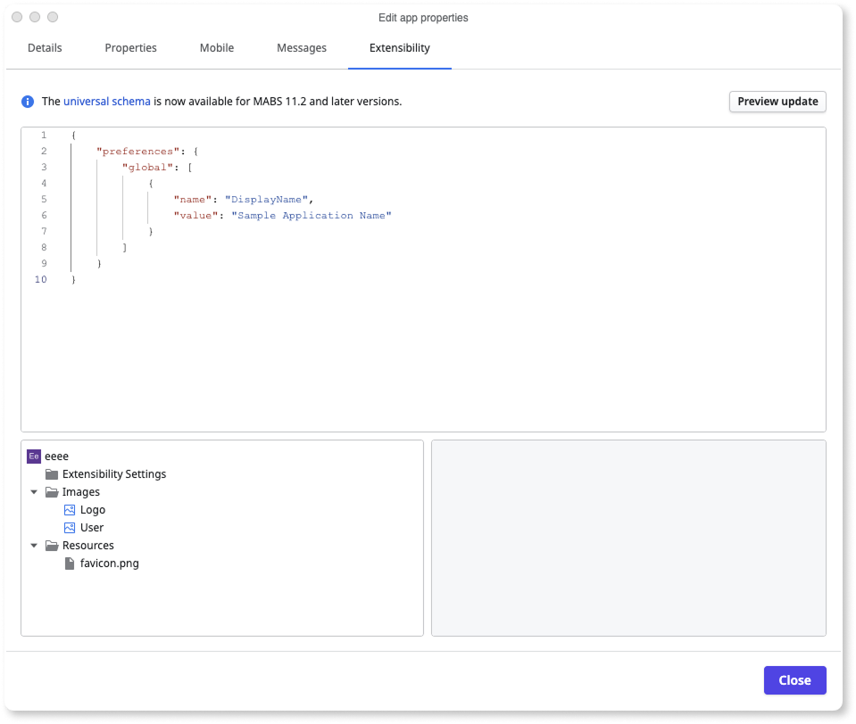
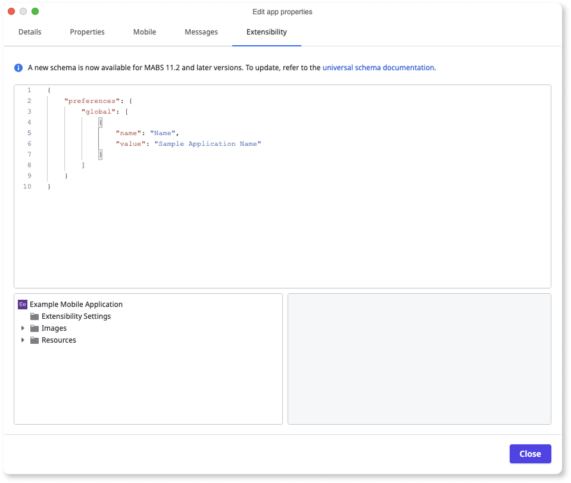
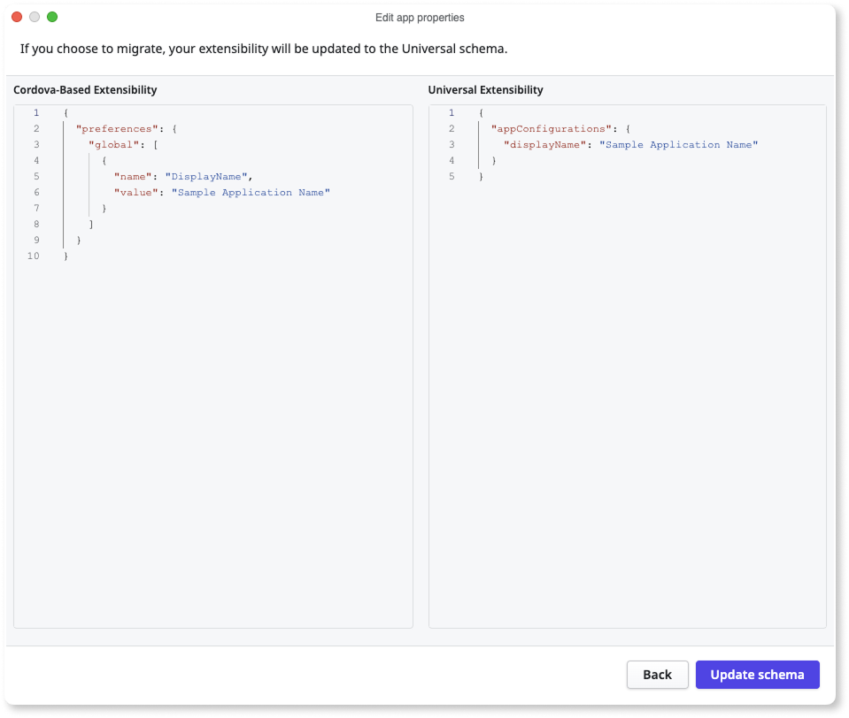
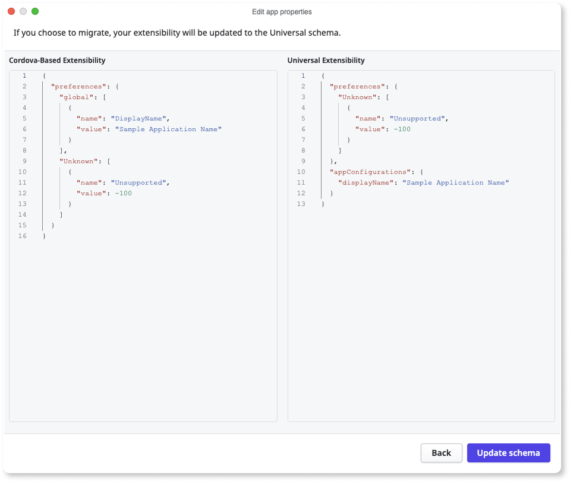
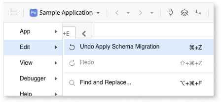

# Migrate your Cordova-based schema to the universal schema

OutSystems is progressively rolling out the automatic migration of Cordova-based schema to universal schema.

This migration applies only to existing mobile apps or libraries that contain extensibility configurations using the Cordova-based schema.

With the introduction of the modern [Capacitor](https://capacitorjs.com/docs) framework, you can now use [universal extensibility configurations](extensibility-configurations.md) that support both Capacitor and Cordova frameworks.

OutSystems recommends that you migrate your existing Cordova-based schema to the universal schema for modern Capacitor support, enhanced development experience, and better  structure and maintainability of your configurations.

If your existing app or library contains Cordova-based extensibility configuration, a **TrueChange** warning appears when you load the asset. This indicates that the Cordova-based schema is being used.

To migrate your schema, follow these steps:

1. Double-click the **TrueChange** warning to open the **Edit properties** dialog and click **Extensibility**.

1. Review the migration notice on the **Extensibility** tab:

    * If your configuration contains recognized Cordova-based properties, the **Preview update** button is displayed.

      

    * If your configuration contains only unrecognized properties,  a link to documentation is displayed instead of a preview option.

      

1. To preview your configuration in the universal schema format, click **Preview update**. The preview screen displays your existing Cordova-based configuration alongside the migrated universal schema configuration.

    

    

    If your configuration includes unsupported properties, the migration tool only migrates the recognized properties and leaves unrecognized properties in place within the new schema structure.

    

    

1. Review the preview and do one of the following:

    * Click **Update schema** to apply the universal schema configuration to your app or library.
    * Click **Back** to return to the previous view without saving your changes.

## Roll back schema changes

To undo the schema migration, use the **Undo** functionality in ODC Studio.

If you can't undo the changes, [revert to a previous version](../../deploying-apps/deploy-apps.md#versions-and-revisions) of your app.

If you encounter any issues while migrating your extensibility configuration, contact the [support team](https://success.outsystems.com/support/home/).

## Related resources

Explore these resources to learn more about the universal extensibility configuration JSON schema:

* [Universal extensibility configurations JSON schema](extensibility-configurations.md)

* [Using universal extensibility configurations](extensibility-configurations-use-cases.md)
