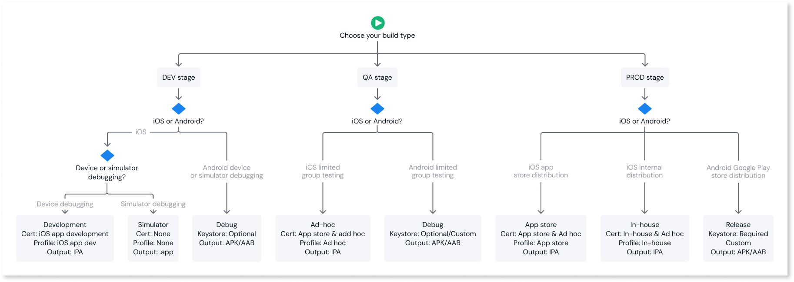

# Mobile app build types

When you [create a mobile app package](creating-mobile-package.md) in the ODC Portal, you select a build type that determines how the package is compiled, signed, and distributed. Each build type serves a different purpose in the mobile app development lifecycle, from development and testing to public distribution through app stores.

ODC provides different build types for iOS and Android platforms, each with distinct signing requirements and distribution capabilities. Choosing the correct build type ensures your app reaches the right audience with the appropriate security credentials.

Use the following decision flow to identify the right build type for your current stage.

## iOS build types

For iOS platform, ODC provides the following build types:

* [Simulator](#simulator-ios-simulator)
* [Development](#development-ios-dev)
* [App Store](#app-store-ios-app-store)
* [Ad-Hoc](#ad-hoc-ios-ad-hoc)
* [In-House](#in-house-ios-inhouse)

Each build type requires a specific combination of certificate and provisioning profiles.

### Simulator {#iOS-simulator}

The **Simulator** build type runs and tests your app in the iOS Simulator on a Mac. This allows you to validate your app’s behavior and appearance without connecting a real device or needing an Apple Developer account. They do not require any certificates or provisioning profiles and produces an `.app` bundle not an IPA file.

Use this build type when you want to quickly test your app's behavior on different iOS device models and screen sizes without provisioning a physical device. OutSystems recommends verifying critical features on actual hardware as well.

For detailed information about running apps in the iOS Simulator, refer to [Running your app in Simulator or on a device](https://developer.apple.com/documentation/xcode/running-your-app-in-simulator-or-on-a-device) in the Xcode documentation.

#### Limitations

The Simulator build type has important differences compared to other physical device builds. Review these before deciding to use this build type:

* **Not installable on physical devices**: Runs only in the Xcode iOS Simulator on a Mac. They can't be installed on physical iOS devices.

* **Not distributable**: Strictly for local development and testing. They can't be shared or submitted to the App Store.

* **Different architecture**: Compiles for the x86_64 or arm64 simulator architecture, not the ARM architecture used by physical iOS devices. Some device-specific behaviors may not reproduce accurately in the simulator.

* **No code signing**: Doesn't enforce the same security model as physical devices, so no code signing is applied.

* **AppShield not applied**: If your app uses AppShield, you can still build it using the Simulator build type, but shielding is not applied. To test security-sensitive features, use a Development or Ad-Hoc build on a physical device.

For a detailed comparison of simulator and physical device testing, refer to [Testing in Simulator versus testing on hardware devices](https://developer.apple.com/documentation/xcode/testing-in-simulator-versus-testing-on-hardware-devices) in the Xcode documentation.

### Development {#iOS-dev}

The **Development** build type is used to test your app on registered physical devices during development. Use this build type when you want to verify functionality on a real device before sharing your app with a wider group of testers.

Here are some additional details about Development build type:

* **Output**: IPA file.
* **Certificate required**: `iOS App Development` certificate. For more information about iOS development certificates and how to create them, refer to [Certificates overview](https://developer.apple.com/help/account/certificates/certificates-overview/) and [Create a certificate signing request](https://developer.apple.com/help/account/certificates/create-a-certificate-signing-request) in the Apple Developer documentation.
* **Provisioning profile required**: `iOS App Development` provisioning profile. For more information about provisioning profiles and how to create a development provisioning profile, refer to [Inside Code Signing: Provisioning Profiles](https://developer.apple.com/documentation/technotes/tn3125-inside-code-signing-provisioning-profiles) and [Create a development provisioning profile](https://developer.apple.com/help/account/provisioning-profiles/create-a-development-provisioning-profile) in the Apple Developer documentation.
* **Device restriction**: Only devices listed in the provisioning profile can install and launch the app. Devices not included in the profile receive an "Unable to Download App" alert.
* **Developer Mode**: Devices must have Developer Mode enabled. For more information, refer to [Apple's Developer Mode documentation](https://developer.apple.com/documentation/Xcode/enabling-developer-mode-on-a-device).

### App Store {#iOS-app-store}

The App Store build type is used to submit your app to the Apple App Store for public distribution. Use this build type when your app is production-ready and you want to make it available to the general public through the App Store.

Here are some additional details about App Store build type:

* **Output**: IPA file.
* **Certificate required**: `App Store and Ad Hoc` certificate. For more information about iOS distribution certificates and how to create them, refer to [Certificates overview](https://developer.apple.com/help/account/certificates/certificates-overview/) and [Create a certificate signing request](https://developer.apple.com/help/account/certificates/create-a-certificate-signing-request) in the Apple Developer documentation.
* **Provisioning profile required**: `App Store` provisioning profile. For more information about how to create an App Store provisioning profile, refer to [Create an App Store provisioning profile](https://developer.apple.com/help/account/provisioning-profiles/create-an-app-store-provisioning-profile) in the Apple Developer documentation.
* **Apple Developer Program**: Requires enrollment in the [Apple Developer Program](https://developer.apple.com/programs/).
* **Review process**: Apple reviews the app before making it available in the app store.

### Ad-Hoc {#iOS-ad-hoc}

The Ad-Hoc build type is used to distribute your app to a limited group of testers outside the App Store. Use this build type when your app is ready for broader testing and you want to share it with a defined group of users before publishing to the App Store. You distribute the app by sharing the IPA file, an installation link, or a QR code. You also have the option to use Apple's TestFlight Beta Testing program through [App Store Connect](https://appstoreconnect.apple.com).

Here are some additional details about Ad-Hoc build type:

* **Output**: IPA file.
* **Certificate required**: `App Store and Ad Hoc` certificate (Apple Developer Program) or `In-House and Ad Hoc` certificate (Apple Developer Enterprise Program). For more information, refer to [Certificates overview](https://developer.apple.com/help/account/certificates/certificates-overview/).
* **Provisioning profile required**: `Ad Hoc` provisioning profile with the relevant device IDs. For more information about how to create an ad hoc provisioning profile, refer to [Create an ad hoc provisioning profile](https://developer.apple.com/help/account/provisioning-profiles/create-an-ad-hoc-provisioning-profile) in the Apple Developer documentation.
* **Device restriction**: Only devices listed in the provisioning profile install and launch the app.
* **Developer Mode**: Devices must have Developer Mode enabled. For more information, refer to [Apple's Developer Mode documentation](https://developer.apple.com/documentation/Xcode/enabling-developer-mode-on-a-device).

### In-House {#iOS-inhouse}

The In-House build type is used to distribute your app internally within your organization, outside the app store. Use this build type when your app is intended only for internal use and doesn't need to go through the App Store.

Here are some additional details about In-House build type:

* **Output**: IPA file.
* **Certificate required**: `In-House and Ad Hoc` certificate. For more information about creating the enterprise distribution certificate, refer to [Create enterprise distribution certificates](https://developer.apple.com/help/account/certificates/create-enterprise-distribution-certificates) in the Apple Developer documentation.
* **Provisioning profile required**: `In-House` provisioning profile. For more information about distributing enterprise apps and how provisioning works in this context, refer to [Distributing your app for beta testing and releases](https://developer.apple.com/documentation/xcode/distributing-your-app-for-beta-testing-and-releases) in the Xcode documentation.
* **Apple Developer Program**: Requires enrollment in the [Apple Developer Enterprise Program](https://developer.apple.com/programs/enterprise/).
* **Review process**: No Apple review. You handle distribution through an internal enterprise store or by sharing the IPA file directly.
* **Device restriction**: No device-level restrictions. Any device within your organization installs the app.

## Android build types

Android offers two build types. The signing mechanism for Android uses a keystore file instead of the certificate and provisioning profile combination used by iOS.

### Debug {#android-debug}

The **Debug** build type is used to test your app on a physical device or emulator during development. Use this build type when you want to verify your app on a device during active development. You optionally sign the debug build with a custom keystore if your testing workflow requires it.

Here are some additional details about Debug build type:

* **Output**: APK or AAB file.
* **Keystore**: Optional. If you don't provide a custom keystore, MABS signs the package with a default debug keystore.
* **Distribution**: Sideload the app onto devices by sharing the build file, an installation link, or a QR code. Not suitable for submission to the Google Play Store.

If the device blocks the installation because the app was obtained from an unknown source, go to the device settings and allow installation from unknown sources.

### Release {#android-release}

The Release build type is used to create a production-ready build for distribution through the Google Play Store or other channels. Use this build type when your app is ready for production, and you want to distribute it to end users. Always use the same keystore to sign updates of the same app, because the Google Play Store requires a consistent signing identity across versions.

Here are some additional details about Release build type:

* **Output**: APK or AAB file.
* **Keystore**: Required. You must provide a custom keystore file, the keystore password, an alias name, and the alias password.
* **Distribution**: Submit to the Google Play Store, distribute through enterprise channels, or share the build file directly.

## Related resources

* [Create mobile app package](creating-mobile-package.md)
  
* [Building Cordova and Capacitor apps in MABS 12](mabs-overview.md)
