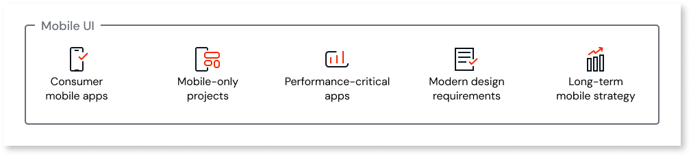
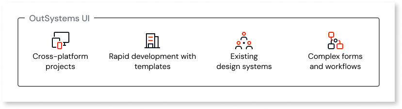

# Mobile UI versus OutSystems UI

When building mobile apps in OutSystems Developer Cloud (ODC), you can choose between **Mobile UI** (mobile-only) and **OutSystems UI** (cross-platform) frameworks. This guide helps you choose the right UI framework for your app.

**Mobile UI** focuses on providing mobile apps with an excellent user experience, ensuring quality and speeding up development through native mobile styling, shadow DOM architecture, and CSS variables customization.

**OutSystems UI** provides comprehensive cross-platform support for web and mobile apps with an extensive widget library and complete tooling ecosystem (theme editor, style editor, and scaffolding).

## Decision guide

Use this guide to determine which framework best fits your project requirements.

Choose **Mobile UI** for:

* Consumer mobile apps: Customer-facing apps where a native mobile experience is critical

* Mobile-only projects: Apps that will never need a web version (excluding PWAs which are  considered mobile projects)

* Performance-critical apps: Apps with time-sensitive transactions or apps with real-time data updates requiring smooth interactions

* Modern design requirements: Apps that need cutting-edge mobile design patterns

* Long-term mobile strategy: New projects that can invest in learning modern mobile technologies

Choose **OutSystems UI** for:

* Cross-platform projects: Building both web and mobile versions of the same app.

* Rapid development with templates: If screen templates and scaffolding are higher priorities than mobile-optimized user experience, OutSystems UI may reduce initial development effort.

* Existing design systems: If you already have a design system implemented with OutSystems UI and want to maintain consistency across your apps, continuing with the same framework helps you build new apps faster.

* Apps with complex forms and workflows: OutSystems UI provides components such as the table and pagination components, and supports adding lists inside other widgets (for example, inside accordions or button groups). These capabilities accelerate the development of apps with heavy data entry and complex forms.

### Quick decision matrix

Use this matrix to select a UI framework that best suits your project type.

| **Your situation** | **Recommended choice** |
| ------------------------------- | ---------------------- |
| Mobile-only consumer app | Mobile UI |
| Performance-critical mobile app | Mobile UI |
| Team new to OutSystems | Mobile UI |
| Modern mobile design required | Mobile UI |
| Rapid development with templates | OutSystems UI |
| Building web and mobile versions | OutSystems UI |

## Framework comparison

The following table compares the key aspects of both frameworks:

| **Aspect** | **Mobile UI** | **OutSystems UI** |
| ------------------- | -------------- | ------------------ |
| **Target platform** | Mobile-specific (Cordova or Capacitor) | Web and mobile (unified) |
| **Performance** | Mobile-optimized with faster rendering and smoother animations, especially in scroll-heavy lists | Balanced cross-platform performance |
| **Developer experience** | More low-code features with extensive styling properties (sizes, shapes, colors), better composability (icons inside inputs, avatar with badges), and better built-in defaults | Patterns with complete tooling (Theme Editor, Style Editor, Scaffolding) |
| **Customization** | CSS variables and Shadow Parts for encapsulated styling without conflicts | CSS classes and theme inheritance |
| **Widget availability** | Mobile-optimized widgets designed for touch interactions and modern mobile experiences. Includes specialized mobile components (for example, Bottom Sheet, OTP Input) and mobile-optimized versions of common widgets. | Comprehensive cross-platform widgets and patterns that work consistently across web and mobile apps. Both frameworks include standard form controls (for example, Input and Button) and layout elements. |
| **Icons** | Phosphor icons (9,000+ icons) | OutSystems icons |

## Related resources

* [Mobile UI overview](mobile-ui-overview.md)

* [Mobile apps introduction](../../mobile/intro.md)

* [Mobile UI website](https://mobileui.outsystems.com)
