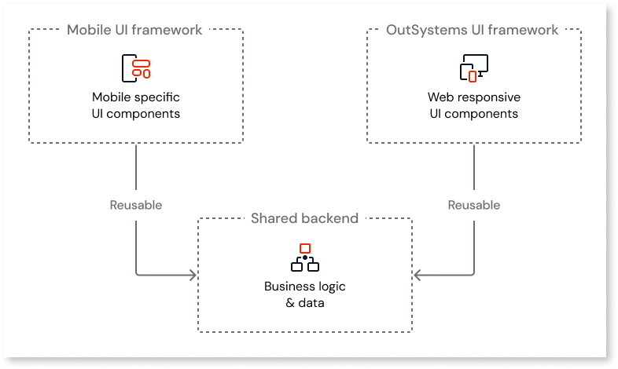
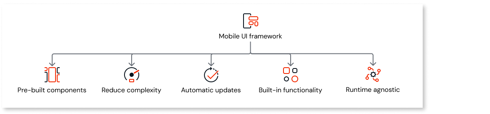

# Mobile UI framework

The **Mobile UI framework** is a UI framework toolkit (a collection of reusable UI widgets) for building mobile apps in ODC Studio. It provides mobile-specific widgets designed for mobile interfaces, addressing common development challenges such as touch interaction, device compatibility, and responsive layouts.

The framework includes widgets with built-in mobile behaviors, configurable design patterns, and a flexible styling system using CSS variables and utility classes. You can use it to build mobile apps that function across different mobile devices and screen sizes.

The Mobile UI framework provides native behaviors by default and configurable design patterns. It is designed to meet the quality and performance standards required for mobile B2C and consumer-facing apps. Use the Mobile UI framework when building mobile apps with a long-term app strategy, where user experience, modern design, and fast development are top priorities.

OutSystems recommends using Mobile UI for mobile development, as it provides a comprehensive set of widgets designed specifically for mobile devices, with consistent patterns and behaviors, consistent look and feel across platforms, and full default configurations for layouts and widgets.

To help you choose between Mobile UI and OutSystems UI frameworks when building your apps, refer to [Mobile UI versus OutSystems UI](framework-comparison.md).

## Key features {#key-features}

The Mobile UI framework provides you with a comprehensive set of tools and components for mobile app development:

* Widget library with capabilities such as loading states, validation feedback, touch gestures, and animation effects.

* Mobile-first design system with pre-defined patterns, spacing, typography, and color schemes optimized for mobile interfaces.

* Flexible styling architecture using CSS variables, utility classes, and configurable widget properties ([Customization and extensibility](#customization-and-extensibility)).

* Native mobile behaviors including automatic keyboard type selection for inputs, haptic feedback integration, and expanded clickable areas for touch interaction. Adaptive layouts handle device-specific features such as status bars and safe areas around notches (for example, screen cut-outs for cameras).

* Design patterns and components that adhere to current mobile interface standards.

## Framework architecture {#framework-architecture}

The Mobile UI framework is only available for mobile apps. While the OutSystems UI is designed to adapt from web to mobile, the Mobile UI is purpose-built for mobile devices, with layouts that naturally scale and adapt to both phones and tablets.

Mobile UI and OutSystems UI are designed as separate, complete frameworks, each with its own distinct visual language (spacing, typography, colors, component structure). Mobile UI introduces concepts and behaviors that don't map 1:1 to OutSystems UI, for example, bottom sheets and mobile-specific navigation patterns. For this reason, OutSystems recommends choosing one framework per app to maintain design consistency and leverage each framework's full capabilities.

Moving from OutSystems UI to Mobile UI is a rewrite, not a migration. Unlike a migration where you convert existing components, switching to Mobile UI requires rebuilding your screens from scratch using Mobile UI widgets. While you can reuse backend logic and data handling, you must rebuild all screens, layouts, and UI components because Mobile UI's widget-based architecture is incompatible with OutSystems UI components.

## Benefits of using the Mobile UI framework {#benefits-of-using-the-mobile-ui-framework}

The Mobile UI framework offers the following benefits:

* Eliminates the need to implement common UI patterns from scratch by providing pre-built components such as buttons with loading states, form validation widgets, and responsive navigation.

* Reduces mobile development complexity with built-in behaviors that handle touch target sizing for accessibility, loading states during async operations, and screen density adjustments without additional configuration. Optimized rendering ensures smooth, responsive interactions across devices.

* Provides automatic updates and improvements when performance enhancements or platform support are released, without requiring individual component modifications or extensive testing.

* Includes comprehensive built-in functionality for common use cases, such as input widgets with labels, helper messages, icons, character counters, clear buttons, and keyboard types, eliminating manual implementation.

* Offers integrated badge support across multiple component types (avatars, bottom bar items, buttons) with automatic placement and styling when you enable the badge property.

* Works with both Capacitor and Cordova native runtime stacks. There are no restrictions between the UI framework and the native runtime stack.

## Customization and extensibility {#customization-and-extensibility}

Mobile UI provides configuration and extensibility options for widgets and layouts through widget properties and CSS variables. You can make additional styling changes directly through CSS, giving you extensive control over widget appearance and behavior. For more information about the available widget properties, refer to the [Mobile UI website](https://mobileui.outsystems.com).

## Related resources {#related-resources}

* [Mobile UI versus OutSystems UI](framework-comparison.md)

* [Mobile UI website](https://mobileui.outsystems.com)
