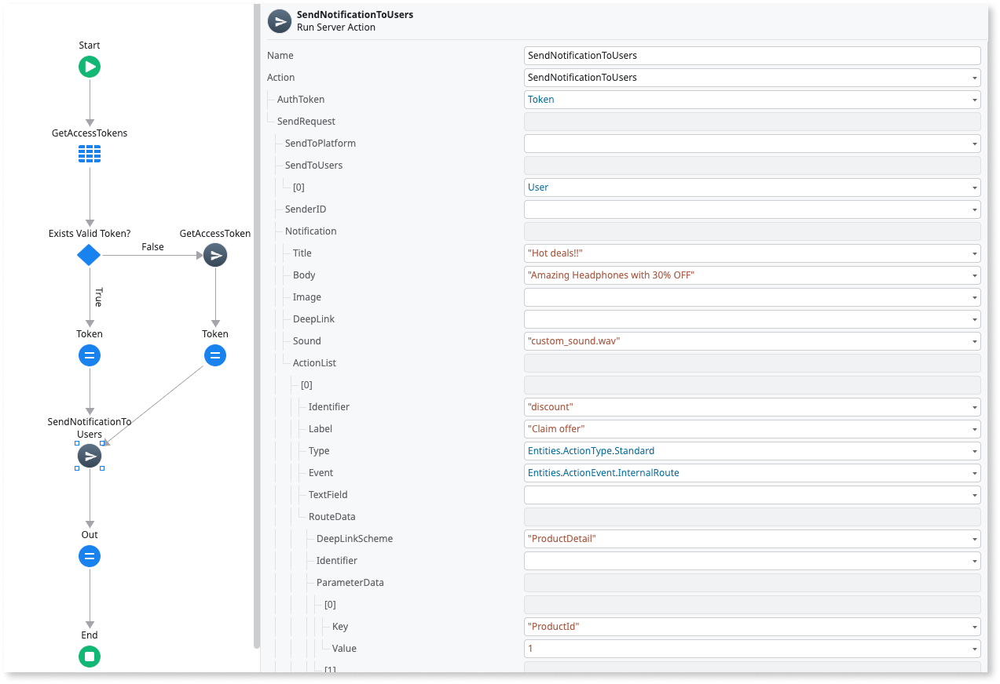
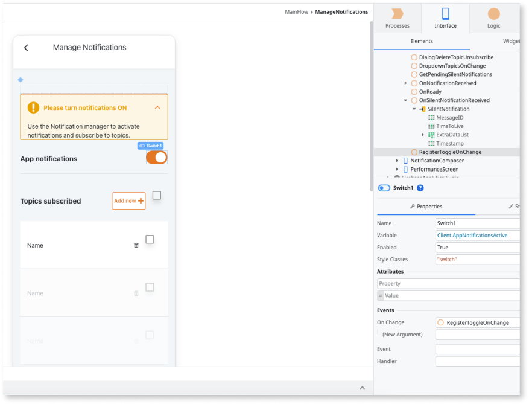
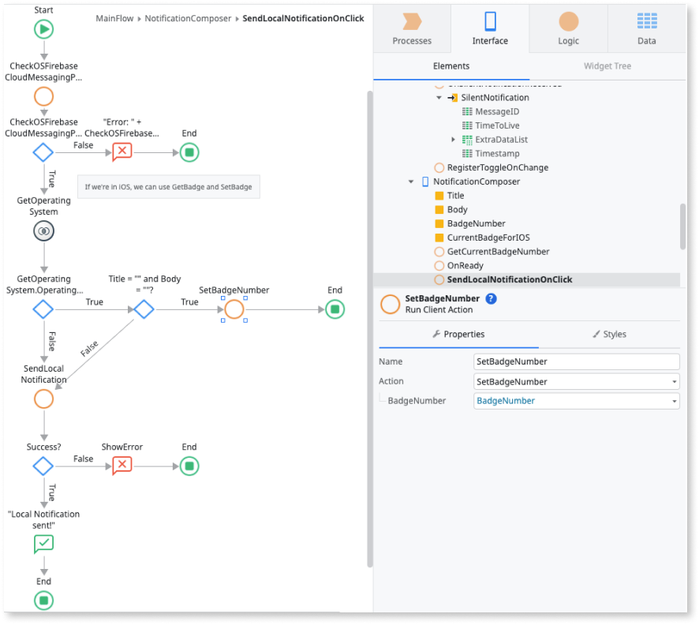
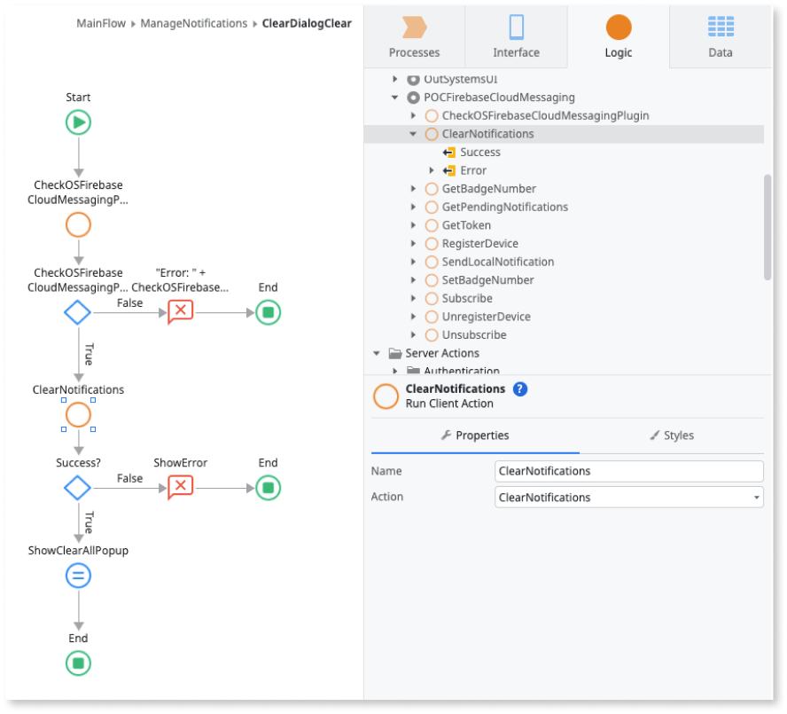

# Firebase Cloud Messaging plugin using server actions

<div class="info" markdown="1">

This article applies only to Firebase Cloud Message plugin version 1.0.0 and newer. The newer versions use [server actions](#server-actions-reference) to manage the notifications.

If you are still using Firebase Cloud Message plugin version 0.1.2 and older, OutSystems recommends that you migrate to version 1.0.0 and newer by June 2024.
 
</div>

The [Firebase Cloud Messaging plugin](https://www.outsystems.com/forge/component-overview/12174/cloud-messaging-plugin-firebase) allows you to set a notification experience that starts the Firebase cross-platform messaging solution. This plugin lets you send normal and silent notifications to your mobile app users. Normal notifications can include customizable actions and sounds.

Normal notifications have a UI that displays visual and auditory cues. The cues either display in the app's notifications area or in the app's scope. Silent notifications don't display any visual cues. Notifications can deliver a data package to the app (called extra data) in the form of a key-value pairs list.

OutSystems also has notification features you can use to create custom actions and custom sounds.

<div class="info" markdown="1">

You can install the Firebase Cloud Messaging Plugin from the Forge in ODC Portal.

</div>

Normal notifications have a UI that displays visual and auditory cues. The cues either display in the notifications area of the app or in the scope of the app. Silent notifications don't display any visual cues. Notifications can deliver a data package to the app (called extra data) in the form of a key-value pairs list.

OutSystems also has notification features you can use to create custom actions and custom sounds.  

Following is a high-level process describing how to implement and manage the notifications of your OutSystems app.

1. Use the **Firebase Cloud Messaging Plugin’s Server Actions** to set up a back-end notification service.

1. Use the **Firebase Cloud Messaging Plugin's Client Actions** to implement basic notification functions in your app.

1. To prevent app runtime errors, verify if the plugin is available during runtime in your app. To check the availability of your plugin, from Service Studio, go to **Logic** > **Client Actions** > **CloudMessagingPlugin** > **CheckCloudMessagingPlugin** action. If the plugin isn't available in your app, display an error to your end-users.

<div class="info" markdown="1">

To learn how to install and reference a plugin in your OutSystems apps, and how to install a sample app, see [Installing a plugin and adding a public element to your app](../intro.md#installing-a-plugin-and-adding-a-public-element-to-your-app). To use this plugin, verify your app meets all the [Firebase prerequisites](intro.md#prerequisites).

</div>

## Sample app

OutSystems provides a sample app that contains logic for common use cases. Install the Firebase sample app from Forge and then open it in ODC Studio.

This sample app shows you how to do the following:

* Trigger a basic notification, leading to internal routes.

* Trigger a notification with custom actions that lead to internal routes.

* Trigger a notification with custom actions that lead to a given URL in the device’s browser.

* Trigger a notification with custom actions that lead to an external app.

* Trigger a notification with custom actions that open a text field.

* Trigger a notification with a custom sound.

## Compose and manage push notifications

The following steps describe how to create a back-end notification service and how to prepare a mobile app to respond with push notifications:

1. [Set up a back-end notification service using the send Notifications Server Actions](#setup-back-end).

1. [Enable basic notification functions in your app using the plugin's actions](#enable-notifications-plugins).

1. [Enable notifications with custom actions](#enable-custom-actions).

1. [Enable notifications with custom sounds](#enable-custom-sounds).

1. [Manage the experience of in-app notifications using the Notifications block](#manage-notification-ux).

1. [Manage the experience of custom actions using the Notifications block](#manage-custom-actions-ux).

### Set up a back-end notification service { #setup-back-end }

<div class="info" markdown="1">

The Cloud Messaging Configurator, version 0.1.2 and older, is deprecated. For more information, see [Firebase Cloud Messaging HTTP protocol](https://firebase.google.com/docs/cloud-messaging/http-server-ref). This means the **v2** and **v1** endpoints will no longer be functional.

The Cloud Messaging Configurator's REST APIs have been replaced by server actions available on the Firebase Cloud Messaging Plugin. If you are consuming these APIs, they must be replaced with the server actions as soon as possible.

</div>

To set up a back-end notification service, do the following:

1. Install the **Cloud Messaging Configurator** app from [Forge] forge component in your environment. 
    This component includes four **Server Actions** that allow you to send notifications to a list of users or topics and one **Server Action** to generate an **Access Token**.

1. Create a new app to serve as your backend notification service.

   This app can be a Reactive Web or Mobile app.

1. In the newly created application, consume the **Firebase Cloud Messaging Plugin** and add the server Actions, along with its associated static entities.
   
   
   

   
1. Get your Firebase Service Account File via **Firebase Console > Settings > Service Accounts > Generate new private key**
   
   

1. Update the plugin’s settings with the information inside this service account JSON File

    1. In ODC Portal, go to the Details page of your app.

    1. Navigate to the Configurations tab, and expand the Settings section.

    1. For the **PrivateKey** setting, copy/paste the value of the private_key field of your Firebase Service Account JSON File.

    1. For the **PrivateKeyID** setting, copy/paste the value of the private_key_id field of your Firebase Service Account JSON File.

    1. For the **FirebaseProjectInfo** setting, open your Service Account File in your text editor of choice, remove private_key_id and private_key fields and copy/paste the resulting JSON.

        The Original Service Account JSON format is: 
        ```JSON
        { 
            "type": "service_account",
            "project_id": "<your-id>",
            "private_key_id": "<your-private-key-id",
            "private_key": "<your-private-key",
            "client_email": "<your-client-email>",
            "client_id": "<your-client-id",
            "auth_uri": "https://accounts.google.com/o/oauth2/auth",
            "token_uri": "https://oauth2.googleapis.com/token",
            "auth_provider_x509_cert_url": "<cert-url>",
            "client_x509_cert_url": "<client-cert-url",
            "universe_domain": "googleapis.com"
        }
         ```
        While the FirebaseProjectInfo JSON setting should be:
        ```JSON
        { 
            "type": "service_account",
            "project_id": "<your-id>",
            "client_email": "<your-client-email>",
            "client_id": "<your-client-id",
            "auth_uri": "https://accounts.google.com/o/oauth2/auth",
            "token_uri": "https://oauth2.googleapis.com/token",
            "auth_provider_x509_cert_url": "<cert-url>",
            "client_x509_cert_url": "<client-cert-url",
            "universe_domain": "googleapis.com"
        }
         ```
1. Create the logic to store and manage your Firebase Access Token in the app you just created.

    Call the new server action GetAcessToken and store its return value. This token expires after one hour and, to avoid calling the action GetAccessToken unnecessarily, its value, along with its creation time, should be stored in a Database table. Before calling the server action, check if the token has expired and only then refresh its value.

Now you can start to create the UI for your back-end notification service. For example, to send a notification to all users on the associated Firebase project (using an app with the Cloud Messaging plugin), associate the **SendNotificationToUsers** Server Action to a button and add logic to retrieve your Service Account file.



Other available methods include **SendNotificationToTopics**, **SendSilentNotificationToUsers**, and **SendSilentNotificationToTopics**.

#### Sending notifications to a  100+ users list{ #send-notifications-limited-list }

<div class="info" markdown="1">

Starting from Firebase Cloud Messaging Plugin version 0.1.3 and onwards, sending notifications to an unlimited list of users is not supported. 

</div>

This section describes how you can send notifications to a big user list, using the **SendNotificationToUsers** and **SendSilentNotificationsToUsers** Server Actions. 

Both server actions have a limit of 100 users (**SendToUsers** parameter), throwing an Exception if a list exceeds this limit. To send notifications to a bigger user list, we recommend using asynchronous logic, with Timers.

Inside a Timer, you can iterate over your user list and send notifications to up to 100 users at a time. 

<div class="info" markdown="1">
To learn more about how to use Timers, see the [documentation](https://success.outsystems.com/documentation/outsystems_developer_cloud/building_apps/use_timers/).
</div>

### Enable basic notification functions in your app { #enable-notifications-plugins }

This section describes some of the actions that you can use to leverage notification functions on your mobile app.

On first use, you might want to send to receive notifications to your app user. For that, you can use the **RegisterDevice** action on the initialization of your app. On first use, this action displays a native request permission, dialog and upon user acceptance, the device is registered on the Firebase Cloud Messaging service and is ready to receive notifications. On future verifications, you can always use the **CheckPermission** action to verify if the app has permission to receive notifications.

Alternatively, you can provide an explicit way to register and unregister the device from the Firebase cloud Messaging service using the **RegisterDevice** / **UnregisterDevice** actions. Then associate the actions to a UI element such as a toggle.



After registering the device on the Firebase Cloud Messaging service, the active device's token becomes available and can be retrieved using the action **GetToken**.

To manage topic subscriptions, you can use the **Subscribe / Unsubscribe** actions. The user will need to set the topic name to which the app will subscribe (or unsubscribe). If the topic doesn't exist yet on the Firebase Cloud Messaging project, it creates a new one.


To retrieve all pending silent notifications, you can use the **GetPendingNotification** action. This action outputs a silent notifications list with Timestamp, MessageID, TimeToLive, and an ExtraData list of key-value pairs. Silent notifications are notifications that have no UI representation in the form of a visual or auditory stimulus in the app. Despite being silent, these notifications can deliver a data package to the app (called extra data), in the form of a list of key-value pairs.

<div class="info" markdown="1">

Note that when receiving a silent notification without extra data and your app is in the background, the notification is not saved in the database, that is, it won’t be returned in the **GetPendingNotifications** action.

</div>

As part of the notification experience, the developer might want to control the badge number which is a value that appears on the top-right corner of the app icon. The way you control the badge number differs from operative system:

* For iOS you can use the **GetBadgeNumber** action to retrieve the current badge number and the **SetBadgeNumber** to specify a given number to be shown on the app icon badge.

* For Android you can only specify a given badge number after receiving a notification. Thus, you can use the **SendLocalNotification** action and set the badge number through the action parameter *BadgeNumber*.



Finally, you might want to give the opportunity to your user to clear all the app's notifications remaining in the notification center. For this, you can associate the **ClearNotifications** action to a piece of UI, such as a button.



### Enable notifications with custom actions { #enable-custom-actions }

To enhance your notification with custom actions you must use the **Plugin's Server Actions**, using the **ActionList** parameter inside the Notification parameter on the **SendNotificationToTopics** or **SendNotificationToUsers** Server Actions.

We offer the following types of custom actions:

* **Internal route** - Sends an event to be handled by the app, similar to a basic notification click.

    * For this action, you must check the **Manage the experience of custom actions**. 

* **Web route** - Opens a given URL in the device’s browser.

* **App route** - Opens a route in an external app.

* **Reply field** - Opens a text field that lets users send a text directly to the app.

### Enable notifications with custom sound { #enable-custom-sounds }

To use custom sounds on your mobile app, complete the following steps:

1. Put your sound (.wav) files, which you want to use as notification sounds, into a zip file called **sounds.zip**.

1. Go to the ODC portal.

1. From the left Navigation menu, select **Apps** > select your app > your app details page > **Configuration**.

1. In the **Sound** setting, upload the **sounds.zip** file.

    <div class="info" markdown='1'>

    Even though this setting is optional, you must add a file to it. This requirement is temporary.

    </div>

Additionally, you must use the **Plugin's Server Actions**, using the **Sound** parameter inside the **Notification** parameter on the **SendNotificationToTopics** or **SendNotificationToUsers** methods.

<div class="info" markdown="1">

* Only .wav files are supported.

* The name of the zip sound file (.wav) can only contain lowercase letters, numbers, and underscores. If you add any other characters, the android build won't work.

</div>

### Manage the experience of in-app notifications { #manage-notification-ux }

By default, a cloud messaging notification displays in the notification center. However, you can also display the notification in-app when the app is on the foreground. To enable this notification, you can use the **NotificationsHandler** block. This block triggers events that pass the parameters of both notifications and silent notifications to the context of the app.

You need to add this block to each screen that might handle the notification content.

### Manage the experience of custom actions using the Notifications block. { #manage-custom-actions-ux }

By default, a cloud messaging notification displays in the notification center. However, you can also display the notification in-app when the app is in the foreground. To enable this you can use the **NotificationsHandler** block, using **InternalRouteActionClicked** for custom actions. This block triggers events that pass the parameters of both notifications and silent notifications to the context of the app.

Add this block to each screen that might handle the notification content.

### Optional setup for notification Channel Name and Description - Android only

By default, the Cloud Messaging plugin defines values for the notification channel name and description on local notifications. But in some instances, you might want to define a different default value by adding the following name and value properties on the extensibility configurations of your app:

```JSON
{
    "preferences": {
        "android": [
            {
                "name": "NotificationChannelDefaultName",
                "value": "This is my channel Name"
            },
            {
                "name": "NotificationChannelDefaultDescription",
                "value": "This is my channel Description"
            }
        ],
    }
}
```

## Server actions reference

### GetAcessToken
Returns the Firebase Access Token of the Firebase Project defined in the OutSystems app settings. This token expires after one hour.

|Parameter| Type | Data Type | Description |
|:--------|:--------|:----------|:------------|
| Token | Output | Text | The generated access token. Expires after one hour. |

### SendNotificationToTopics

Sends a notification to all users associated with a topic or group of topics.

|Parameter| Type | Data Type | Description |
|:--------|:--------|:----------|:------------|
| AuthToken | Input | Text | The Firebase Access Token. |
| SendRequest | Input | SendToTopics Data Structure | The notification to topics request. |
| Response | Output | FirebaseResponse Data Structure | The Response sent by Firebase. |

### SendNotificationToUsers

Sends a notification to a user or group of users.

Parameter| Type | Data Type | Description |
|:--------|:--------|:----------|:------------|
| AuthToken | Input | Text | The Firebase Access Token. |
| SendRequest | Input | SendToUsers Data Structure | The notification to users request. |
| Response | Output | FirebaseResponse Data Structure | The Response sent by Firebase. |

### SendSilentNotificationToTopics

Sends a silent notification to all users associated with a topic or group of topics.

|Parameter| Type | Data Type | Description |
|:--------|:--------|:----------|:------------|
| AuthToken | Input | Text | The Firebase Access Token. |
| SendRequest | Input | SilentTopicNotification Data Structure | The silent notification to topic request. |
| Response | Output | FirebaseResponse Data Structure | The Response sent by Firebase. |

### SendSilentNotificationToUsers

SendSilentNotificationToUsersSends a silent notification to a user or group of users.

|Parameter| Type | Data Type | Description |
|:--------|:--------|:----------|:------------|
| AuthToken | Input | Text | The Firebase Access Token. |
| SendRequest | Input | SilentUserNotification Data Structure | The silent notification to users request. |
| Response | Output | FirebaseResponse Data Structure | The Response sent by Firebase. |

## Limitations

### On silent notifications

For iOS.

When a device has a low battery, apps don't process silent notifications.

For more information, see [Apple documentation](https://developer.apple.com/documentation/).

### On subscribe to topic

For both iOS and Android.

Firebase SDKs for Android and iOS don't support subscribing to topics if the name contains spaces, like `TV Shows`.

## On compatibility with Firebase Performance

For both iOS and Android.

Using the Firebase Cloud Messaging in combination with Firebase Performance requires v1.0.4 (or higher) of the latter.
