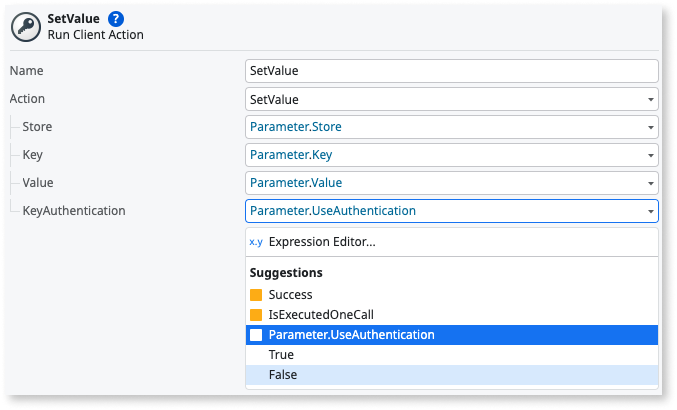

# Key Store Plugin

Applies only to Mobile Apps.

Use the Key Store Plugin to enable an application to securely store, get and remove secrets (key-value pairs) such as usernames, passwords, tokens, certificates, or other sensitive information on iOS and Android devices.

See [Adding plugins](../intro.md) to learn how to install a plugin in your OutSystems apps.

## Manage your secrets

To manage secrets and provide a good user experience:

* Create logic to set, get and remove a secret
* Create logic to handle errors

### Creating logic to set, get and remove a secret

The KeyStore Plugin actions are in the Logic tab of ODC Studio, in **Client Actions > KeyStorePlugin**.

#### Check if the plugin is available in the app

To prevent errors, it's a best practice to check if the plugin is available (1) with the action **CheckKeyStorePlugin**. If the plugin isn't available to the app, display an error to the user (2).

#### Set a value

You can use the **SetValue** action to set a new secret (3). In the **SetValue** action, you set the key-value pair and the key authentication method.

Check if setting a value works by verifying the value of **SetValue.Success** (4) is **True**. If **False**, you can add an **Error** and enter a **Message** that users can see in case of an error.

#### Get a value

You can use the **GetValue** action to get a specific secret (5). In the **GetValue** action, you can get the value by using the Store name and the Key parameter.

Check if getting a value works by verifying the value of **GetValue.Success** (6) is **True**. If **False**, you can add an error message.

#### Remove a key

Use the **RemoveKey** action to remove a specific key (7). In the **RemoveKey** action, you can remove the key by using the Store name and the Key parameter.

Check if removing a key works by verifying the value of **RemoveKey.Success** (8) is **True**. If **False**,  you can add an error message.

### Choose authentication to access your secrets

You can optionally set additional authentication to access your key-value pairs by setting the value for **KeyAuthentication** in the **SetValue** client action.

By default, you don't need authentication to access the pair (**False**). If **True**, access to the pair requires an additional user authentication method. This authentication method depends on the user's device lock screen settings.

Any value chosen for the KeyAuthentication variable doesn't affect the security of your secrets. Whether the key-value pair requires authentication or not, secrets are always encrypted.

## Handling errors

The app with the KeyStore Plugin can run on many Android or iOS devices, with different hardware and configurations. To provide a good user experience and prevent the app from crashing, handle errors within the app.

The following actions can handle errors. Use the actions with the **If** nodes to check for errors and control how the app works.

Variable|Action|Description
---|---|---
IsAvailable|CheckKeyStorePlugin|True if the KeyStore Plugin is available in the app.
Success|SetValue|True if there aren't errors while setting a new key-value pair.
Success|GetValue|True if there aren't errors while getting a key-value pair.
Success|RemoveKey|True if there aren't errors while removing a key-value pair.

## Reference

More information about the plugin.

### Actions

The KeyStore plugin uses a Cordova plugin. For more information check [cordova-plugin-secure-storage](https://github.com/OutSystems/cordova-plugin-secure-storage). The following actions are available in the plugin.

Action|Description|Available in PWA
---|---|---
CheckKeyStorePlugin|Checks if the KeyStore Plugin is available in the app.|Yes
SetValue|Adds or sets the key with the value in the store.|Yes
GetValue|Gets the value associated with the key from the store.|Yes
RemoveKey|Removes the key and its associated value from the store.|Yes

### MABS compatibility

The table shows the compatibility of the KeyStore Plugin with the Mobile Apps Builds Service (MABS).

Plugin version|Compatible with MABS version|Notes
---|---|--
1.0.0 and later|MABS 9.0 and later.|

## Known issues

None.
