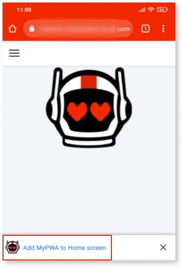
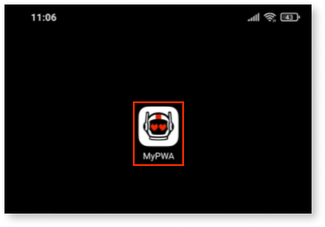
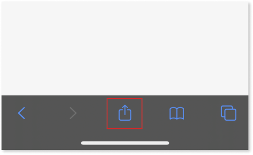
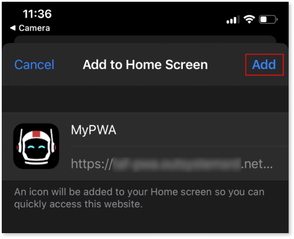
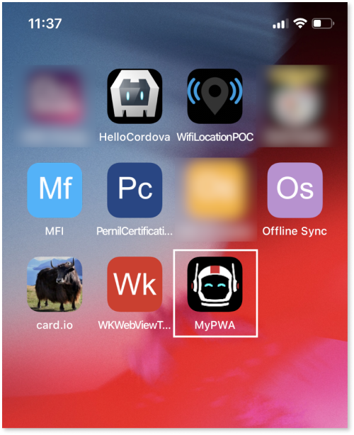

# Distribute as progressive web app

Project Neo documentation is under construction. It's frequently updated and expanded.

A progressive web app (PWA) provides a native-like experience without having to distribute a native mobile app. PWA is an emerging technology that combines existing web technologies with modern browser features.

The main benefits of PWAs:

* More efficient to manage, as they don't require app stores like native mobile apps.
* Based on the web browser technology that doesn't depend on a platform. The same app runs on Android and iOS. Additionally, in OutSystems you can distribute an app as a PWA and as native builds for Android/iOS.
* PWAs can run on a web browser with the same offline capabilities of a mobile app.
* They update the moment you publish changes to your OutSystems environment.
* Lighter on user devices' systems resources.
 
PWA in OutSystems is a distribution mode for mobile apps. You can simultaneously distribute a mobile app as a native mobile app and as a PWA.

## PWA is active by default

Select **Phone App** or **Tablet App** when you're creating a new app in Service Studio that you want to offer users as a PWA. By default, the progressive web app (PWA) distribution is always active.

## Trying out the PWA

To run the WPA, open your mobile device and scan the QR code in one of the following places:
  
* In Portal, click the app icon to open the detail, then click **Preview app** and look for **As PWA**. 
* In Service Studio, click the app from the main screen and look under **PWA**.

After you push your app to production, share the QR from the production stage of Portal to your users.

### PWA in Android

Follow these steps to install and run your PWA on an Android device.

1. Visit the app URL in Chrome.

1. Tap the banner **Add (my app) to Home screen**.

    

1. After you see a confirmation that Android added the shortcut to the home screen, open the app like any other app installed from a store. You can uninstall it like any other Android app.
    
    

### PWA in iOS

Follow these steps to install and run your PWA on an iOS device.

1. Visit the app URL in Safari.

1. Tap the Share button. The share menu opens.
   
    

1. Tap **Add to home screen**. The confirmation screen opens.

    

1. In the confirmation screen, tap **Add**.
    
    

1. Your app should now be on the home screen. You can uninstall it like any other iOS app.
    
    

## Debugging your PWA

To debug a PWA, emulate the app in Google Chrome. From the **Debugger** tab, select **Debug Setup** > **Emulate using Chrome**.

________________________________________
_QR CODE is a registered trademark of Denso Wave Incorporated._
