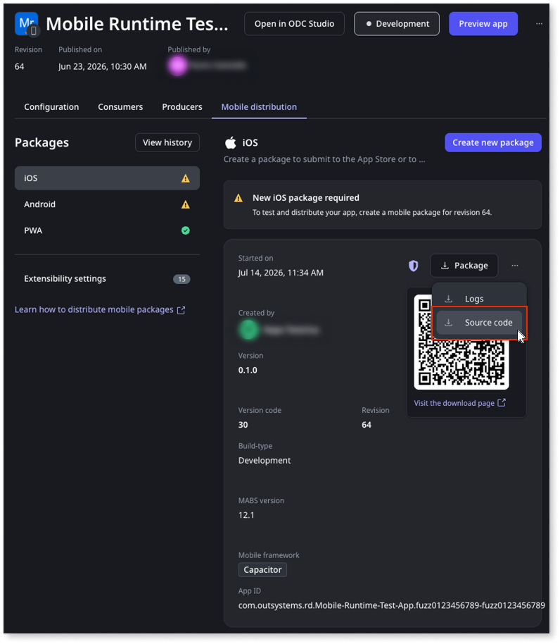

# Using the Capacitor source code

<div class="info" markdown="1">
Applies to Capacitor mobile apps built with MABS 12 or later.
</div>

When you create a Capacitor mobile package in ODC, you can grab the generated source code alongside the compiled package. Use it to run your app in Xcode or Android Studio when debugging native crashes, stepping through plugin code, or reproducing issues that only appear on a real device.

The source code layout isn't quite the same as Cordova. This page covers how to build source locally.

**Warning:** The source code is a snapshot of your mobile package. Changes you make locally don't sync back to ODC Studio. Use it for inspection and debugging, not as a place to build production ready apps.

## What you need

* Node.js LTS
* Capacitor CLI. Optional, since `npx cap ...` works too. The version used for the build is in `package.json` under `devDependencies`.
* For iOS:
    * A Mac with Xcode and the command-line tools. The minimum version depends on your MABS version — check the **iOS tools** column in [Mobile Apps Build Service Versions](https://success.outsystems.com/Support/Release_Notes/Mobile_Apps_Build_Service_Versions).
    * CocoaPods (`brew install cocoapods`) — needed if your package uses the CocoaPods template. If you're not sure, install it, it won't hurt to have it. SPM is built into Xcode and doesn't need a separate install.
* For Android:
    * Android Studio
    * JDK. The minimum version depends on your MABS version. Check the **Android tools** column in [Mobile Apps Build Service Versions](https://success.outsystems.com/Support/Release_Notes/Mobile_Apps_Build_Service_Versions).

## Grab the source code

1. In the **ODC Portal**, go to your app's details page.
1. Click **Mobile distribution** and then **View history**.
1. Find the package you want, then download the source code from its actions menu.

    

1. Extract it wherever you want.

    ```bash
    tar -xzf source.tar.gz -C my-app
    ```

    iOS and Android ship as separate archives. Grab both if you want to work on both.

## What's inside

Both archives share the same top-level layout:

```
.
├── android/                          # Android project (Android archive only)
├── ios/                              # iOS project (iOS archive only)
├── assets/                           # App icon, build assets
├── capacitor.config.json             # appId, plugins, server URL
├── dist/                             # Pre-built web assets
├── outsystems.config.json            # OS-specific build config
├── package.json                      # Plugins as local .tgz refs
├── package-lock.json
└── plugins/                          # Plugin .tgz files
```

The iOS archive also ships the pre-built `.ipa`, `.xcarchive`, and dSYM at the root.

## Run npm install first

<div class="warning" markdown="1">
This one's mandatory. The native projects reference `node_modules/` for pods and gradle, so if you skip this step nothing works.
</div>

From the source code root:

```bash
npm install
```

This unpacks the local plugin `.tgz` files from `plugins/` into `node_modules/`.

## Open the iOS app

Two ways to do this. Pick whichever feels natural.

### Browse to the project

1. In Finder, go to `unzipped-source/App/`.
1. Open `App.xcworkspace` in Xcode.

### Run npx cap open

```bash
npx cap open ios
```

## Run the iOS app with Xcode

1. Select the **App** target.
1. Under **Signing & Capabilities**, set your **Team**.
1. Pick a simulator or connected device.
1. Run.

### If you need to reinstall pods

Pods ship pre-installed. If you touch the Podfile or want a clean install:

```bash
cd ios/App
pod install
```

Only works after `npm install`, since the Podfile itself references node_modules paths.

## Open the Android app

Two ways to open the Android project. Pick whichever feels natural.

### Run npx cap open

```bash
npx cap open android
```

### By opening it yourself

1. In Android Studio, **File** > **Open**.
1. Select the `android/` folder inside the extracted source code.

## Run the Android app with Android Studio

1. Wait for the Gradle sync.
1. Pick an emulator or connected device.
1. Hit **Run**.

### Troubleshoot sync failures

`capacitor.settings.gradle` includes modules from `../node_modules/`, so sync breaks without `npm install`. Run it at the source code root and re-sync.

## Things to watch out for

* Signing (iOS). You need a valid Apple Developer account and a dev cert for physical devices. Simulator's fine without.
* `capacitor.config.json`. Has your appId, server URL, plugin config that ODC generated. Editing it only affects your local build. Nothing syncs back to ODC.
* Local plugin archives. Plugins are `.tgz` files under `plugins/`, wired via `file:` in `package.json`. Swapping one out means replacing the tarball and running `npm install` again.

## Troubleshooting

| Symptom | What's going on |
| --- | --- |
| `pod install` fails with a `require_relative` error | Run `npm install` first. |
| Gradle sync fails looking for `../node_modules/@capacitor/...` | Run `npm install` first. |
| `npx cap open` errors with a missing module | Run `npm install`. |
| App builds but shows a white screen | Check `server.url` in `capacitor.config.json` and that your device or simulator can reach it. |
| Xcode signing errors | Set your **Team** under **Signing & Capabilities**. Confirm the bundle id doesn't collide with something already in your dev account. |

## Related resources

* [Create mobile app package](creating-mobile-package.md)
* [Debugging apps](../../debugging-apps/intro.md)
* [Capacitor and Cordova support in MABS](mabs-overview.md)
