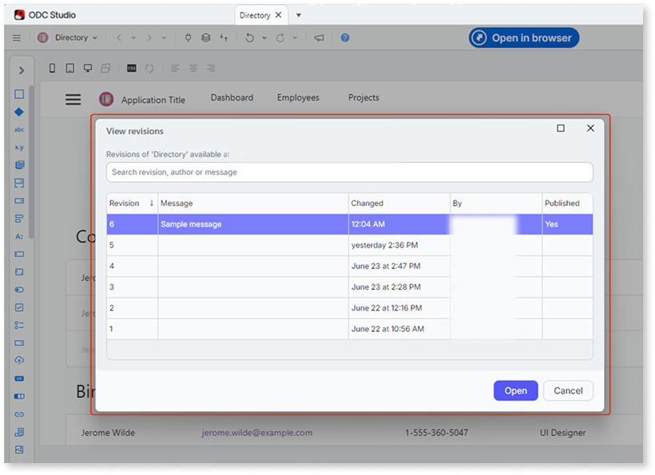
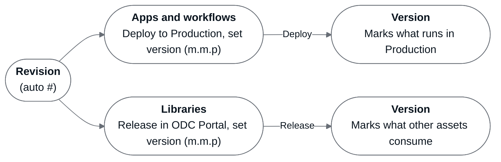
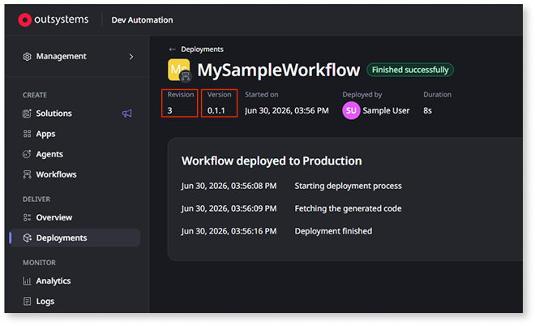

# Revisions

In OutSystems Developer Cloud (ODC), a revision is an automatic, incremental, immutable whole-number snapshot of your asset's source code. Revision numbers increment by one and remain fixed. ODC Studio requires a change before it publishes, so each publish produces a revision.

The source code in a revision stays fixed. The information attached to a revision, such as the publish message and the version, stays editable through the ODC public APIs.

A revision exists independently of any stage. The **View revisions** dialog in ODC Studio lists every revision of an asset and marks the published one. Publishing targets the Development stage. To take a revision further, you deploy it for apps and workflows, or release it for libraries.

## Builds

A build compiles a revision into a deployable package. ODC creates the following build types:

* **Debug**: The build type that the Development stage runs. ODC stores the compiled files directly, which supports differential builds and shortens publish time.
* **Release**: The build type that packages a revision as a container image. Apps and workflows run release builds in every stage other than Development.

Libraries use debug builds. ODC merges a library's package into the container of each asset that consumes it, and the consumer's release build carries the library into other stages.

For more information about retrieving revisions and release builds through the ODC public APIs, refer to [Selecting the revision and build of your asset](../../reference/apis/public-rest-apis/ci-cd-apis-use-cases/select-revision-build.md).

## Publish messages

You can add a message when you publish to describe the changes in that revision. Messages help your team understand the intent behind each revision and improve traceability.

For apps and libraries, use the **1-Click Publish with message** option in ODC Studio, or press **Shift+F5** (Windows) or **Shift+Cmd+F5** (macOS). For more information, refer to [Understanding 1-Click Publish](../../deploying-apps/one-cp.md).

For workflows, select **Publish with message** from the dropdown next to the **Publish** button in the workflow editor. For more information, refer to [Messages in workflows publishing](../workflows/publish-workflows.md).

After publishing, ODC stores the message with the revision. To review messages for apps and libraries, open ODC Studio and go to **App** > **View revisions**, which displays them read-only. Through the ODC public APIs, you update or clear the message on any revision.

## Revision behavior by asset type

Revisions behave differently for each ODC asset type. The following sections describe each one.

### Apps and agentic apps

For web apps, mobile apps, and agentic apps, only one revision runs per stage. When you deploy a revision to a stage, it replaces the one already there. Each publish in ODC Studio increments the revision number by one.

### Libraries

Library revisions increment the same way app revisions do, and the number is immutable. Libraries differ in how a revision reaches other assets: you release a library, and its package travels inside each consumer.

The release process sets a version number on a particular revision, following this lifecycle:

1. **Develop and test**: Publish revisions iteratively in ODC Studio. You test a library inside one app at a time, and each publish updates that test app to the revision you published.
1. **Release**: Set a semantic version number (major.minor.patch) and write release notes in the ODC Portal. Release notes are required. Releasing the first version makes the library's elements available to the other assets in your organization.
1. **Update consumers**: ODC Studio notifies developers that a version is available. Each developer accepts or dismisses the update, which keeps the consuming asset on a version its developer chose.

Each consumer includes the library's package in its own container, so a library version reaches a stage inside the assets that consume it. For more information about library versioning, refer to [Libraries versioning](../libraries/libraries.md#libraries-versioning).

### Workflows

Workflows support multiple revisions in the same stage simultaneously. Each workflow instance runs on the revision that created it and completes execution independently of newer deployments. When all instances of a revision are completed or terminated, ODC removes that revision from the stage, unless it's the latest deployed revision.

In the Development stage, instances run in the last five revisions. When a sixth revision appears, ODC terminates the instances running in the oldest of the five. The QA and Production stages keep instances running in any number of revisions.

For more information about multiple workflow revisions, refer to [Multiple revisions of a workflow](../../deploying-apps/deploy-apps.md#workflow-revisions).

## Revisions and versions

A version is a semantic identifier (major.minor.patch) that you set on a revision. ODC builds and deploys the revision, and the version identifies it. Each version is unique within an asset.

The version marks a different thing for each asset type. For an app or workflow, it marks what runs in Production. For a library, it marks what other assets consume. The following diagram shows the two paths in the ODC Portal.

In the ODC Portal, each asset type reaches a version by a different route:

* **Apps and agentic apps**: You set the version number when you deploy to Production. ODC suggests `0.1.0` for the first version, and each new version number you enter must be higher than the highest one the asset already has.
* **Workflows**: You set the version number when you deploy to Production, the same as apps.
* **Libraries**: You set the version number and the release notes when you release the library. The first release accepts `0.1.0` or higher.

Deploying a revision that already has a version keeps that version. This is what lets you roll back to an earlier revision in Production, which arrives with the version number it carried before.

CI/CD pipelines set a version on any revision through the ODC public APIs, and a deployment is a separate step. The APIs enforce uniqueness, and the higher-number rule applies in the Portal. For more information, refer to [Setting the release version and release notes](../../reference/apis/public-rest-apis/ci-cd-apis-use-cases/set-version-release-notes.md).

The following screenshot shows a workflow deployed to Production with revision 3 and version 0.1.1. Both numbers appear side by side on the Deployments screen.

For more information about versions and the deployment process, refer to [Deploying assets](../../deploying-apps/deploy-apps.md).

## Related resources

The following training courses cover publishing and revisions:

* [ODC Studio Overview](https://learn.outsystems.com/training/journeys/odc-studio-overview-2397): covers 1-Click Publish, compare, and merge.
* [Architecture Fundamentals in ODC](https://learn.outsystems.com/training/journeys/architecture-fundamentals-in-odc-2395): covers how revisions, versions, and deployments fit into the ODC architecture.
