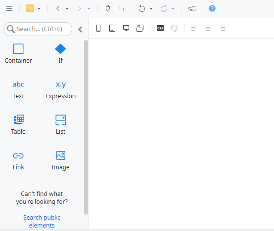

# Widgets in emails

OutSystems designed widgets to help you create lightweight emails that most email readers can open. When you edit an email, ODC Studio shows the available widgets in the [available Email widgets](#widgets-available-in-emails) in the widgets tool bar.

Use the Email widgets like you use the Screen widgets, with the following common differences designed to make the emails light and secure:

* Email widgets don't have features that require handling plenty of data. For example, Tables in Emails don't show a pagination section.
* You can't use JavaScript and custom actions in Email widgets. Most email clients don't support JavaScript due to security concerns.

## Widgets available in Emails

You can use the following widgets in Emails.

| Widget      | Description                                         | Notes                                                          |
| ----------- | --------------------------------------------------- | -------------------------------------------------------------- |
| Container   | Lets you arrange other widgets.                     |                                                                |
| Expressions | Evaluates expressions and displays variable values. |                                                                |
| If          | Shows content based on a condition.                 |                                                                |
| Images      | Embeds an image.                                    | Using binary content from a database |
| Link(*)        | Adds a navigational element.                        |                                                                |
| List        | Shows records as items in a list.                   | To quickly create a list in a Mobile App, drag an Entity to Email.                                                                |
| Table       | Shows records in columns and rows.                  | To quickly create a table in a Web App, drag an Entity to Email.                                                              |

 

(*) If your app is using a [custom domain](../../manage-platform-app-lifecycle/custom-domains.md) and you want to link to a screen in your app, you must link to the URL of the screen. For example, to link to screen `Screen1` in `App1` using custom domain `example.com`, you set the **OnClick** property to **RedirectToURL** with the expression `"https://example.com/App1/Screen1"`. You can find guidance on how to build an expression [here](../../building-apps/logic/expressions.md).

