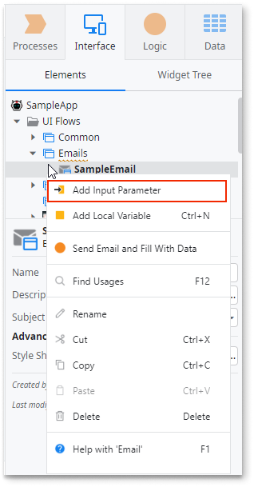

# Working with emails

In ODC Studio, Email is a UI element that lets you design and manage the content of email messages. Like Screens, you can find and create Emails in the UI Flows. However, unlike Screens that usually use the OutSystems UI, Emails require lightweight styles to follow the industry best practices for email sizes.

## Create a new Email

To create a new Email, go to ODC Studio and follow these steps:
 
1. Go to **Interface** > **UI Flows** and do one of the following:

    * If this is the first email you're adding in an app, right-click any UI Flow and select **Add Email**.
    * If you already have an email in your app, right-click the **Emails** UI Flow and select **Add Email**.
   
    

    

    Emails require a light theme. When you add your first email, ODC Studio creates the UI Flow with  a light theme, and then adds your email.

    

2. Select the Email below  the UI Flow, and enter the following details:

    * In the **Name** field, enter a name to identify this email.
    * In the **Subject** field, enter `"No subject"` as a temporary subject. 

    

## Add content to an Email

To add content to your email, follow these steps in ODC Studio:

1. From  **Interface** select **UI Flows** > **your Emails UI Flow**  double-click the Email you want to edit. The Email opens for editing. The widget list on the left displays the available widgets that you can use in Emails.
    
    

2. From the widget display, drag the **Text** widget to the Email and enter some text.

    

3. Optionally, you can edit the **Text** widget properties from the **Styles** tab and,modify the text look and feel.

## Modify content in Emails

You can customize the content of your emails by adding information to the corresponding Email. Emails support compound data types and can use the data from the client scope of Email.

To add an **Input** to your Email and display the value in the email body, follow these steps:

1. Add an [Email to your app](#create-a-new-email) and optionally add [some text](#add-content-to-an-email).

1. From the **Interface** tab, right-click the Email and from the menu, select **Add Input Parameter**. ODC Studio adds an Input Parameter.

    

1. Set the following Input Parameter properties:

    * **Name** - enter `Handle`
    * **Description** enter information to identify the input parameter.
    * **Data Type** - select **Text**
    * **Is Mandatory** - Select **Yes** to make the **Handle** a required value in the Email

    

1. From the **Interface** tab, double-click the Email to open it for editing.

1. From the widget list, drag the **Expression** widget to the Email. The expression editor opens.

1. Enter `"Hello, " + Handle + "!"` and click **Done**.

    

When you open this email in the email client, the expression displays "Hello, John!" when the value of **Handle** is `"John"`.

## Clipped content warning { #clipped-content-warning }

If the content of an email is too big, some email readers clip the content. For example, Gmail displays **[Message clipped] View entire message** for all emails larger than 102KB. This can happen if you're generating content in your emails with a Theme that has a lot of CSS not designed for emails.

To reduce the size of the email content, use a blank Theme or a dedicated email Theme. You can also create UI Flow without styles and then add your emails under this UI Flow.

