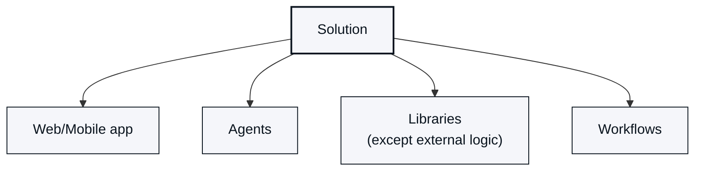
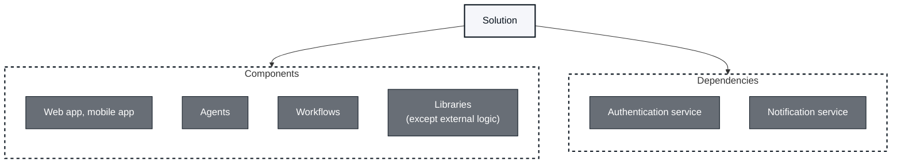
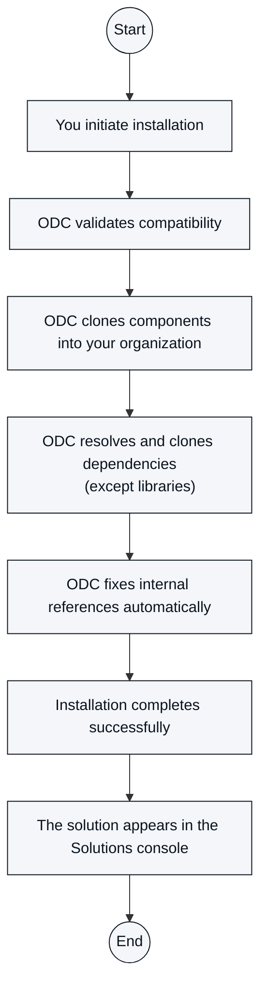

# Accelerate time-to-value with ODC solutions

A **solution** is a complete package that bundles everything needed to solve a specific business problem: apps, agents, libraries, and workflows that work together as one unit. Instead of assembling assets one by one, you get a pre-built, tested collection designed to behave as a single, cohesive offering.

## Why solutions matter

Solutions shorten time to value. Rather than building from scratch or working out which components fit together, you start from a pre-tested, validated package that's ready to use.

## Solutions architecture

Every solution is categorized into **Components** you customize for your core business outcomes and **Dependencies** you maintain to power them behind the scenes.

### Components

Components are what you customize for your specific needs. They are the core, primary assets that deliver direct business value and are yours to shape and control completely. After installation, your organization controls them within their license terms, and they follow an independent lifecycle based on your customization and deployment needs. Because they map directly to your business goals, they represent the assets you control and can customize:

* **Applications**: Web and mobile user-facing applications.

* **[Agents](https://success.outsystems.com/documentation/outsystems_developer_cloud/building_apps/build_ai_powered_apps/about_ai_agent_builder/)**: AI agents to perform tasks, automate workflows, or handle complex multi-step interactions.

* **[Workflows](https://success.outsystems.com/documentation/outsystems_developer_cloud/building_apps/about_business_processes/workflows_in_odc/)**: Business processes and orchestration logic.

* **[Libraries](https://success.outsystems.com/documentation/outsystems_developer_cloud/building_apps/libraries/)**: Business-specific reusable libraries, except external logic.

### Dependencies

Dependencies sit underneath your components to provide foundational support. They are the underlying assets your components rely on, including Forge assets that produce the functionality your components consume. ODC manages dependencies by resolving and validating them during installation, similar to asset installation, and keeping their versions aligned. OutSystems maintains solutions only while they are in Forge. After installation, your organization is responsible for maintaining the dependencies in your environment.

## Solutions console

The **Solutions console** is an interface within the **CREATE** menu in **ODC Portal**. The console has a logical grouping where you view solution metadata, track components together, and access solution documentation.

## Set up your solution

Follow these steps to set up a solution:  

1. Open **Forge** in the ODC Portal and select **Solutions** in **Filters**.

1. Click **Install** on the solution card, or navigate to the **Versions** tab of the solution's detail page, to install the solution package.

1. A confirmation popup appears whose content depends on your portfolio configuration and Terms of Use status.

    * If your organization has multiple portfolios:
      * You haven't already accepted the **Forge Terms of Use**: the popup displays both portfolio selection and terms of use acceptance.
      * You have already accepted the **Forge Terms of Use**: the popup displays only portfolio selection.
    * If you have a single portfolio:
      * You haven't already accepted the **Forge Terms of Use**: the popup displays terms of use acceptance, and the installation starts after you accept.
      * You have already accepted the **Forge Terms of Use**: the installation starts directly without additional prompts.

1. After you accept the terms, the **Install** button on the solution card or detail page switches to a loading state. At the same time, a catalog card displays the installation progress of each component and dependency.

   When the install completes successfully, the button on the solution card changes to an **Installed** state.

The one-click installation process is fully automated: you initiate installation, and ODC validates compatibility, clones components and dependencies (except libraries) into your organization, fixes internal references automatically, completes the installation successfully, and makes the solution available in the Solutions console.

The diagram below shows how ODC handles each step.

### Manage solution after installation

After installation, solution components behave like standard assets in your organization. You deploy them independently to production, customize them for your specific needs, integrate them with other applications, monitor their performance using standard tools, and manage them with standard governance policies.

When you modify a solution component, you own that modified version.

Installed solution components appear in the following places:

1. **Solutions console**, a centralized view of every solution installed in your organization.
1. **Apps list**, where applications and libraries are available for use, deployable to environments, and manageable as standard assets.
1. **Agents list**, where agentic apps are available for use and management.
1. **Workflows list**, where workflows are available for use and management.
