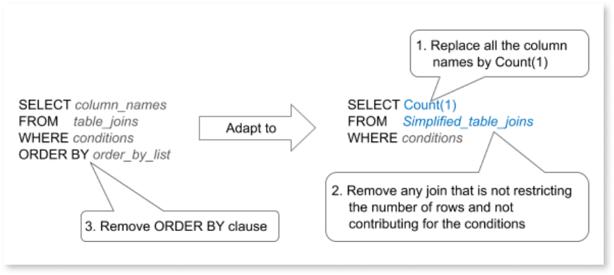
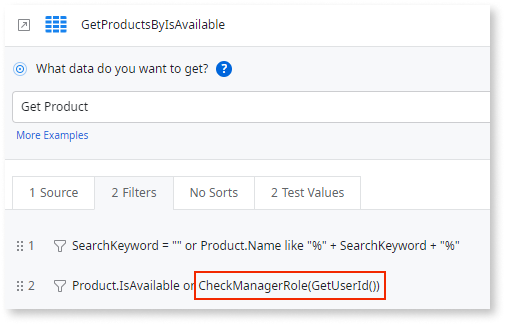

# Best practices for fetching and displaying data

In OutSystems, you can [fetch data to populate screens](../interaction/fetch-display.md) using aggregates or data actions. Follow these best practices to manage and display data from different sources efficiently.

## Use aggregates to fetch data from database entities { #aggregates }

[Aggregates](../../data/fetch-data/aggregate.md) allow you to fetch data using an optimized query tailored to your needs.

### Recommendations

Use aggregates to fetch data from database entities. Favor using aggregates over SQL queries.

### Benefits

When fetching data from database entities, aggregates offer the following advantages:

* Aggregates are visually defined, making data retrieval more intuitive. They also allow you to preview their outputs in real time.

* Aggregates automatically absorb changes in the data model.

* Aggregates support combining several entities and advanced filtering.

* Aggregates retrieve only the attributes that are used on the screen.

* Aggregates run asynchronously, allowing users to interact with the app while data loads.

For more information, refer to [Fetch and display data from the database in OutSystems](../interaction/fetch-display.md) and [Displaying Data on Screens](https://learn.outsystems.com/training/journeys/building-screens-with-data-637/displaying-data-on-screens/odc/109).

## Use data actions to fetch complex data from the database or to fetch external data { #data-actions }

Data actions allow you to define custom server-side logic. The outputs of a data action can be used in screen widgets.

### Recommendations

Use data actions when:

* Fetching complex data from the database, which you cannot achieve using a single aggregate.

* Fetching data from external sources (for example, REST APIs).

### Benefits

Data actions can call external REST APIs or execute advanced SQL queries, allowing you to retrieve complex data from the database, which you wouldn't be able to do using aggregates.

For more information, refer to [Displaying Data on Screens](https://learn.outsystems.com/training/journeys/building-screens-with-data-637/displaying-data-on-screens/odc/109).

## Avoid fetching a large number of records { #large-nr-records }

Displaying a large number of records all at once is slow and unnecessary, as the user may only need some records at a time.

### Recommendations

When displaying a large number of records, follow these recommendations:

* Fetch data only on demand by setting the **Fetch** property of your screen aggregates to ```Only on Demand```. For more information, refer to [Fetching Data On Demand](https://learn.outsystems.com/training/journeys/programming-model-645/fetching-data-on-demand/odc/487).

* If you use the list widget, take a lazy loading approach by handling the **On Scroll Ending** event. This approach enables your app to load data incrementally as users scroll. ​

* If you use the table widget, use the [pagination](../patterns/navigation/pagination.md) UI pattern to load only a certain number of records each time instead of loading an entire table at once.

### Benefits

Implementing these best practices helps reduce initial load times and server strain, while ensuring a smooth user experience. You can efficiently handle large datasets without overwhelming the user interface.

## Keep the number of fetched records consistent with your needs { #max-records }

Usually, there's no need to display thousands of records on a single screen. For example, a list usually displays only a fixed set of records, then additional records are fetched with the use of pagination or infinite scroll mechanism. If you don't limit the maximum number of records read from the database, all the records that match the criteria will be unnecessarily fetched, increasing database load and response time.

### Recommendation

Keep the number of records fetched by your aggregates and SQL queries consistent with your needs:

* For aggregates, set the **Max. Records** property to match the amount of data you want to display. If you need the total count of records, use the **&lt;Aggregate&gt;.Count**, as it's not limited by the **Max. Records** value.

* For SQL queries, add an SQL clause to the SQL element statement to filter the results at the database level. For example, `SELECT <column_names> FROM <table_joins> LIMIT 10`.

    <div class="info" markdown="1">

    Setting the **Max. Records** property in SQL queries doesn't change its SQL statement. This limit is only applied at the app level to the results returned by the database.

    </div>

    By limiting the results returned by the query, you no longer rely on the **&lt;SQL query&gt;.Count** property to get the correct count of records complying with the original query conditions and joins. If you need the total number of records, you must make a separate query to do that count.

### Benefits

Keeping the number of records fetched from the database consistent with your needs optimizes aggregates and SQL queries execution time and improves screen loading. This is especially useful when fetching table records or when an aggregate is used to fetch a single record.

## Optimize record counting { #record-counting }

When you use **&lt;Aggregate&gt;.Count** or **&lt;SQL query&gt;.Count** to get the total count of records returned by a query, OutSystems generates a second query to perform the counting, ignoring the **Max. Records** value.

For aggregates, OutSystems generates an optimized query for counting records. However, that's not the case for SQL queries.

The SQL element enables you to write complex SQL queries, which can be too complex for counting records. Consider you have a query that fetches a lot of fields, performs several joins, and eventually, sorts the results. By using **&lt;SQL query&gt;.Count** to count the records returned by that query, OutSystems re-runs the same complex query again.

### Recommendations

When counting the number of records returned by aggregates or SQL queries, follow these recommendations:

* With aggregates, use **&lt;Aggregate&gt;.Count**. The platform runs the same query in an optimized way to count the records.

* With SQL queries, run a modified version of the original query, with the only purpose of counting the number of records:



* Don't use **&lt;Aggregate&gt;.Count** or **&lt;SQL query&gt;.Count** to check if the query result is empty or not, as this will run an extra query unnecessarily. To check if the result is empty, use **&lt;Aggregate&gt;.List.Empty** or **&lt;SQL query&gt;.List.Empty** instead.

### Benefits

By following these recommendations, you avoid running complex queries repeatedly, improving the app's performance.

## Don't show a blank screen while data is being fetched { #blank-screen }

Plan what your app displays to the user while data is being fetched.

### Recommendations

To avoid showing a blank screen while data is being fetched:

* Fetch smaller data when initializing the app. This renders essential elements while larger data loads in the background.

* Inform users that data is loading. For example, use loading spinners, progress bars, or skeleton screens.

### Benefits

By following these recommendations, you avoid the perception of an unresponsive or broken app, improving user experience.

## Optimize data fetching { #optimize-fetching }

Fetching data for display on a screen using complex calculations or logic increases the time users must wait for the data to load.

### Recommendations

Follow these recommendations to optimize the fetching of data to display on your screens:

* Know your data requirements and [design a data model](../../data/modeling.md) that supports the use case of the screen, instead of calculating the information when fetching the data or on the expressions of the screen widgets. For example, having to group a large volume of data by complex criteria to get averages or counts.

* Perform all the calculations in advance using one of the following options:

    * When data is generated. For example, every time you add a vacation period, immediately update the remaining available days in the employee detail instead of calculating it when you want to list the available vacation days per employee.

    * Using [a Timer](../../../manage-platform-app-lifecycle/configuration-management.md#managing-timers) to prepare data upfront. For example, prepare agglomeration entities to support dashboards.

* If you need to [fetch complex data using data actions](#data-actions), use proper joins and SQL functions to gather all required data in a single SQL query [executed outside a cycle](../../logic/best-practices-logic.md#aggregates-inside-cycle). Make sure you [create entity indexes](../../data/data-best-practices/intro.md#index-entities) for the attributes used in `JOIN` and `WHERE` clauses.

* Create different specialized screens, instead of a power screen with inefficient data preparation that needs to cope with all situations.

### Benefits

Optimizing the fetch of data to display on a screen reduces the time users must wait for the data to load, improving the screen's performance and the end user experience.

## Restrict access to sensitive data { #restrict-access }

When fetching sensitive data that depends on the user role or Id, it's not safe to rely on control information from client-side inputs, as it can be manipulated by malicious users.

### Recommendations

Filter your aggregates using the **CheckROLENAMERole()** function to [restrict access sensitive data](../../../user-management/secure-app-with-roles.md#restrict-access-to-data). You can also use the **GetUserId()** function for more restricted access.



You can reinforce this best practice by [validating user permissions also on the server-side logic](../../logic/best-practices-logic.md#validate-permissions-server-side).

### Benefits

Restricting access to your data brings an additional level of security to your app.
