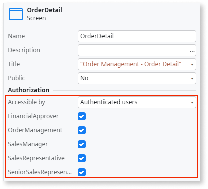
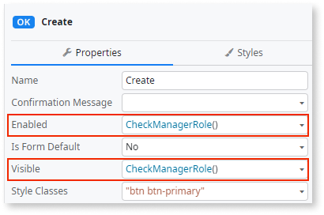

# Best practices for building screens

OutSystems enables you to build [screens](../screen-about.md) quickly and intuitively. By following some recommendations, you can ensure that your screens are fast, user-friendly, and work well on different devices.

## Use OutSystems widgets and UI patterns instead of high-code

OutSystems offers a comprehensive set of widgets and UI patterns to build your app's UI. 

### Recommendations

When building screens in OutSystems:

* Use OutSystems widgets and UI patterns instead of using high-code. These components follow best practices for design and functionality and are customizable. 

* Use high-code only in advanced extensibility scenarios.

### Benefits

OutSystems widgets and UI patterns adhere to recommended platform best practices, offering several advantages over high-code:

* **Speed and Efficiency:** OutSystems provides built-in screen templates and UI patterns that accelerate development. These pre-built elements save time compared to writing code from scratch.

* **Consistency:** Using standardized UI patterns ensures a consistent look and feel across your app, which enhances user experience and makes the app easier to navigate.

* **Responsiveness:** The OutSystems UI framework is responsive by default, meaning your screens will adapt to different device sizes without additional effort.

* **Accessibility:** OutSystems UI patterns comply with WCAG 2.1 accessibility standards, ensuring your app is accessible to a wider audience.

* **Maintainability:** Using OutSystems' pre-built components makes your codebase easier to maintain and update, as these components are well-documented and supported.

## Keep CSS styles on separate files { #css }

During development cycles, developers frequently resort to inline styles (for example, to quickly adjust the padding of an element), overriding styles defined on the Theme or screen's Style Sheet. In ODC Studio, you can define inline CSS styles via the Attributes section of an element's Properties.

Although using inline styles might be handy, it has some drawbacks that can be critical for app performance and maintainability.

### Recommendations

When working with CSS on your apps:

* Separate content and style, by keeping CSS styles in a separate location, such as CSS stylesheets. The resources can then be cached and reused.

* As each screen or block can have its own custom CSS files and other resources, be careful not to escalate the number of resources needed to render a given page. Having a high number of resources leads to slow page rendering.

* Use inline CSS for testing purposes only (for example, to preview changes). Then, remove it and add it to a separate file.

### Benefits

Using CSS in a separate location instead of inline offers several long-term advantages:

* **Performance:** By keeping CSS in a separate location, styles can be cached by browsers, reducing load time. This makes your screens faster and more efficient.

* **Maintainability:** When you need to change a style, you only need to do it in one place instead of going through every element where you defined that style inline. 

* **Collaboration**: By keeping CSS separate, you improve collaboration with other developers or designers, who don't need to be familiar with all the code to be able to edit styles.

## Optimize image sizes { #image-size }

Large images increase bandwidth usage and processing time, slowing screen rendering.

### Recommendations

When adding images to your screens:

* Reduce the size of images to the minimum needed to be correctly displayed to the user (below 150KB for mobile apps, and 500KB for web apps). 

* Reduce the images' resolution to a maximum of 1024px. Simply setting their width/height to lower values doesn't reduce the bandwidth needed to fetch the image from the server. 

* Consider having big images as external resources, not contained inside the app.

* Use different images for​ different screen sizes.

* Use different images when displaying full-size images or thumbnails.

### Benefits

Optimizing image sizes makes your screens load faster by decreasing bandwidth usage and request processing time in the browser. On the development side, an app with smaller images results in smaller OML files, which take less time to save and publish.

## Use roles to protect your screens { #roles }

You can decide the behavior of your app's UI based on the user role using the **CheckROLENAMERole()** function on your screens. However, relying on UI for access control is not safe. Skilled users can overcome those limitations and access parts of the screen to which they are not authorized, such as disabled or invisible buttons.

### Recommendations

In addition to using roles to decide the UI behavior, the following best practices help you protect your screens from malicious users:

* [Set your screens](../../../user-management/secure-app-with-roles.md#restrict-access-to-a-screen) to be **Accessible by** authenticated users of specific roles. If the screen gets too complex, consider splitting it into multiple screens with specific functionality for each role.

  

* Control the access to the screen's widgets, such as buttons or links, using the **Visible** and **Enabled** properties. Use the **CheckROLENAMERole()** function to validate access only to authorized roles.

  

For sensitive operations, such as database operations that can modify data, [validate user permissions also on the server-side logic](../../logic/best-practices-logic.md#validate-permissions-server-side).

### Benefits

Using roles to protect your screens adds a first layer of security to your app.
