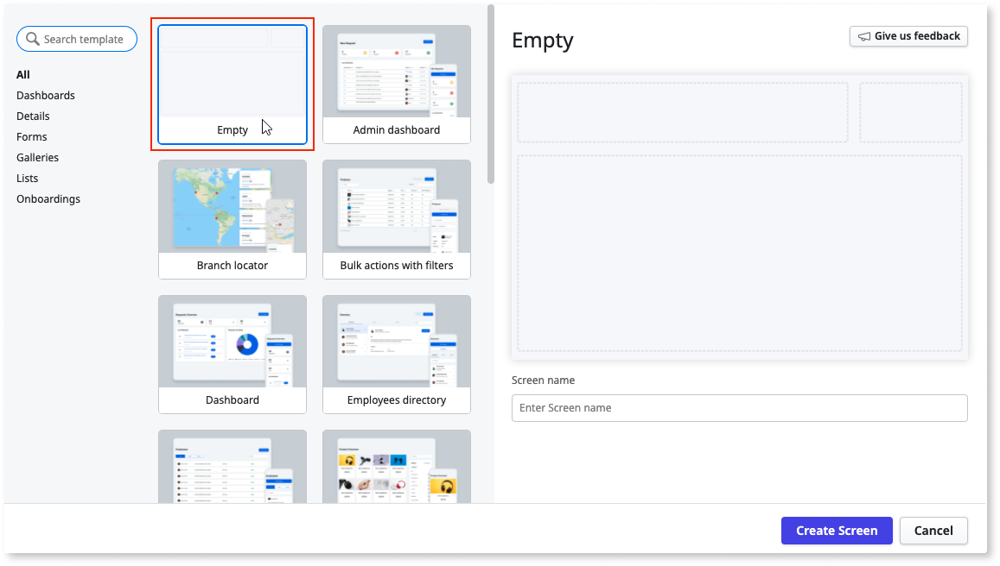

# Create screen from scratch

A Screen is a user interface (UI) element that contains other UI elements for users to interact. An empty Screen contains a basic layout for you to add widgets. A Screen based on a Screen Template has predefined content that works as a demo.

How Screens show in an app to you users depends on the app type:

* In a Web App, Screens render as web pages in a browser.
* In Mobile Apps, Screens render as screens of a mobile app.

## Creating a Screen

To create a Screen, follow these steps in ODC Studio:

1. Go to the **Interface** tab, and then expand the **UI Flows** folder.

    

1. From the **UI Flows**, right-click **MainFlow** and in the menu select **Add Screen**.

    

1. Select one of the following:
    
    * **Empty**, to create an empty Screen
    * A Screen Template, to create a Screen based on a template

    

1. Optionally, enter a name in the **Screen name** field.

1. Click **Create Screen**.
