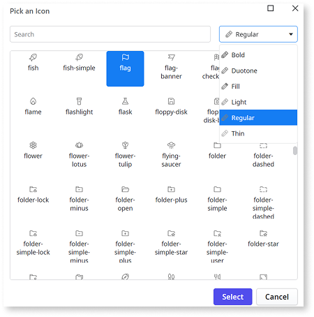
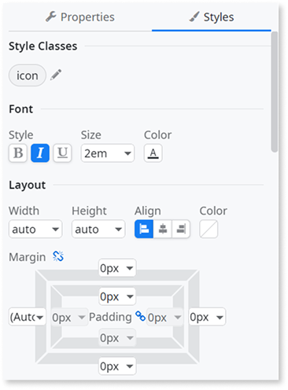
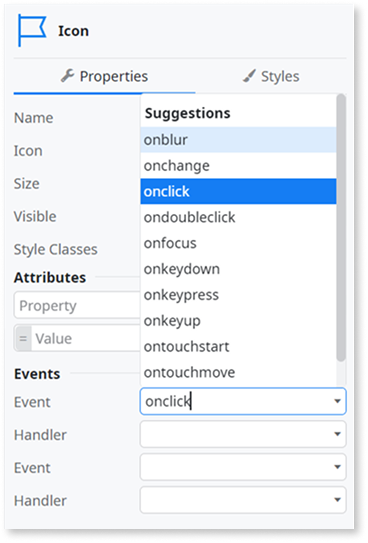

# Use icons

Icons are visual symbols that represent actions, objects, or concepts in your app's user interface. Icons enhance usability by providing intuitive visual cues that help users quickly recognize functionality and navigate your app.

Icons improve the user experience by:

* Reducing cognitive load through visual recognition instead of text-only labels
* Saving screen space while maintaining clear navigation and actions
* Providing universal symbols that transcend language barriers

## Icons in OutSystems UI

Starting from version 2.28.0, OutSystems UI supports both the Font Awesome and [Phosphor 2.0](https://phosphoricons.com/) icon libraries, giving you a wide range of visual options for your apps.

Phosphor is the default icon library for new apps in OutSystems UI. [Font Awesome](https://fontawesome.com/) remains available for existing apps and legacy compatibility.

To use Phosphor icons, you need OutSystems UI version 2.28.0 or newer and ODC Studio version 1.7.3 or later.

You can choose which icon library your app uses by setting the **Icon Library** property at the [theme level](../themes/intro.md#theme-properties-theme-properties). By default, new apps use the Phosphor icon library, while existing apps created before OutSystems UI 2.28.0 continue using FontAwesome for compatibility. You can update this setting at any time to match your design needs.

### What are Phosphor icons

[Phosphor 2.0](https://phosphoricons.com/) is an icon library that provides over 9,000 icons with a consistent design system.

Here are some of key benefits of using Phosphor icons in your app:

* Each icon is available in six different weights (Thin, Light, Regular, Bold, Fill, and Duotone), allowing you to match the icon style to your app’s context and visual needs.
* Icons use a scalable vector format, so they stay sharp and clear at any size, without any loss of quality.
* Icons are optimized to display well in both light and dark themes, making them accessible and easy to read in any mode.

## Use icons in your apps

For your app, you can select the icon library at the [theme](../themes/intro.md#theme-properties-theme-properties) level. All app templates include Phosphor 2.0 as the default icon library.

When you create a new app, the app's theme's default icon library is set to Phosphor.

To add phosphor icons to your screens, follow these steps:

1. In ODC Studio, drag an **Icon** widget from the toolbox onto your screen.
1. Browse the Phosphor icon library and choose the icon that best represents your action or content.
1. Select the [appropriate weight](#choosing-the-right-icon-weight-choose-icon-weight) such as **Thin**, **Light**, **Regular**, **Bold**, **Fill**, or **Duotone** based on your design needs.

   

1. Adjust the size, color, and styling using the icon's properties or CSS classes.

   

Both Phosphor and Font Awesome icons can be used with [UI patterns](../patterns/intro.md) and screen templates. You can add icons to buttons, navigation menus, forms, cards, lists, and any other UI element to enhance visual communication.

### Choosing the right icon weight {#choose-icon-weight}

Select icon weights based on context and visual hierarchy:

* Use **Regular** weight for most standard UI elements
* Use **Bold** weight to emphasize primary actions or important navigation items
* Use **Light** or **Thin** weights for secondary information or subtle UI elements
* Use **Fill** for active or selected states (for example, a filled star for favorites)
* Use **Duotone** to add visual interest and improve icon recognition through contrast

## Changing the icon library of your app

You can to choose between the Phosphor 2.0 and Font Awesome 4 icon libraries at the theme level, making it easy to maintain consistency with existing apps or adopt the latest icon set.

To use Font Awesome icons for a new app for compatibility with older apps, update the **Icon Library** setting in your app’s [theme](../themes/intro.md) to Font Awesome. ODC  automatically converts any Phosphor icons in your app to their Font Awesome equivalents. Review any **TrueChange** warnings for icons that do not have direct equivalents, and manually select replacement icons as needed.

To update an existing app using Font Awesome to Phosphor 2.0, update the **Icon Library** setting in your app’s [theme](../themes/intro.md) to Phosphor 2.0. ODC automatically maps Font Awesome 4.0 icons to similar Phosphor 2.0 icons.  

All Font Awesome 4.0 icons have equivalent mappings in the Phosphor library. However, since Phosphor offers a larger icon set some Phosphor icons don't have reverse mappings to Font Awesome.

### Working with blocks from different icon libraries

When your apps include blocks or libraries that use different icon libraries, keep the following constraints in mind:

* You cannot change the icon library for blocks that are referenced from other libraries directly within your app.
  
* If a referenced block uses a different icon library than your app's theme, ODC Studio displays an error message explaining the mismatch. To resolve the issue, navigate to the producer library where the block is defined and update its icon library setting to match your apps's theme.

* You can copy and paste UI elements containing icons between app's using different icon libraries. However, when you paste an icon from a different library, ODC Studio displays a **TrueChange** warning.  To resolve, you can open the icon widget dialog to manually change the icon to one available in the current theme.
  
* Update the pasted icons to match your current theme's icon library to maintain visual consistency. Open the Icon widget dialog and manually change the icon to one available in the current theme.

## Usage examples

The following examples demonstrate common ways to use the Icon widget in your apps.

### Add an icon to a button

You can enhance buttons by adding icons that provide visual context:

1. Drag an **Icon** widget into a button container.
1. Select an appropriate icon for example, a trash can for delete actions.
1. Choose the icon weight.
1. Optionally, add text next to the icon for clarity.

### Create an interactive icon

Icons can respond to user interactions such as clicks, making them functional UI elements. Use event handlers to trigger actions when users interact with icons.

To make an icon clickable, follow these steps:

1. Drag an Icon widget to your screen.
1. In the Events section, select **onclick** from the Event drop-down.

   

1. Create or select a client action as the Handler.
1. The icon becomes interactive and executes the action when clicked.

### Conditional icon display

You can dynamically change which icon displays based on app state or user data. Use expressions to select different icons that reflect current conditions, such as showing a checkmark for completed items or an alert icon for errors.

To show different icons based on conditions:

1. Add an Icon widget to your screen.
1. Enclose the icon using **If** and define conditions to select different icons based on app logic. For example, you can create a Boolean local variable and use this variable as a condition for enclosed If. Then, in your client action, use an **Assign** to toggle the variable.

## Best practices

Here are some best practices when working with icons in your apps:

* Always use icons that match the intent and meaning of the action or content. Do not use decorative icons for functional elements.
* Choose icon weights and styles that are consistent with your app’s established visual hierarchy.
* Pair icons with text labels when the meaning might be ambiguous
* Ensure adequate contrast and size for accessibility (minimum 16x16 pixels recommended)
* For Phosphor icons, use **Fill** or **Bold** weights for selected or active states to provide clear visual feedback. Leverage **Duotone** icons sparingly to highlight key features without overwhelming the interface
* Avoid mixing icon libraries within the same interface to prevent visual inconsistency
* When updating an existing app, verify that replaced icons maintain the same clarity and recognizability for users
* Custom or branded icons should follow the same sizing and alignment standards as native Phosphor icons to ensure a seamless experience.

## Related resources

For more information about working with icons refer to:

* [Icon widget reference](icon-widget-ref.md).

* [Themes](../themes/intro.md)  
  