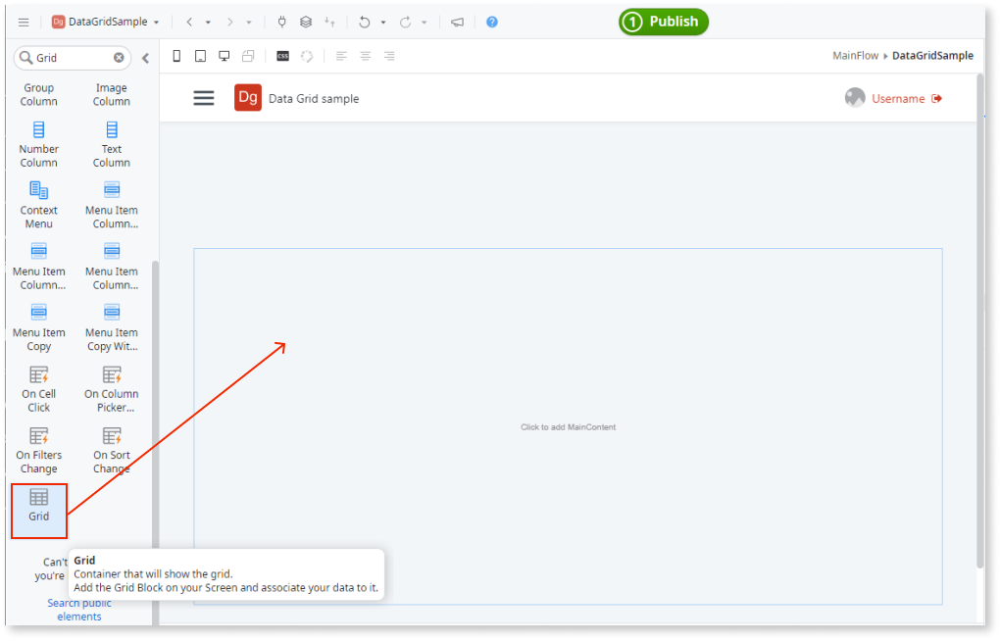
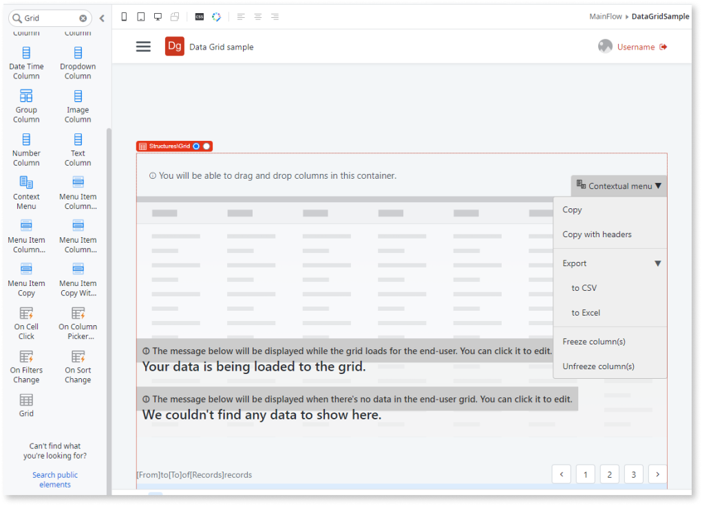
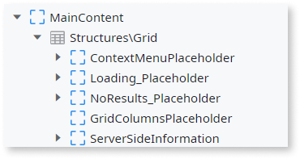
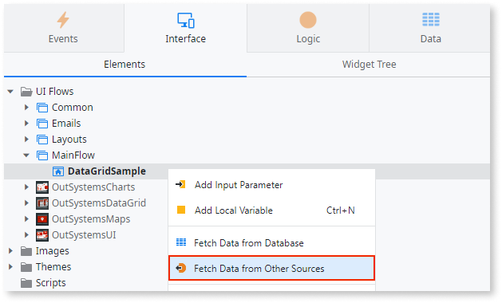
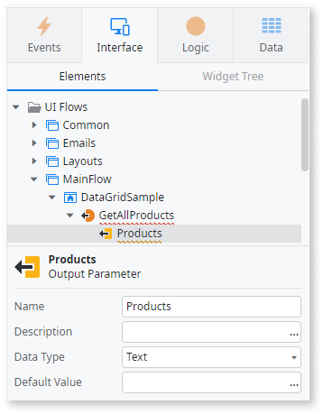
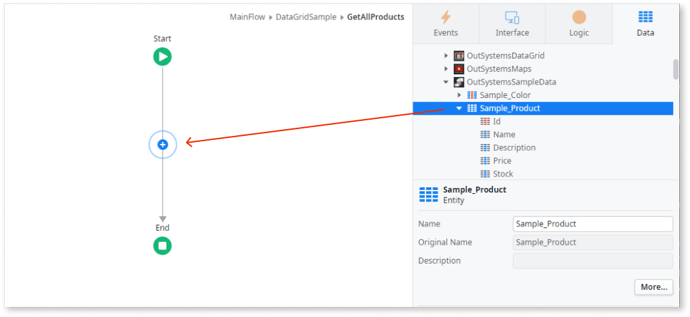
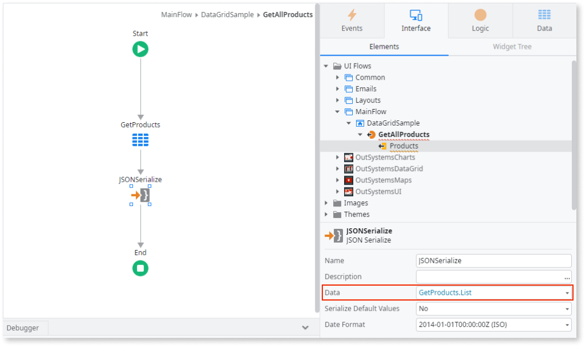
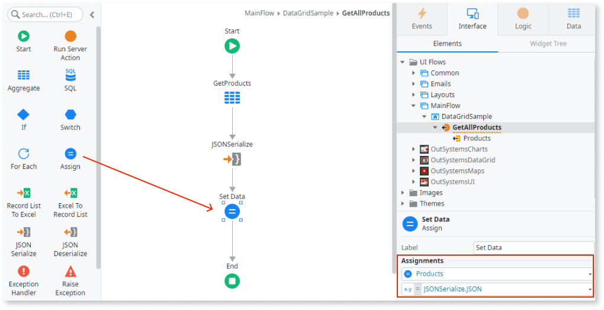
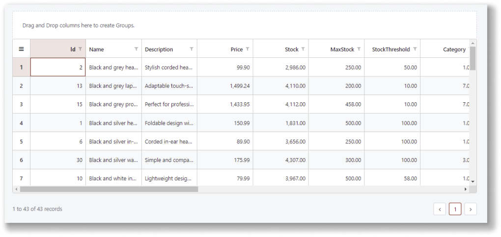

# Fetch data for OutSystems Data Grid

Applies to the OutSystems UI framework only.

**Prerequisites**

* Install the ODC Data Grid component from Forge.
  
* In ODC Studio, add the necessary Data Grid public elements to your app.

## Fetch data from a database

This example fetches data from a database and displays it in the grid. (This example does not define any column structure.)

<!-- Add the Grid block to a screen and learn about it's placeholders -->
### 1. Add the Grid widget to the screen

1. In ODC Studio, in the toolbox, search for the Grid widget and drag it into the **MainContent** area of your app's screen.

    

    The Grid widget is added to the screen.

    

    By default, the Grid widget contains the following placeholders:

    * ContextMenu
    * Loading (displayed while data is being fetched from the server)
    * NoResults (displayed when no results are returned)
    * GridColumns
    * ServerSideInformation (adds no functionality, only provides guidance for server-side pagination)

    

    You can change the content of these placeholders as required.

<!--Create a data action to fetch data to display in the Grid, serialize data as JSON-->
### 2. Create a data action to fetch the data

1. On the **Interface** tab, right-click your screen and select **Fetch Data from Other Sources**.

    

1. Enter a name for the action's output parameter (for example, Products) and ensure the **Data Type** is **Text**.

    This output parameter is used to receive the data fetched from the database.

    

1. To build the logic for the **GetAllProducts** data action, double-click it. The data action flow is displayed. Switch to the **Data** tab and drag the data source entity onto the flow.

    

    An aggregate (in this example, GetProducts) is automatically created.

1. The Grid block receives data in JSON format. Therefore, after the aggregate, you must serialize its results. To do this, from the **Toolbox**, drag the **JSONSerialize** onto the flow and place it between the **GetProducts** aggregate and the **End** node.

1. Set the **Data** property to the aggregate result, `GetProducts.List`. The list of the aggregate results is passed to the **JSONSerialize**.

    

1. Next, assign the resulting JSON to the `Products` output parameter by dragging an **Assign** onto the flow after **JSONSerialize** and assigning the `JSONSerialize.JSON` to `Products`. The `Products`output of the `GetAllProducts` data action is what is used by the Grid widget on the screen.

    

   <!--Bind the results of the data action to the Grid data property-->

### 3. Bind the data action's results to the Grid data property

1. Return to the main screen and select **Structures\Grid** to display its properties.

1. On the **Properties** tab, set the **Data** to the output of the Data action, in this example, `GetAllProducts.Products`.

1. Bind the Grid's **IsDataFetched** property to the Data Action property **IsDataFetched**.

    

<!--Add Column blocks for each attribute to display in the Grid, learn the type of block to use-->
### 4. Display the data

1. Populate the **Structures\Grid** block with all the columns you want to display in the grid. The columns are added to the **GridColumnsPlaceholder**.

1. Drag the relevant Column type to the **GridColumnsPlaceholder**.

After following these steps and publishing the module, you can test the component in your app. The result is a screen with a Grid widget that can display data from an aggregate.

## Next steps

* [Edit data in OutSystems Data Grid](data-grid-edit.md)
* [Save changes in OutSystems Data Grid](data-grid-save.md)

## Grid block properties

The following table lists all the properties of the Grid block, its data types, and their description.

| **Properties** | **Description** |
| --- | --- |
| Data (Text): Mandatory | The data displayed in the Grid. |
| IsDataFetched (Boolean): Mandatory | Defines what is displayed while data is loading. |
| GridHeight (Integer): Optional | Sets the Grid's height in pixels. Default height is 400 pixels. |
| HasGroupPanel (Boolean): Optional | Enables the group panel to allow dragging columns and apply the grouping by the fields corresponding to the dragged columns. Default value is True. |
| AllowColumnEdit (Boolean): Optional | Allows columns to be edited. Default value is False. |
| AllowColumnReorder (Boolean): Optional | Allows columns to be reordered. Default value is True. |
| AllowColumnResize (Boolean): Optional | Allows column width to be resized. Default value is True. |
| AllowColumnSort (Boolean): Optional | Allows sorting data by column. Default value is True. |
| KeyBinding (Text): Optional | Set the primary key field of the data. Expected format: 'Entity.Attribute'.  Use this field when doing server-side validations.   Don't refresh the grid after adding lines. Combine with UpdateAddedLineKey and GetRowNumberByKey actions. |
| RowHeight (Integer): Optional | Sets the row height in pixels. Default height is 48 pixels. |
| RowsPerPage (Integer): Optional | Sets the number of rows displayed per page. Default value is 50. |
| ShowAggregateValues (Boolean): Optional | Set to True to display a line below the grid with the column values aggregated (sum, min, max, etc.).  By default, the parameter is set to False.  To define the aggregation function of a given numeric (Number or Currency) column, use the SetColumnAggregate client action. |
| SanitizeInputValues (Boolean): Optional | Set True to assure the values inputed in the grid will be sanitized or False if you want to explicitly allow custom code to run. |
| ServerSidePagination (Boolean): Optional | Set to True if you want to enable server-side pagination. Default value is False. |
| RowHeader (RowHeader Identifier): Optional | Defines what is shown on the first column of the grid. Default value is ``Entities.RowHeader.RowNumber``. |
