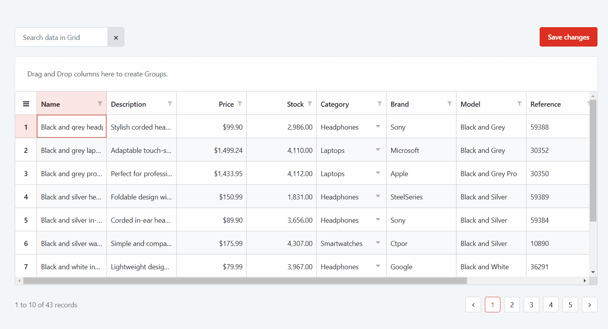

# OutSystems Data Grid for ODC

Applies to the OutSystems UI framework only.

The OutSystems Data Grid is a supported component available in Forge, that allows you to view, explore, and edit large amounts of data in a familiar spreadsheet interface.

You can use the OutSystems Data Grid component to create enterprise-grade interfaces that are more suitable and time-effective than designing a custom solution every time you need to manipulate dense datasets.  

The OutSystems Data Grid component has the following key features:

* Data selection and editing in a familiar interface
* Data sorting by parameter
* Data grouping
* Virtual scrolling

If your goal is to display simple, sequential data in a lightweight widget without the need for inline editing, [use lists instead](../../../interaction/fetch-display.md). List records can be [edited using forms](https://www.outsystems.com/tk/redirect?g=0d085705-57aa-4615-bddf-dbeb65ef5251).

## Installing OutSystems Data Grid and adding it to your app

To install the OutSystems Data Grid from Forge, follow these steps:

1. Navigate to **ODC Portal** > **Forge**, find the OutSystems Data Grid component, and open the details page.

1. Click **Install** and follow the instructions to install the component.

1. Once the installation finishes, add the elements you want to use as public elements in your web app.

## See also

* [Fetch data for OutSystems Data Grid](data-grid-fetch-data.md)
* [Edit data in OutSystems Data Grid](data-grid-edit.md)
* [Save data in OutSystems Data Grid](data-grid-save.md)
* [Data Grid reference](../../../../../reference/data-grid-ref.md)
