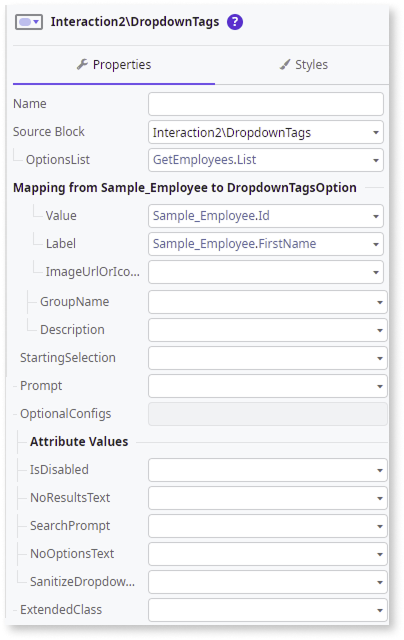

# Dropdown Tags

The Dropdown Tags UI Pattern offers multiple choice options to the user when when using a dropdown search.

**How to use the Dropdown Tags UI Pattern**

In this example, we create a dropdown tags search for a list of employees and a message that displays the number of selected items.

1. In ODC Studio, in the Toolbox, search for `Dropdown Tags`.

    The Dropdown Tags widget is displayed.

    

1. From the Toolbox, drag the Dropdown Search widget into the Main Content area of your application's screen.

    

1. Select and right-click your screen name, and select **Fetch Data from Database**.

1. To add a database entity, click the screen, and from the **Select Source** pop-up, select the relevant database entity and click **Select**.

    In this example, the **Sample_Employee** entity is selected. 

    

    The **GetEmployees** aggregate is automatically created.

    

1. Return to your screen by double-clicking the screen name, select the **Dropdown Tags** widget, and on the **Properties** tab, set the mandatory properties (**ItemList**, **Value**, **Text**).

    

1. Staying on the **Properties** tab, from the **Handler** dropdown, select **New Client Action**.

    

1. Add the relevant logic to the client action. 

    In this example:
    
    1. Add a Message to the client action.
    1. Add the following logic to the expression editor:

        `CurrentList.Length`

    1. Click **Close**. 
    
        This displays the number of selected items selected.

        

1. You can configure the Dropdown Tags by selecting the pattern, and on the **Properties** tab, set the relevant optional properties. For more configurations, expand the **OptionalConfigs** property.

    

After following these steps and publishing the app, you can test the pattern in your app. The result of this example should look something like the following:

## Properties

| Property                                            | Description                                               |
|-----------------------------------------------------|-----------------------------------------------------------|
| OptionsList (DropdownTagsOption List): Mandatory    | List of items to show in the dropdown.                    |
| SelectedOptions (DropdownTagsOption List): Optional | Defines preselected items in the dropdown list.           |
| Prompt (Text): Optional                             | Text that is displayed when no items are selected.        |
| OptionalConfigs.IsDisabled (Boolean): Optional      | Set as True to disable the Dropdown.                      |
| OptionalConfigs.NoResultsText (Text): Optional      | Text that is displayed when there are no results to show. |
| OptionalConfigs.SearchPrompt (Text): Optional       | Prompt text displayed in the search input box.            |
| OptionalConfigs.NoOptionsText (Text): Optional      | Set the message that is displayed in the Dropdown list when there are no options available.  The default message is: **There are no options to show.** |
|ExtendedClass (Text): Optional | Adds custom style classes to the Pattern. You define your custom style classes in your application using CSS.  Examples   <ul><li>_Blank_ - No custom styles are added (default value).</li><li>"myclass" - Adds the ``myclass`` style to the UI styles being applied.</li><li>"myclass1 myclass2" - Adds the ``myclass1`` and ``myclass2`` styles to the UI styles being applied.</li></ul>You can also use the classes available on the OutSystems UI. |
